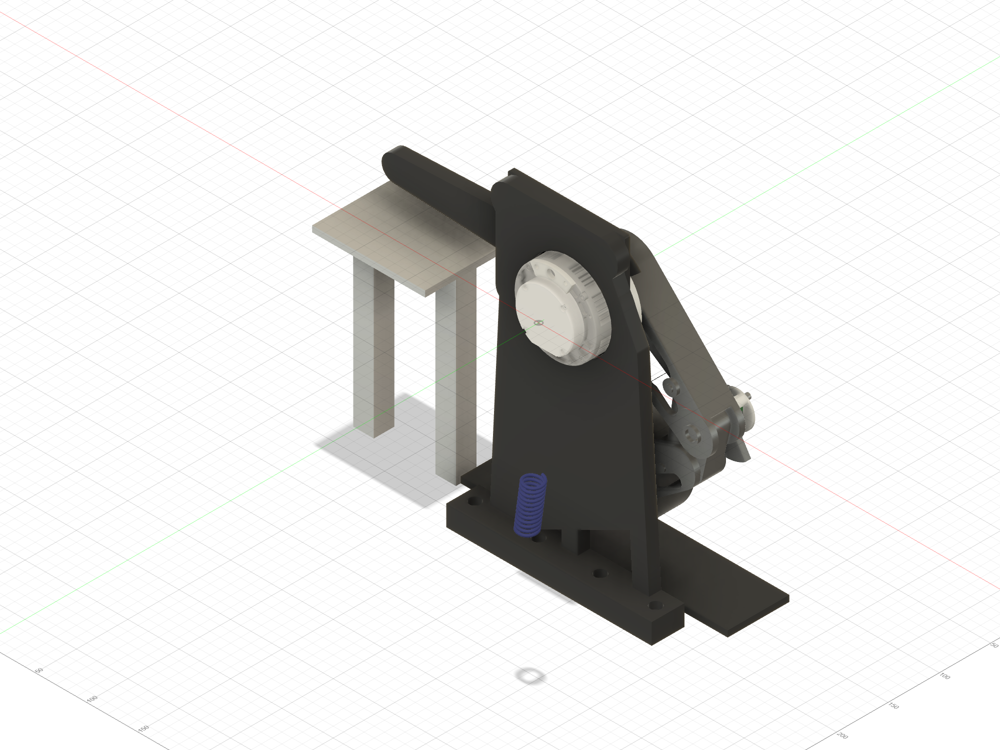

# Beni

A mostly 3D-printed wheeled biped with active shoulders, passive spring-loaded
knees, and a driven wheel on each leg. A complete ABS single-leg integration
article is the active build; PA-CF structural printing is deferred to the later
two-leg build.

**[Current status](PROJECT_STATUS.md)** · **[Mechanical design](beni_prototype1_design_record.md)** · **[Electronics](electronics/README.md)** · **[Firmware](firmware/README.md)** · **[Interactive viewer](web/)**

## Mechanisms

| Complete leg | Wheel motor and hub | Passive knee |
|:---:|:---:|:---:|
|  |  |  |

## Shoulder assembly path

| Plate first | Hub through plate | Final stack |
|:---:|:---:|:---:|
|  |  |  |

[Illustrated assembly manual: 21 steps](docs/assembly/ordered_pin_picture_guide.md) · [Printable PDF](output/pdf/beni_single_leg_assembly_manual.pdf) · [Shoulder close-up](docs/assembly/shoulder_to_proximal_link.md) · [Heat-set receiver picture map](docs/assembly/heatset_receiver_map.md) · [Assembly-path evidence and acceptance result](evidence/shoulder_assembly/2026-08-23_plate_sequence/README.md) · [First-article prints](first_article_stl/README.md) · [Manufacturing constraints](MANUFACTURING_CONSTRAINTS.md)

The CAD gallery is exported from the live Fusion model with
[`readme_images_fusion.py`](readme_images_fusion.py) and should be refreshed with
model changes.

The passive-knee detail includes the live `Knee_Spring_L` helical body: Ø19 OD,
Ø2.6 wire and an 11.8-total-coil representation rebuilt to the current cartridge
length. This is the original 55 mm baseline. The owner has the recommended
yellow OD18 / ID9 × **50 mm spring**; the earlier longer-length report was a
typo, corrected on September 6. Keep that spring. The 50 mm test-only cartridge
is released for the unpowered ABS hand test; see the
[ordered-pin picture guide](docs/assembly/ordered_pin_picture_guide.md)
before assembly. The final structural cartridge is still held.

## Current ABS mechanical article

---

<!-- PRINT_QUEUE_START -->
## Current print — ordered-pin unpowered ABS mechanical article

Automatically maintained convenience links for the active ABS article.

**Reprint three parts: shoulder hub, proximal link and distal link.**
[Direct-download the corrected PINREV2 distal STL](https://raw.githubusercontent.com/TnnsBeast/Biped/main/first_article_stl/ordered_pin_integration/ABS_PINREV2_Distal_Link_D10p30_D6x10_CLEVIS_D4p30_PRINT_ORIENTED.stl).
The September 22 distal file lost its Ø10.30 receiver and incorrectly exported
Ø16. The corrected file restores Ø10.30 × 20.0. At the owner's request,
root-dowel sockets and clevis-link passages now use **Ø4.30**, one +0.05 mm
step beyond the selected Ø4.25 ladder station, for easier removal. These new
fits still need final-part hand acceptance. Other pin interfaces are unchanged.

The [all-15-part audit](evidence/assembly/2026-09-23_mechanical_reprint_audit/)
finds no other reprint necessary for the current released files. Keep the
closed-skin stop plate and the six earlier parts below. Keep the wheel hub,
cable cover and front post. Stand and shoulder plate may be kept only if they
are the current Ø4.5 M3-receiver versions; their physical print revisions are
still unconfirmed. Withdraw the older hub and links from the active assembly.

### Three PINREV2 replacements; retain the existing stop plate

| Part | Qty | Import orientation and supports |
|---|---:|---|
| [Shoulder output hub with three Ø4 × 10 root sockets](first_article_stl/ordered_pin_integration/ABS_PINREV2_Shoulder_Output_Hub_D4p15_ROOT_D4p30_PRINT_ORIENTED.stl) | 1 ABS | Import unchanged, Ø56 outboard flange on bed; no supports; controlled socket bridges |
| [Proximal link with root sockets and integral M4 × 40 upper land](first_article_stl/ordered_pin_integration/ABS_PINREV2_Proximal_Link_D19p15_ROOT_D4p30_CLEVIS_D4p30_PRINT_ORIENTED.stl) | 1 ABS | Import unchanged, broad outboard face on bed; no support in functional bores or channel |
| [Distal link with captive Ø6 × 10 socket and integral M4 × 40 lower land](first_article_stl/ordered_pin_integration/ABS_PINREV2_Distal_Link_D10p30_D6x10_CLEVIS_D4p30_PRINT_ORIENTED.stl) | 1 ABS | Import unchanged, broad inboard face on bed; use only the traveller's selective supports and block all fit bores |
| [KEEP: -8°…+15° closed-skin captive stop plate](first_article_stl/ordered_pin_integration/ABS_PINREV_Knee_Stop_Plate_15deg_D6x10_CAPTIVE_PRINT_ORIENTED.stl) | 1 ABS | Import unchanged, closed skin on bed and channel upward; no supports |

### Six earlier parts reported printed — retain and inspect

| Part | Qty | Import orientation and supports |
|---|---:|---|
| [Upper 50 mm cartridge eye](first_article_stl/mechanical_spring_test/ABS_TEST_Cart_Upper_Eye_50mm_AXIS_UP_PRINT_ORIENTED.stl) | 1 ABS | Import unchanged, spring axis vertical; no supports; brim required |
| [Lower 50 mm cartridge eye](first_article_stl/mechanical_spring_test/ABS_TEST_Cart_Lower_Eye_50mm_AXIS_UP_PRINT_ORIENTED.stl) | 1 ABS | Import unchanged, spring axis vertical; no supports; brim required |
| [Removable guide bar](first_article_stl/mechanical_spring_test/ABS_TEST_Cart_Guide_Bar_50mm_FLAT_PRINT_ORIENTED.stl) | 1 ABS | Import unchanged, long face on bed; no supports |
| [Outboard knee-pin spacer](first_article_stl/mechanical_spring_test/ABS_TEST_Knee_Pin_Outboard_Spacer_PRINT_ORIENTED.stl) | 1 ABS | Import unchanged; no supports |
| [Encoder bracket used as pin keeper](first_article_stl/mechanical_spring_test/ABS_TEST_Knee_Encoder_Bracket_PIN_KEEPER_PRINT_ORIENTED.stl) | 1 ABS | Import unchanged; no supports |
| [No-tyre wheel shell](first_article_stl/mechanical_spring_test/ABS_TEST_Wheel_Rim_NoTyre_PRINT_ORIENTED.stl) | 1 ABS | Import unchanged, broad web face on bed; no supports; print alone |

Use the tuned enclosed ABS profile: **0.20 mm layers, 4 walls, 5 top and 5 bottom layers, 30% infill**. Do not rotate, scale, compensate holes, drill, sand, file or heat-fit a failed article. The pointed roofs in the eye pivots are intentional self-supporting geometry.

### Existing parts and hardware that must pass first

1. The ordered-pin distal link is also the current Ø10.30 × 20.0 steel knee-pin article. Before installing the spring, confirm firm-thumb knee-pin insertion, hand withdrawal, no free spin, no radial rock, and acceptable axial play.
2. Install inserts in the **new hub and proximal link** after inspection; the new distal link and stop plate receive none. Retain the earlier hub, proximal link, distal link, and stop plate as evidence, not assembly parts.
3. Identify the printed stand and shoulder plate before using them. Use the [Ø4.5 Mode A stand](first_article_stl/mode_a/ABS_FA_RIG_Stand_M3_INSERTS_PRINT_ORIENTED.stl) and current [Ø4.5 shoulder plate](first_article_stl/assembly_dry_fit/ABS_FA_Chassis_Shoulder_Plate_L_M3_INSERTS_PRINT_ORIENTED.stl); print either only if the version in hand is absent or the prior Ø4.0 revision. Securely clamp the stand.
4. Have the owned spring, **3 × Ø4 × 10 dowels**, **2 × M4 × 40 clevis pins with supplied cotters**, **2 × ISO 7089 M4 washers**, **1 × Ø6 × 10 dowel**, **3 × M3 × 10 stop screws**, the received steel knee pin, both 6800 bearings, and the printed wheel hub. The seller dimensions are already designed in; only visual inspection and hand fit are required.

Follow the [picture-led assembly guide](docs/assembly/ordered_pin_picture_guide.md)
and its [detailed ordered-pin checklist](first_article_stl/ordered_pin_integration/README.md#ordered-assembly),
including the detached D10 knee-pin and clevis checks, then the September 17 spring hand test. Install the spring only with the knee resting at the -8° stop. Both motor power and communication cables stay unplugged. Support the distal side by hand, keep the wheel clear, and record whether the leg settles and returns at -8°, 0°, 5°, 10° and 15°. Stop immediately for binding, cracking, stop bypass, coil contact, guide escape or loss of pin control.

The support-free no-tyre wheel shell is a suspended mechanical-test part. The final tyre-compatible structural rim, final pin retention, encoder coupling, ground contact, spring-rate/solid-height characterisation, intentional preload and powered motion remain held. Keep the TPU tyre off this article.

The earlier loose printed-pin mock-up and detached spring caps remain accepted historical evidence only. The provisional shin was destroyed during steel-pin recovery and must not be reprinted. [Earlier owner result](evidence/assembly/2026-09-07_owner_mockup/) · [real-pin failure and corrected receiver release](evidence/knee_fit/2026-09-16_distal_d10p30_release/).
<!-- PRINT_QUEUE_END -->
