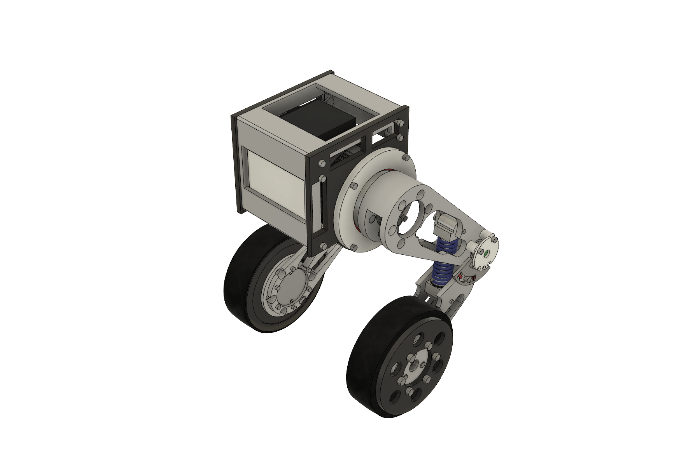
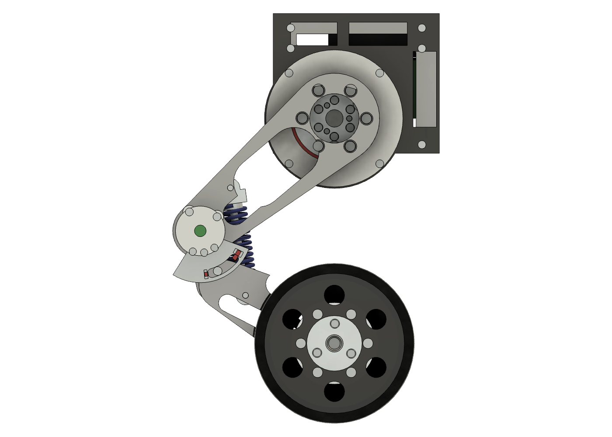
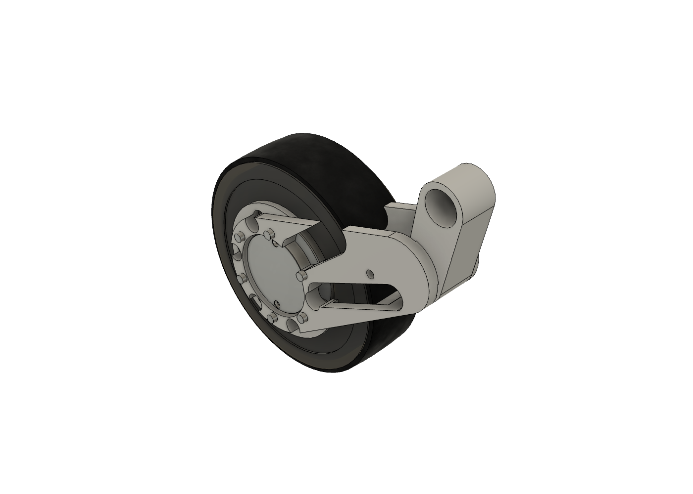
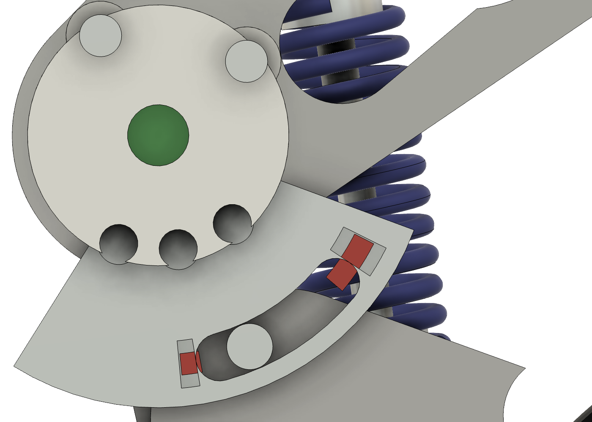

# Beni

A mostly 3D-printed wheeled biped with active shoulders, passive spring-loaded
knees, and a driven wheel on each leg. A complete ABS single-leg integration
article is the active build; PA-CF structural printing is deferred to the later
two-leg build.

**[Current status](PROJECT_STATUS.md)** · **[Mechanical design](beni_prototype1_design_record.md)** · **[Electronics](electronics/README.md)** · **[Firmware](firmware/README.md)** · **[Interactive viewer](web/)**

## Mechanisms

| Complete leg | Wheel motor and hub | Passive knee |
|:---:|:---:|:---:|
|  |  |  |

## Shoulder assembly path

| Plate first | Hub through plate | Final stack |
|:---:|:---:|:---:|
|  |  |  |

[Shoulder picture assembly guide](docs/assembly/shoulder_to_proximal_link.md) · [Heat-set receiver picture map](docs/assembly/heatset_receiver_map.md) · [Assembly-path evidence and acceptance result](evidence/shoulder_assembly/2026-08-23_plate_sequence/README.md) · [First-article prints](first_article_stl/README.md) · [Manufacturing constraints](MANUFACTURING_CONSTRAINTS.md)

The CAD gallery is exported from the live Fusion model with
[`readme_images_fusion.py`](readme_images_fusion.py) and should be refreshed with
model changes.

The passive-knee detail includes the live `Knee_Spring_L` helical body: Ø19 OD,
Ø2.6 wire and an 11.8-total-coil representation rebuilt to the current cartridge
length. The ordered part requirement remains 55 mm free length; CAD coil-bind
acceptance is governed by the specified 30.68 mm solid height and physical test.

---

<!-- PRINT_QUEUE_START -->
## Current print — convenience link

**Print one ABS shoulder hub now:** [direct raw-GitHub STL download](https://raw.githubusercontent.com/TnnsBeast/Biped/main/first_article_stl/assembly_dry_fit/ABS_FA_Shoulder_Output_Hub_L_D4p15_OWNED_M4x8_D5p30_PRINT_ORIENTED.stl).

This automatically maintained section links the next verified print. The
owner's Ø5.3 M4 × 8 ABS ladder passed on 2026-09-04; Fusion incorporated the
result in both documents. This hub retains the proven Ø4.15 motor-pin bores.

**Quantity 1, ABS.** Import the supplied orientation unchanged: broad Ø56
outboard flange on the bed, all critical bores vertical. No rotation, scaling,
hole compensation or supports. Use the same tuned enclosed ABS profile as the
passing coupon: 0.20 mm layers, 4 walls, 5 top/bottom layers, 30% infill; use a
brim if that profile needs one. The two Ø11 blind-relief ceilings and motor
counterbore shoulders bridge; check for loose/drooping strands before assembly.

**Acceptance:** while the hub is detached, install six owned **M4 × 8 inserts**
from the link face with a depth stop, flush at both ends, and let them cool.
Then repeat the unplugged GIM6010 motor fit: plate first, hub second; all three
pins enter with light finger pressure and all six M3 output screws start
freely. No screw pull-down. Use **M3 × 8** for the eight housing screws and
**M3 × 10** for the six output-hub screws.

**Keep the Ø19.10 proximal link and both bearings.** The six-screw link joint
remains on an assembly-path hold: two M4 heads collide on a straight approach
through the opposite arm. Check whether all six screws can be loaded into the
detached physical link without force before another link print is considered.
See the [shoulder guide](docs/assembly/shoulder_to_proximal_link.md).

Other bed-ready ABS files, quantity 1 each if needed: [shoulder plate](first_article_stl/assembly_dry_fit/ABS_FA_Chassis_Shoulder_Plate_L_M3_INSERTS_PRINT_ORIENTED.stl),
[cable cover](first_article_stl/assembly_dry_fit/ABS_FA_Shoulder_Cable_Cover_L_CLEARANCE_PRINT_ORIENTED.stl),
[wheel hub](first_article_stl/assembly_dry_fit/ABS_FA_Wheel_Hub_L_OWNED_M4x8_D5p30_PRINT_ORIENTED.stl), and
[stand](first_article_stl/mode_a/ABS_FA_RIG_Stand_M3_INSERTS_PRINT_ORIENTED.stl).
Use their unchanged supplied orientations and no supports; the stand requires
at least 300 mm bed length. Confirm the exact M3 insert coupon before heat
installation. Part-specific acceptance and limitations are in the
[receiver map](docs/assembly/heatset_receiver_map.md).

**Still held:** wheel rim (unsupported ledges), distal link (real steel-pin fit
and printability), knee collar (retention), and the complete wired fixture
(cable-post clash/floor disposition). The wheel hub is available for detached
motor fit while the rim is held. The next full-leg phase remains ABS,
wheel-clear and current-limited under self-weight only after all gates close;
no spring preload or structural loading. PA-CF is deferred.
<!-- PRINT_QUEUE_END -->
