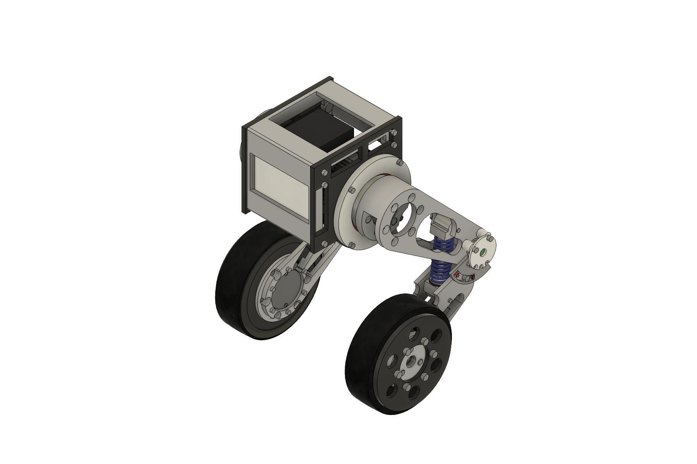
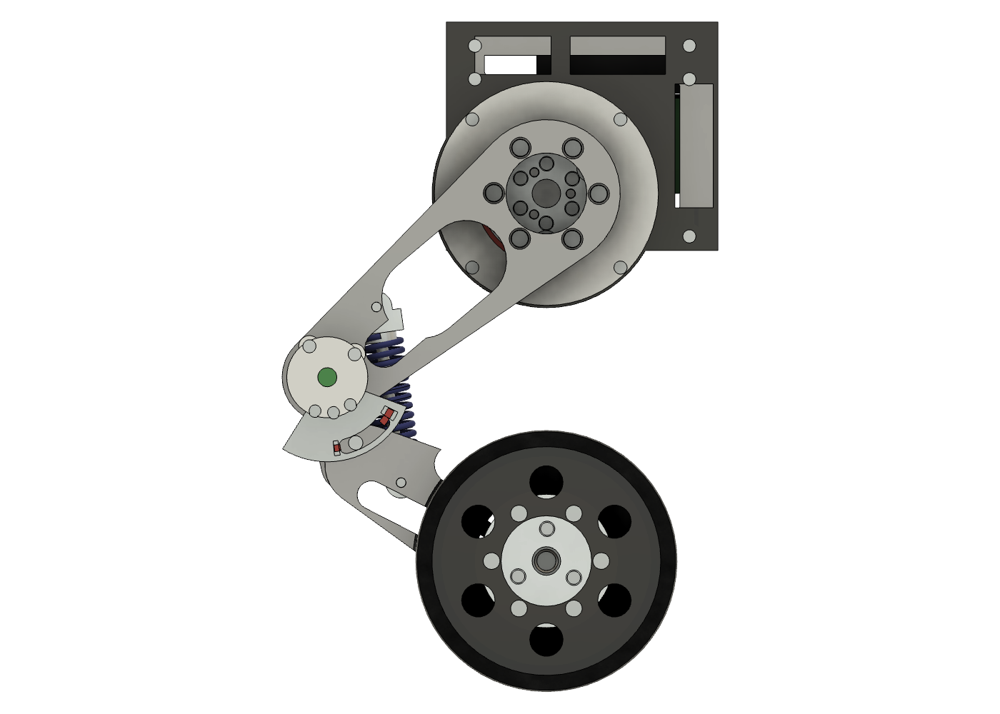
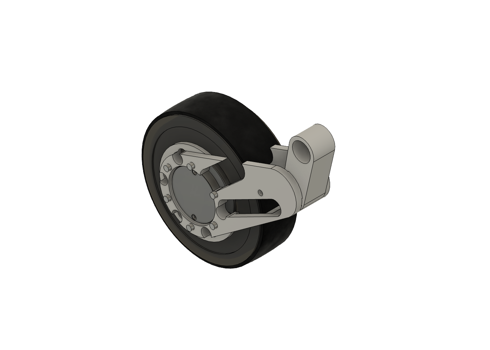
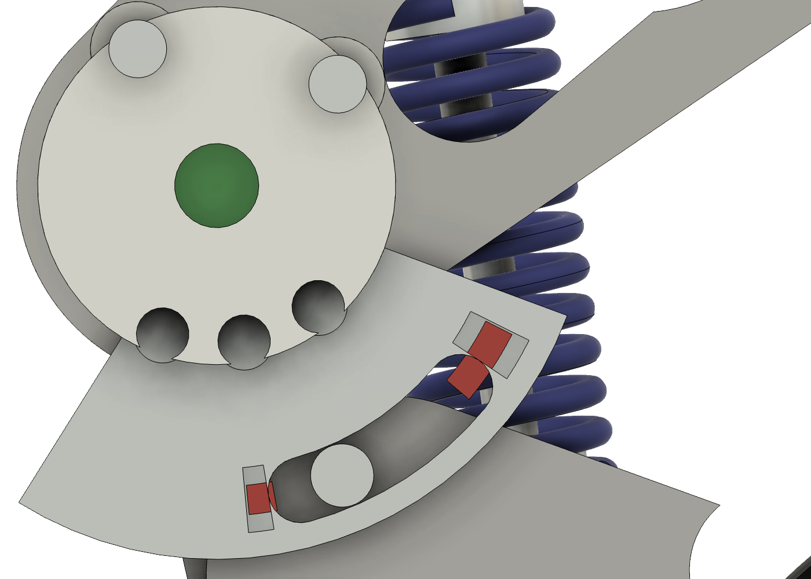

# Beni

A mostly 3D-printed wheeled biped moving to **Active-Knee Revision 2 (R2A)**:
active shoulder, a Beni-style crank-and-pushrod knee driven from the shoulder
axis, and a driven wheel on each leg. The current CAD gallery and assembled ABS
leg show the legacy passive-knee prototype. They remain the dimensional and
failure-analysis baseline while the new mechanism is designed.

**[Current status](PROJECT_STATUS.md)** · **[R2A plan](docs/design/active_knee_revision2_plan.md)** · **[Teardown evidence](evidence/reference/2026-09-25_beni_teardown/)** · **[Legacy mechanical design](beni_prototype1_design_record.md)** · **[Electronics](electronics/README.md)** · **[Firmware](firmware/README.md)** · **[Interactive viewer](web/)**

## Architecture direction

R2A removes the axial compression-spring cartridge and copies Beni's knee
drive. A second GIM6010-8 rides on the proximal-link root, coaxial with the
shoulder, and turns a crank inside the link. A rod-end pushrod drives a lever on
the distal link behind the knee.

This design:
- keeps the knee motor's mass on the shoulder axis;
- references the knee coordinate to the proximal link, so it does not depend on
  shoulder angle;
- extends the knee range to α 51…150° (a 128.5 mm stroke);
- reuses the owned shoulder and wheel actuators, the electronics, and the proven
  plate, hub, knee and wheel interfaces.

Concept work is on branch `r2a-active-knee`. See the
[R2A plan](docs/design/active_knee_revision2_plan.md), the
[actuator recommendation](docs/design/active_knee_actuator_trade_study.md) and
[`r2a_calc.py`](r2a_calc.py). Nothing is released for print or purchase until
the Fusion digital gate passes.

## Legacy mechanism and physical evidence

| Complete leg | Wheel motor and hub | Legacy passive knee |
|:---:|:---:|:---:|
|  |  |  |

The owner printed and assembled the corrected shoulder hub, proximal link and
distal link. Most interfaces work, but the spring compresses on a curved path,
twists near both ends and escapes sideways. The unloaded guide is disengaged
and does not enter reliably during compression. Keep this article spring-free
and unpowered. The full observation is recorded in the
[failure evidence](evidence/assembly/2026-09-24_spring_escape/).

A frame review of the public teardown (September 27) shows Beni's knee driven
from the hip: a hip-coaxial crank moves the shin through a link, and a
body-fixed motor drives each hip ring through a short toothed belt. No belt runs
down the leg. R2A copies the crank-and-link knee. See the
[timestamped evidence note](evidence/reference/2026-09-25_beni_teardown/)
and the [R2A work plan](docs/design/active_knee_revision2_plan.md).

## Existing assembly references

The following documents describe the legacy article and remain useful for
accepted fit results, hardware inventory and assembly-path lessons:

- [Illustrated passive-article assembly manual](docs/assembly/ordered_pin_picture_guide.md)
- [Shoulder close-up](docs/assembly/shoulder_to_proximal_link.md)
- [Heat-set receiver picture map](docs/assembly/heatset_receiver_map.md)
- [Assembly verification gate](ASSEMBLY_VERIFICATION.md)
- [First-article evidence and archived print files](first_article_stl/README.md)
- [Manufacturing constraints](MANUFACTURING_CONSTRAINTS.md)

The CAD gallery is exported from the live Fusion model with
[`readme_images_fusion.py`](readme_images_fusion.py). It must be refreshed only
after a verified R2A Fusion model changes the displayed robot, leg, wheel or
knee views.

---

<!-- PRINT_QUEUE_START -->
## Current print queue — no R2A parts released

Automatically maintained convenience section for the active build.

**Do not print another passive-knee spring part.** No Active-Knee Revision 2
part or STL has been released. The next printable items will be the new-fit
coupons and an unpowered ABS crank-and-pushrod article, after the R2A Fusion
digital gate proves the linkage, service paths and print orientation.

Keep the assembled legacy article spring-free and unpowered. Retain its parts,
owned actuators, bearings, pins and fasteners as evidence and possible reusable
hardware until the R2A BOM identifies them explicitly.
<!-- PRINT_QUEUE_END -->
