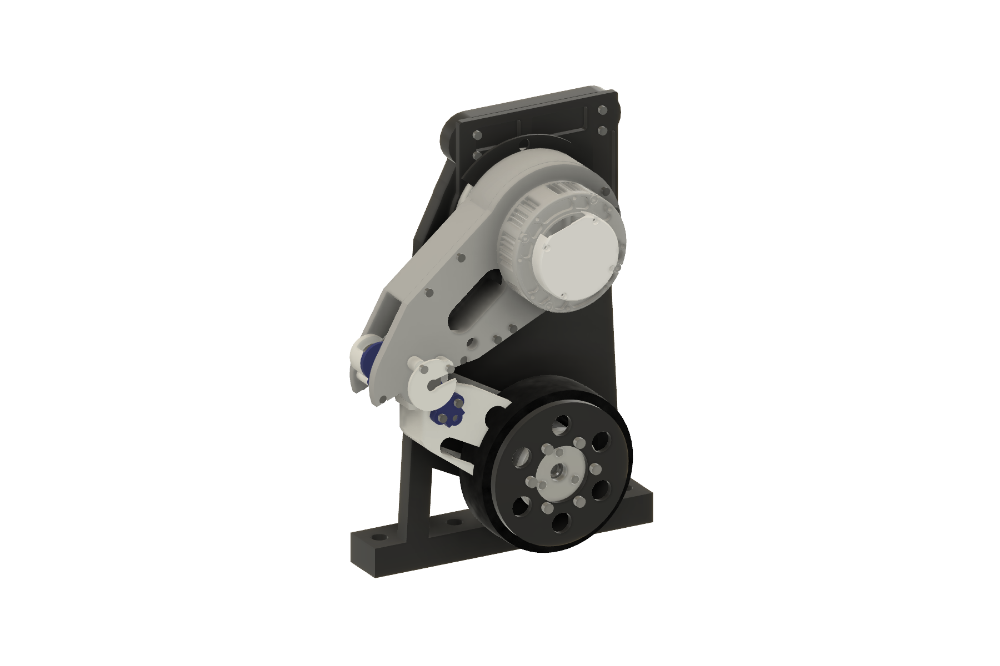
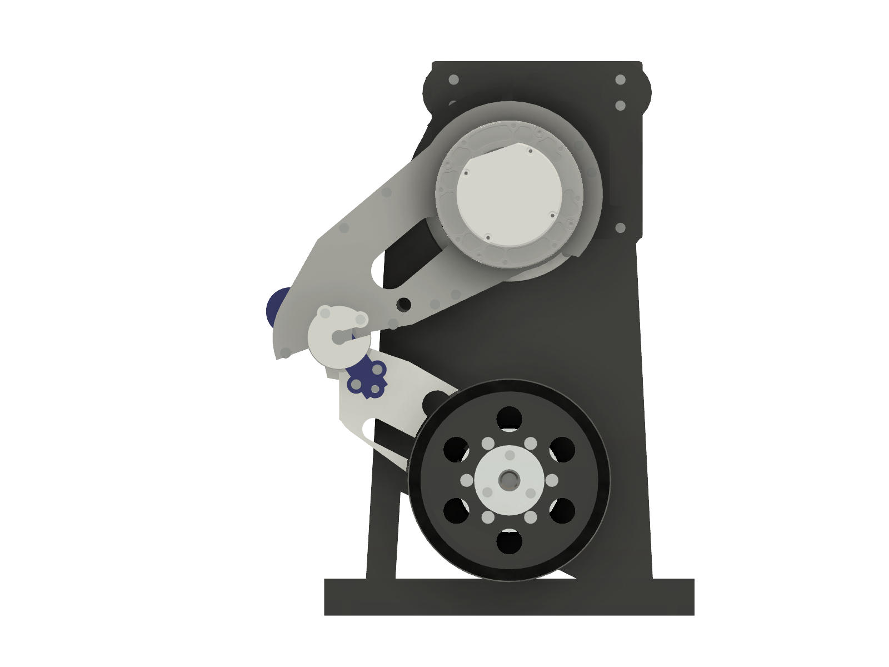
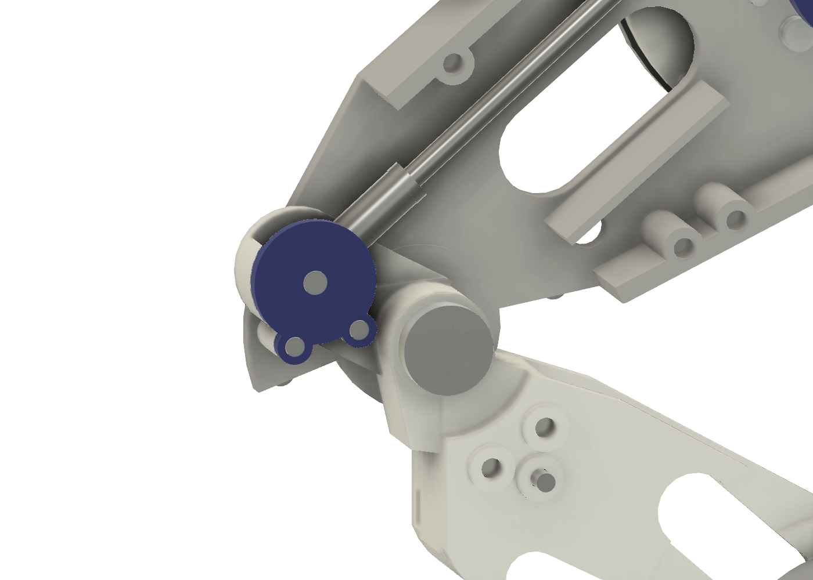
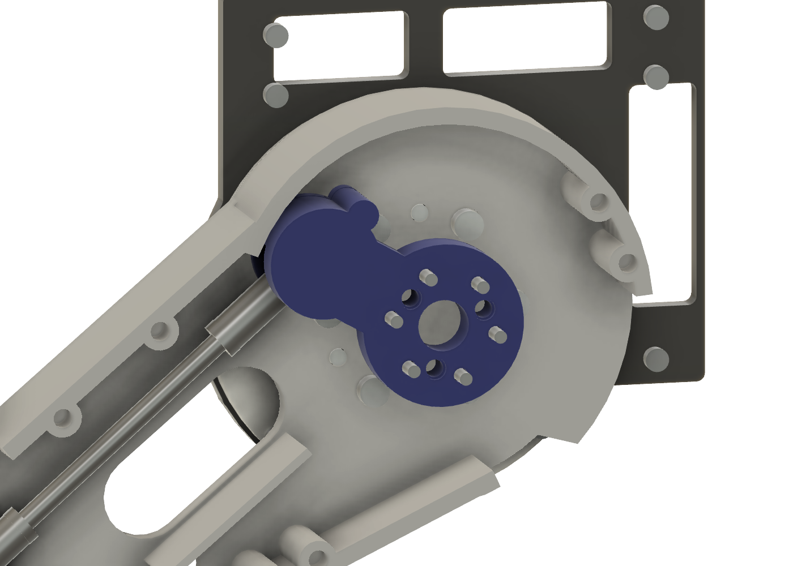
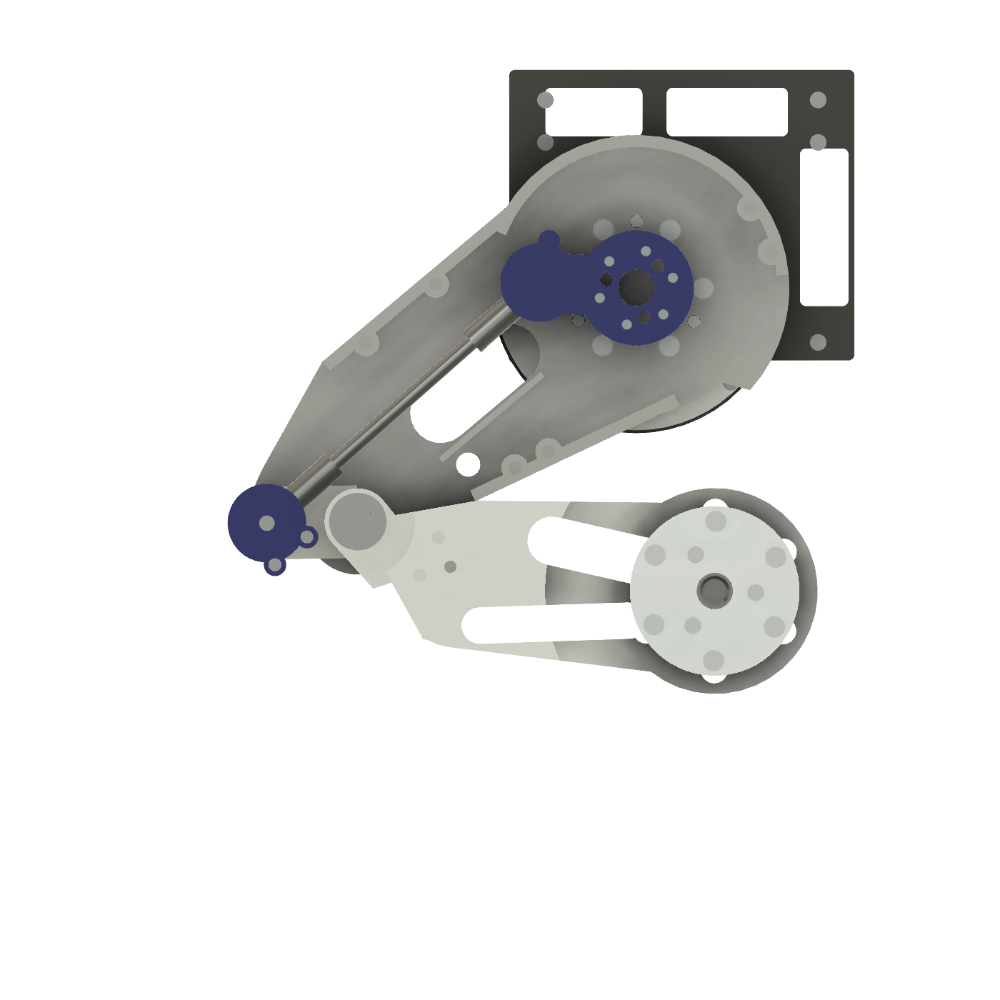
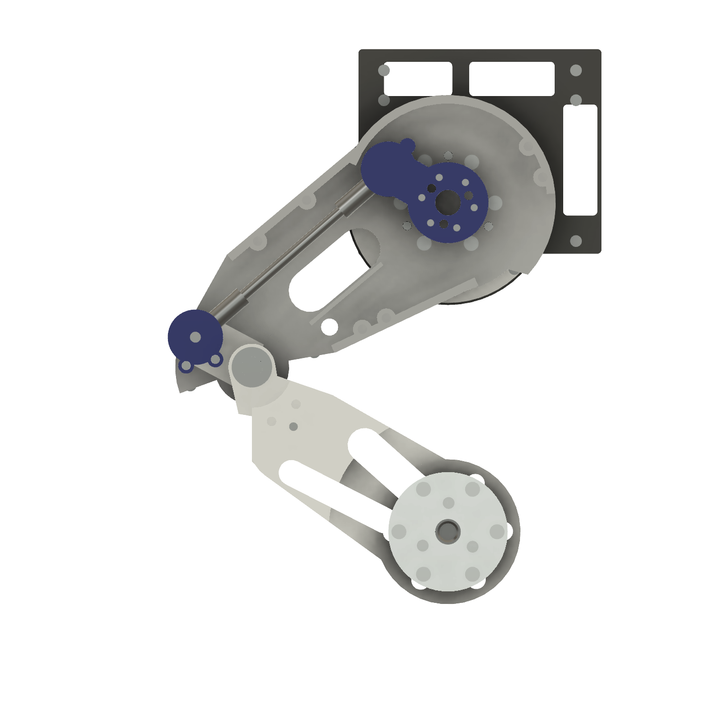
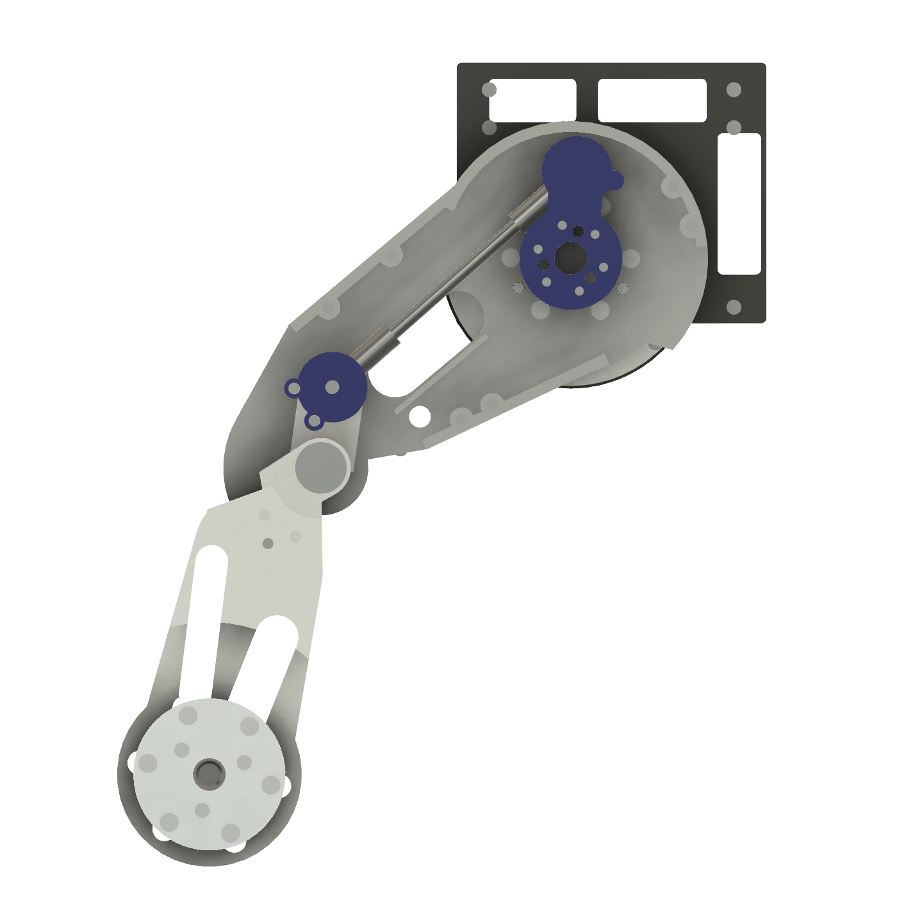

# Beni

A mostly 3D-printed wheeled biped. **Active-Knee Revision 2 (R2A)** gives each
leg three actuators: the shoulder GIM6010-8, a second GIM6010-8 coaxial with
the shoulder that drives the knee through a Beni-style crank and pushrod, and
the GIM4305-10 wheel. The single-leg ABS article is designed, CAD-verified and
released for printing. The first 23-piece coupon batch is printed; fit checks
and the complete proof-of-concept build remain pending.

**[Current status](PROJECT_STATUS.md)** · **[R2A plan](docs/design/active_knee_revision2_plan.md)** · **[POC guide](docs/assembly/r2a_poc_guide.md)** · **[POC print files](r2a_poc_stl/README.md)** · **[Print files](r2a_stl/README.md)** · **[Ordering guide](procurement/r2a_ordering_guide.md)** · **[Assembly guide](docs/assembly/r2a_assembly_guide.md)** · **[Test traveller](docs/assembly/r2a_test_traveller.md)** · **[CAD evidence](evidence/r2a/2026-09-27_digital_gate/README.md)** · **[Electronics](electronics/README.md)** · **[Firmware](firmware/README.md)**

## Where R2A stands

- **CAD:** Fusion `Beni_R2A_SingleLeg` holds the complete leg. A 140-pose
  sweep of knee and shoulder shows no real clash; 33 insertion, tool and
  service paths are `CAD PATH VERIFIED`; stops at α 51° / 150° are measured.
- **Linkage:** crank 32 mm, pushrod 120 mm, lever 30 mm; knee range α 51…150°,
  a 128.5 mm leg-length stroke ([`r2a_calc.py`](r2a_calc.py)).
- **Print:** three fit coupons first, then nine article parts, all ABS except
  four TPU stop plugs. One part, the AS5048A bracket, is on hold.
- **Proof of concept first:** printed stand-ins for every purchased part let
  the whole leg be built from owned hardware and prints and moved by hand,
  unpowered ([POC guide](docs/assembly/r2a_poc_guide.md)). CAD-verified
  2026-09-29; not yet built.
- **Buy, after the POC passes:** one knee GIM6010-8, M5 rod ends, rod and jam
  nuts, Ø5 × 18 pins, and a few small items. Prices and vendors are not
  confirmed.
- **Printed:** the 23-piece P1 coupon batch, owner reported October 2
  ([record](evidence/r2a/2026-10-02_p1_printed/README.md)). Fit checks are next.
- **Not yet done:** coupon acceptance, the remaining prints, the POC
  demonstration, the physical assembly rehearsal and the three test gates.

## The R2A leg

| On the stand, outboard | Knee | Crank on the knee actuator |
|:---:|:---:|:---:|
|  |  |  |

The linkage at the flexion stop, the build pose and the extension stop, seen
from outboard with the outboard half and knee actuator hidden:

| α = 51° | α = 80° | α = 150° |
|:---:|:---:|:---:|
|  |  |  |

The images are exported from the live Fusion model by
[`r2a_images_fusion.py`](r2a_images_fusion.py) through the Fusion MCP. Refresh
them only after a verified model change.

## Why the knee changed

The legacy passive knee used an axial compression spring. On the printed ABS
article the spring bowed, twisted and escaped sideways
([failure record](evidence/assembly/2026-09-24_spring_escape/)). A frame review
of a public Beni teardown showed its knee driven from the hip through a crank
and link ([evidence](evidence/reference/2026-09-25_beni_teardown/)). R2A copies
that: the knee actuator's weight stays on the shoulder axis, the knee angle is
referenced to the proximal link, and the proven shoulder, knee-pin and wheel
interfaces carry over.

## Legacy passive-knee baseline

The legacy Fusion documents `Beni_Prototype1` and `Beni_SingleLegRig` are
preserved unchanged, and the assembled legacy ABS article stays spring-free
and unpowered as fit and failure evidence. Its design records, assembly
manuals and archived print files start from
[`PROJECT_STATUS.md`](PROJECT_STATUS.md#legacy-single-leg-rig--physical-evidence-baseline);
the legacy CAD views are in [`docs/readme/`](docs/readme/).

---

<!-- PRINT_QUEUE_START -->
## Current print queue — R2A all-printed proof of concept first

Automatically maintained convenience section for the active build. Branch
`r2a-active-knee`, POC released 2026-09-29. Import every file **unchanged**:
it is already in its print orientation. Profile: enclosed ABS, 0.20 mm
layers, 4 walls, 5 top / 5 bottom, 30 % infill; no hole compensation; **no
supports on any POC file**.

**1. The proof of concept (POC) needs nothing bought.** Printed stand-ins
replace the knee actuator, rod ends, rod, jam nuts, Ø5 pins, 6800 bearings
and M2.5 × 10 screws. The build and the hand demonstration are in the
[POC guide](docs/assembly/r2a_poc_guide.md). It is unpowered and unloaded.

**P1 is printed — test it first.** The owner reports the complete 23-piece
batch printed ([record](evidence/r2a/2026-10-02_p1_printed/README.md)). Pass
every [POC acceptance test](r2a_poc_stl/README.md#acceptance-tests) before
printing P2. The P1 links below remain references for the printed parts:

1. [Printed clevis pins](https://raw.githubusercontent.com/TnnsBeast/Biped/r2a-active-knee/r2a_poc_stl/POC_Clevis_Pin_D4p75x18_ABS_ON_END.stl) — **4 ×**, on end. Pass: slides through the pin-ladder coupon's Ø5.15 station by hand.
2. [Rod-eye coupon](https://raw.githubusercontent.com/TnnsBeast/Biped/r2a-active-knee/r2a_poc_stl/POC_COUPON_Rod_Eye_ABS.stl) + [thrust washers](https://raw.githubusercontent.com/TnnsBeast/Biped/r2a-active-knee/r2a_poc_stl/POC_Eye_Thrust_Washer_D11x1p5_ABS.stl) (**6 ×**) — flat / on face. Pass: eye and two washers in the crank-clevis coupon swing freely; the pin withdraws by hand.
3. [Mock rotor stub](https://raw.githubusercontent.com/TnnsBeast/Biped/r2a-active-knee/r2a_poc_stl/POC_COUPON_Mock_Rotor_Stub_ABS.stl) + [mock housing ring](https://raw.githubusercontent.com/TnnsBeast/Biped/r2a-active-knee/r2a_poc_stl/POC_COUPON_Mock_Housing_Ring_ABS.stl) — output / mount face down. Pass: the ring turns freely on the stub; the crank-register coupon sits flat on three dowels and clamps with M3 × 10.
4. [Bushing-seat coupon](https://raw.githubusercontent.com/TnnsBeast/Biped/r2a-active-knee/r2a_poc_stl/POC_COUPON_Bushing_Seat_ABS.stl) + [knee bushings](https://raw.githubusercontent.com/TnnsBeast/Biped/r2a-active-knee/r2a_poc_stl/POC_Knee_Bushing_OD18p90_ID10p60_ABS_ON_END.stl) (**3 ×**) — hub face down / on end. Pass: bushing seats by thumb and holds; the steel Ø10 pin turns in it.
5. [Tyre-gauge lip coupon](https://raw.githubusercontent.com/TnnsBeast/Biped/r2a-active-knee/r2a_poc_stl/POC_COUPON_Tyre_Gauge_Lip_ABS.stl) — lip down. Pass: slides onto the no-tyre shell by hand and stays.

**Then the POC parts**, 1 × ABS each unless stated:

| File | On the bed |
|---|---|
| [Mock actuator housing](https://raw.githubusercontent.com/TnnsBeast/Biped/r2a-active-knee/r2a_poc_stl/POC_Knee_Actuator_Mock_Housing_L_ABS_MOUNT_FACE_DOWN.stl) | Mount face |
| [Mock actuator rotor](https://raw.githubusercontent.com/TnnsBeast/Biped/r2a-active-knee/r2a_poc_stl/POC_Knee_Actuator_Mock_Rotor_L_ABS_OUTPUT_FACE_DOWN.stl) | Output face |
| [Mock actuator knob](https://raw.githubusercontent.com/TnnsBeast/Biped/r2a-active-knee/r2a_poc_stl/POC_Knee_Actuator_Mock_Knob_L_ABS_OUTER_FACE_DOWN.stl) | Outer face |
| [Knob lock pin](https://raw.githubusercontent.com/TnnsBeast/Biped/r2a-active-knee/r2a_poc_stl/POC_Knob_Lock_Pin_ABS_HEAD_DOWN.stl) — **2 ×** | Head |
| [Pushrod](https://raw.githubusercontent.com/TnnsBeast/Biped/r2a-active-knee/r2a_poc_stl/POC_Pushrod_L_ABS_FLAT.stl) | Flat |
| [M2.5 washer, 2.0 mm](https://raw.githubusercontent.com/TnnsBeast/Biped/r2a-active-knee/r2a_poc_stl/POC_Washer_M2p5_2p0_ABS.stl) — **8 ×** | Face |
| [Knee protractor](https://raw.githubusercontent.com/TnnsBeast/Biped/r2a-active-knee/r2a_poc_stl/POC_Knee_Protractor_L_ABS_FLAT.stl) | Flat, scale up |
| [Tyre gauge ring Ø110](https://raw.githubusercontent.com/TnnsBeast/Biped/r2a-active-knee/r2a_poc_stl/POC_Tyre_Gauge_Ring_D110_ABS_LIP_DOWN.stl) | Lip |
| [Feeler 4.0 / 5.0](https://raw.githubusercontent.com/TnnsBeast/Biped/r2a-active-knee/r2a_poc_stl/POC_Feeler_4p0_5p0_ABS_FLAT.stl) | Flat |

Details and every acceptance test: [POC print traveller](r2a_poc_stl/README.md).

**2. The R2A article parts, used by the POC unchanged.** Print these for the
POC too. The finished article additionally needs the **purchased** knee
GIM6010-8, rod ends, rod, jam nuts, Ø5 × 18 pins, 6800-2RS pair and
M2.5 × 10 ([ordering guide](procurement/r2a_ordering_guide.md)); buy them
only after the POC passes.

- Article coupons: [pin and dowel ladder](https://raw.githubusercontent.com/TnnsBeast/Biped/r2a-active-knee/r2a_stl/R2A_COUPON_Pin_Dowel_Ladder_ABS.stl), [crank register](https://raw.githubusercontent.com/TnnsBeast/Biped/r2a-active-knee/r2a_stl/R2A_COUPON_Crank_Register_ABS.stl), [crank clevis](https://raw.githubusercontent.com/TnnsBeast/Biped/r2a-active-knee/r2a_stl/R2A_COUPON_Crank_Clevis_ABS.stl) + a crank cap.
- Article parts, 1 × ABS each unless stated: [proximal inboard half](https://raw.githubusercontent.com/TnnsBeast/Biped/r2a-active-knee/r2a_stl/R2A_Prox_Inboard_L_ABS_Y59p5_DOWN.stl), [proximal outboard half](https://raw.githubusercontent.com/TnnsBeast/Biped/r2a-active-knee/r2a_stl/R2A_Prox_Outboard_L_ABS_Y91p1_DOWN.stl), [crank](https://raw.githubusercontent.com/TnnsBeast/Biped/r2a-active-knee/r2a_stl/R2A_Crank_L_ABS_OUTPUT_FACE_DOWN.stl), [crank cap](https://raw.githubusercontent.com/TnnsBeast/Biped/r2a-active-knee/r2a_stl/R2A_Crank_Cap_L_ABS_OUTER_FACE_DOWN.stl) (**2 ×**), [distal link](https://raw.githubusercontent.com/TnnsBeast/Biped/r2a-active-knee/r2a_stl/R2A_Distal_Link_L_ABS_Y59p5_DOWN.stl) (**painted supports only**, see [traveller](r2a_stl/README.md#distal-link-supports)), [lever cap](https://raw.githubusercontent.com/TnnsBeast/Biped/r2a-active-knee/r2a_stl/R2A_Lever_Cap_L_ABS_OUTER_FACE_DOWN.stl), [encoder arm](https://raw.githubusercontent.com/TnnsBeast/Biped/r2a-active-knee/r2a_stl/R2A_Encoder_Arm_L_ABS_TOP_FACE_DOWN.stl), [knee-pin cap](https://raw.githubusercontent.com/TnnsBeast/Biped/r2a-active-knee/r2a_stl/R2A_Knee_Pin_Cap_L_ABS_OUTER_FACE_DOWN.stl), [TPU stop plug](https://raw.githubusercontent.com/TnnsBeast/Biped/r2a-active-knee/r2a_stl/R2A_Knee_Bumper_TPU95A_D6x4.stl) (**4 × TPU 95A**, on end, 100 % infill).

Acceptance: [article print traveller](r2a_stl/README.md#acceptance-tests).

**On hold:** `R2A_Encoder_Bracket_L`, until the AS5048A adapter-board outline
is known; the POC protractor uses its inserts meanwhile. **Retired:** every
legacy spring, cartridge, stop-plate and link print. Reused as printed:
shoulder hub, shoulder plate, cable cover, stand, cable post, wheel hub and
no-tyre shell.
<!-- PRINT_QUEUE_END -->
