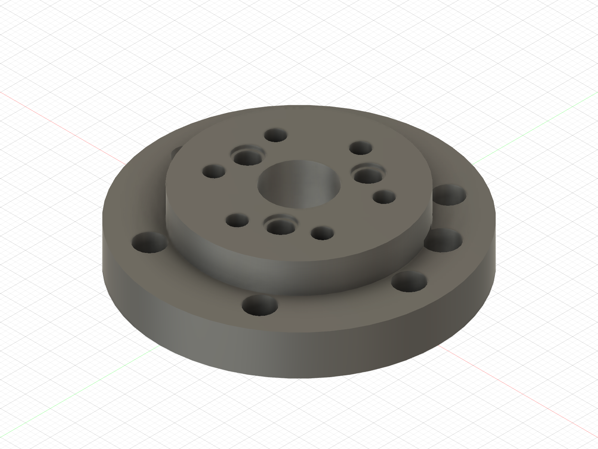

# Picture guide — printed threaded receivers

This is the installation map for every existing printed part that owns a
female thread. It separates receiver parts from clearance parts and records
the screw direction that remains accessible in the assembled robot.

The complete single-leg article is ABS. PA-CF coupons and structural prints
wait for the later two-leg build.

## Release status — updated 2026-09-23

The owner successfully installed inserts in the earlier Ø5.3 shoulder hub and
confirmed all six M4 screws seat in the earlier corrected proximal link. Keep
those physical results as evidence. The active hub and proximal link are the
PINREV2 reprints (Ø4.30 root-dowel and clevis-link holes); install inserts only
in those new prints. Their receivers are unchanged: six Ø5.3 M4 in the hub,
five Ø4.5 M3 in the link, with the corrected M4 access paths. The owner
confirmed on September 23 that the stand and shoulder plate in hand are the
Ø4.5 prints. [Owner report](../../evidence/assembly/2026-09-23_owner_stand_plate_and_washers/).
[Physical acceptance](../../evidence/assembly/2026-09-07_owner_mockup/). Use the
[current print queue](../../README.md#current-print--ordered-pin-unpowered-abs-mechanical-article) and
[access audit](../../evidence/assembly/2026-09-05_access_fix/).
The final tyre-compatible wheel rim retains its independent printability hold.
The support-free no-tyre shell is released separately for the suspended,
unpowered September 17 mechanical test only.

The general gauge's nominal Ø4.0 M3 station was too small. The owner then
reported that the largest, unmarked-end pocket on the dedicated Ø4.1–4.5
[M3 ladder](../../first_article_stl/insert_fit/) works best. That station is
nominal Ø4.5. Fusion now carries Ø4.5 through the active ABS receiver family.
[Physical selection and limitations](../../evidence/inserts/2026-09-14_m3_coupon_pass/).

## Insert redesign retained from 2026-09-03

- The shoulder and wheel M4 joints now use the owner's Kadriick M4 × 8 inserts;
  procurement of a separate short family is no longer required.
- The shoulder receiver runs through the full 8.0 mm flange.
- The wheel hub embeds 6.0 mm of the insert; the remaining 2.0 mm nests in six
  new `Wheel_Rim_L` reliefs without changing the frozen Y stack.
- The stand has five Voron-style M3 pockets instead of Ø5 clearance bores.
- Cable-cover inserts moved from the removable cover into the shoulder plate;
  all four screws are now reachable from outboard.
- The future chassis frame and deferred Mode-B carriage now have explicit
  receiver bosses/pockets.
- `RIG_Knee_Collar_L` is not a heat-set joint and is **not released**: its
  current geometry cannot retain the pin.

## Shoulder hub — six M4 inserts

- Status: **PINREV2 HUB REPRINT PENDING / INSERT INSTALLATION PENDING.** The
  earlier hub's insert and six-screw pass does not establish the new print's
  physical fit. Do not install inserts in the superseded September 22 hub.
- Receiver: 6 × owner-selected Ø5.3 through the 8.0 mm flange.
- Insert: 6 × owner-held Kadriick M4 × 8, installed from the outboard/link
  face with a depth stop and flush at both ends.
- Fastener: 6 × M4 × 10 through the proximal-link root.
- Result: 6.2 mm thread engagement; screw tip stops 1.8 mm before the
  motor-side insert end.
- The three Ø4.30 × 5.0 root-dowel sockets must stay clear of the iron and
  molten ABS. Install the three Ø4 × 10 dowels after the inserts cool.

The earlier Ø4.15 hub with successfully installed Ø5.3 inserts remains
historical physical evidence; it is superseded for this pin-based assembly.

## Shoulder plate and cable cover — four M3 inserts total

| Receiver: shoulder plate | Clearance part: cable cover |
|:---:|:---:|
|  |  |

- **ABS RELEASE:** the current plate receivers are owner-selected Ø4.5 through
  5.0 mm. Replace a prior Ø4.0 plate, then install 4 × approved 5 mm
  Voron-style M3 inserts flush from the
  shoulder plate's **outboard** face.
- Put **no inserts** in the cover. Its four holes are Ø3.4 clearance.
- Drive 4 × M3 × 10 from the cover's exposed outboard face. Each screw crosses
  6.5 mm of cover, engages 3.5 mm of brass and stops 1.5 mm before the plate's
  inboard face.
- This screw direction remains available after the stand or chassis frame is
  fitted. Remove the link before removing the cover. With revised cable post A,
  use two M3 × 12 through the upper cover positions; the lower two remain ×10.
  The added 2 mm post thickness preserves the same engagement and tip clearance.

## Proximal link — five M3 inserts

The image records the earlier Ø19.10 bearing-fit article. The printed corrected
Ø19.15 link passed all six M4 hub screw seats, but has the failed Ø4.0 M3
pockets. Retain it as physical evidence. The current PINREV2 proximal link
(reprint pending) has five Ø4.5 × 5.0 pockets: three for the knee stop plate
and two for the encoder bracket. Install the five M3 inserts in that new part
only after checking its bearing seats and screw-access paths.

## Mode A stand — five M3 inserts

- Status: **ABS PRINT RELEASE.** Fusion verifies the source and clean bed-ready
  STL after the Ø4.5 promotion.
- Receiver: 5 × Ø4.5 × 6.0 blind pockets from the y = 42 mount face.
- Insert: 5 × approved 5 mm Voron-style M3.
- Fastener: 5 × M3 × 10 through the 5 mm shoulder plate.
- Clearance: 1.0 mm below the insert and a 6.0 mm printed floor.

## Wheel hub and rim — six owned M4 × 8 inserts

| Wheel hub — printed; physical checks pending | Rim — printability hold |
|:---:|:---:|
|  |  |

- Status: **hub PRINTED; insert installation/detached motor fit pending; rim
  DO NOT PRINT**. [Owner print completion](../../evidence/assembly/2026-09-07_small_parts_printed/).
  The rim's 14 mm inward
  ledge and outer flange overhang invalidate the former no-support instruction.
- Hub receiver: 6 × owner-selected Ø5.3 through 6.0 mm.
- Insert: 6 × owner-held Kadriick M4 × 8. Install from the motor face with a
  depth stop, leaving 2.0 mm projecting from the outboard/rim face.
- Rim: 6 × Ø6.0 × 2.2 coaxial reliefs from the hub-mating face, with a 1.0 mm
  ligament to the Ø38 web opening; it owns no
  inserts.
- Fastener: 6 × M4 × 8 through the 4.0 mm rim web.
- Result: 6.0 mm thread engagement, 2.0 mm screw clearance to the insert's
  motor-side end, 0.25 mm radial and 0.20 mm axial protrusion clearance.

After the screws are removed, the rim services straight outboard along the six
open coaxial reliefs. M4 × 10 was rejected because its additional 2.0 mm of
projection requires more rim relief without adding useful engagement.

## Deferred receivers already corrected in source

| Part | Receiver geometry | Status |
|---|---|---|
| `Chassis_Frame` | 10 Ø4.5 × 6.0 M3 pockets in Ø10 × 6.5 bosses | master source and B-Rep audit updated; repeat coupon for PA-CF before two-leg print release |
| `RIG_Carriage` | builder inherits five Ø4.5 × 6.0 M3 plus 4 × Ø5.3 through M4 receivers for owned M4 × 8 | stripped/deferred component not rebuilt; repeat coupon and rebuild/verify in Fusion when Mode B returns |
| optional M2 satellite-PCB boss | no existing part | architecture decision remains open; do not invent receivers |

## Installation gate

1. The existing Ø4.0 ABS station failed. The owner selected the dedicated
   ladder's unmarked-end Ø4.5 station. Use Ø4.5 only with the same ABS profile;
   repeat the ladder for any other process or the later PA-CF build.
2. The owned M4 × 8 ladder is complete: Ø5.3 is the owner-confirmed ABS PASS.
   Use the same profile and vertical bore axis for the released hub files.
3. Heat inserts with a perpendicular, depth-controlled tip; stop flush and let
   the part cool without a screw installed.
4. Start every screw with fingers. Never use screw torque to seat a printed
   part or straighten an insert.
5. Keep the motors unplugged. The earlier link's six-screw seating check is
   historical evidence; complete the new link's root-dowel face mating and
   six-screw seating check using the
   [current traveller](../../first_article_stl/ordered_pin_integration/README.md#ordered-assembly).

For the complete shoulder order and link attachment, continue with the
[shoulder-to-proximal picture guide](shoulder_to_proximal_link.md).
