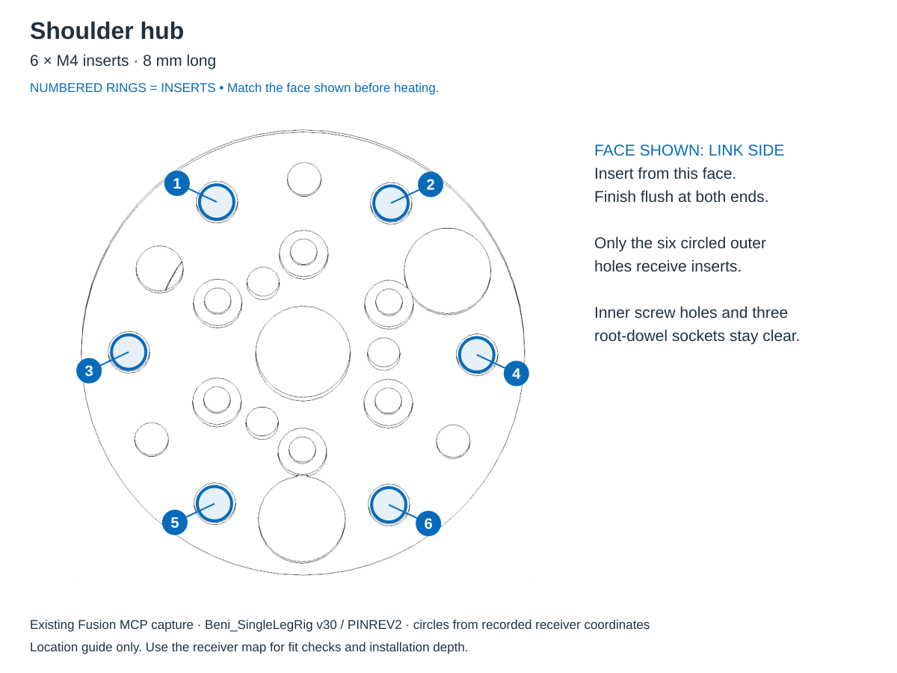
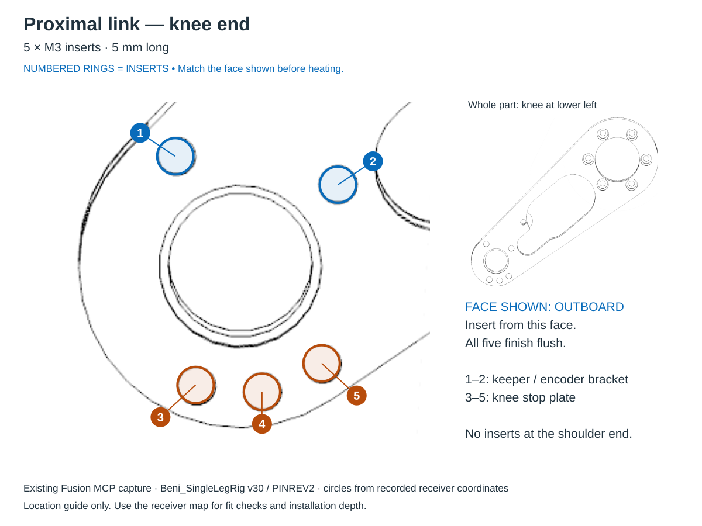
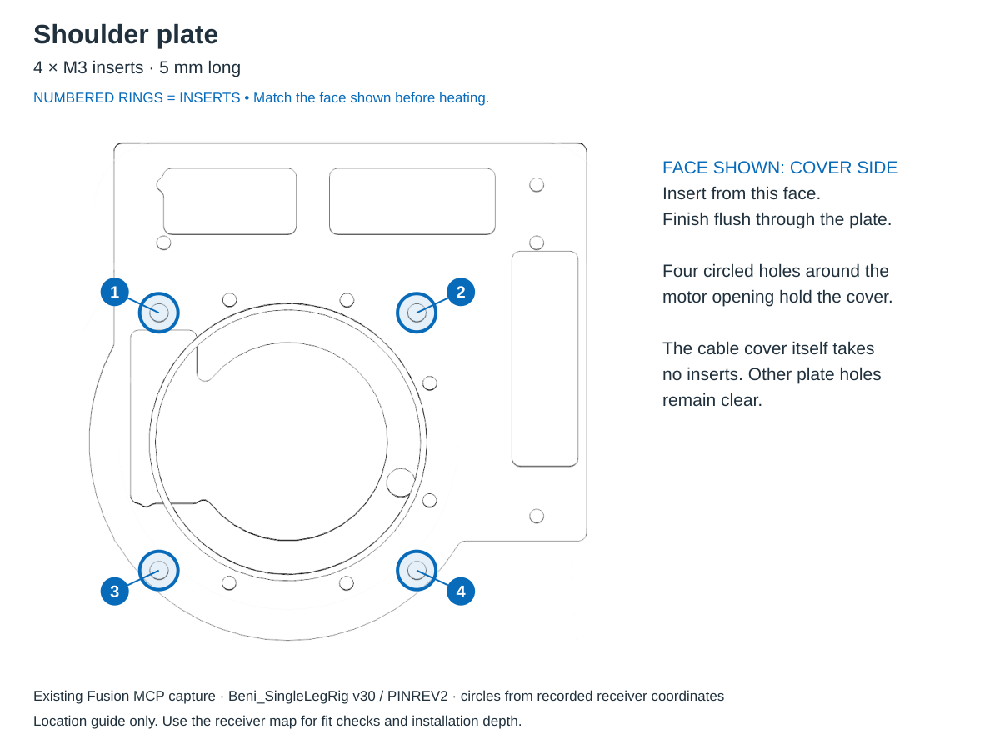
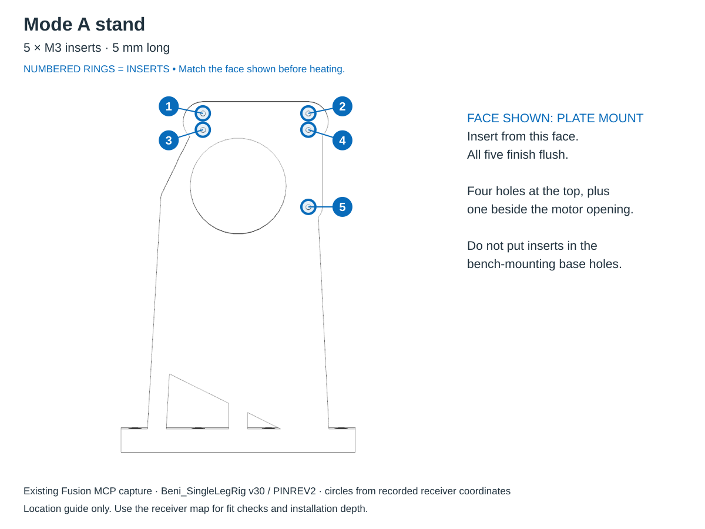
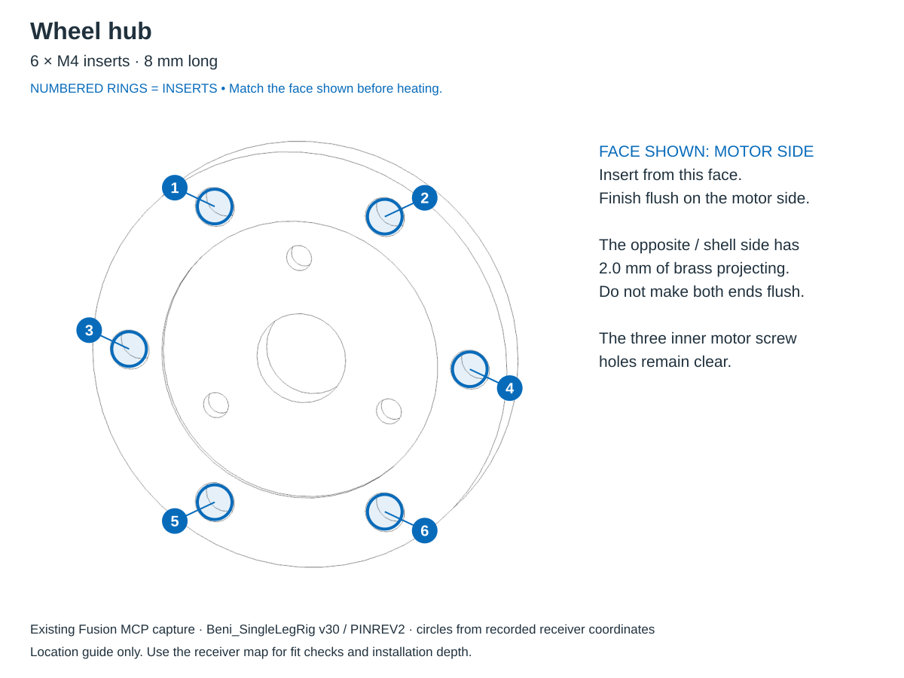

# Heat-set insert map — active ABS single leg

**Five parts receive inserts: 14 × M3 (5 mm long) and 12 × M4 (8 mm long).**
Use the approved Voron-style M3 and owned Kadriick M4 × 8 inserts.
The owner reports the three PINREV2 replacement parts printed. Of those three,
only the **shoulder hub and proximal link** receive inserts; the distal link
receives none. Skip inserts already fitted in accepted retained parts.

Each picture below faces the **insert-entry side**. **Numbered rings mark the
insert holes**; unmarked holes do not receive inserts. Numbers identify holes,
not an installation sequence. Click a picture to enlarge it.

| Part | Install | Entry face | Finished depth |
|---|---|---|---|
| [New shoulder hub](#shoulder-hub--6-m4) | 6 × M4 × 8 | Outboard: meets the proximal link | Flush at both ends |
| [New proximal link](#proximal-link--5-m3) | 5 × M3, 5 mm long | Outboard knee face: stop plate / keeper side | Flush |
| [Shoulder plate](#shoulder-plate--4-m3) | 4 × M3, 5 mm long | Outboard: cable-cover side | Flush at both ends |
| [Mode A stand](#mode-a-stand--5-m3) | 5 × M3, 5 mm long | Shoulder-plate mounting face | Flush; 1.0 mm remains below insert |
| [Wheel hub](#wheel-hub--6-m4) | 6 × M4 × 8 | **Motor side** | Flush on motor side; **2.0 mm projects on shell side** |

## Shoulder hub — 6 M4

Use the **new PINREV2 hub**. Install six M4 × 8 inserts into the numbered
Ø5.3 through holes in its outer flange, from the face that meets the proximal
link. The flange is 8.0 mm thick, so both insert ends finish flush.

The inner motor-screw holes and the three Ø4.30 root-dowel sockets take **no
inserts**. Keep the dowel sockets clear of the iron and molten plastic. Fit the
three root dowels only after the inserts have cooled. The six M4 × 10 screws
later pass through the proximal root and thread into these hub inserts.

## Proximal link — 5 M3

Use the **new PINREV2 proximal link**. Find the **small knee-bearing end**, then
turn the part to the outboard face with **five small blind pockets** around the
bearing opening. The large shoulder ring is at the opposite end of the link.

- **Blue 1–2:** two M3 inserts for the encoder bracket used as the knee-pin keeper.
- **Orange 3–5:** three M3 inserts for the knee stop plate.

All five inserts are 5 mm long and finish flush in Ø4.5 × 5.0 mm blind pockets.
The six shoulder-root screw paths take **no inserts**: their screws thread into
the shoulder hub. The stop plate and keeper bracket themselves also take none.

## Shoulder plate — 4 M3

Face the side with the raised cable-routing lip around the motor opening—the
side that meets the cable cover. Install four 5 mm M3 inserts in the **four
numbered holes around that opening**, flush through the 5.0 mm plate.

The other holes are screw clearances. In particular, the plate-to-stand screws
pass through the plate and thread into the **stand's** inserts. Put **no inserts
in the cable cover or front cable post**.

## Mode A stand — 5 M3

Face the upright surface that meets the shoulder plate, with the bench base
at the bottom. Install five 5 mm M3 inserts: **four near the top, plus the fifth
beside the motor opening**, as numbered. These Ø4.5 × 6.0 mm blind pockets leave
1.0 mm below a flush insert. The base's bench-mounting holes take no inserts.

The stand and shoulder plate in hand were confirmed as the current Ø4.5
receiver prints on September 23.

## Wheel hub — 6 M4

Install six M4 × 8 inserts in the **six outer numbered holes**, entering from
the **motor face shown**. Leave the three smaller inner motor-screw holes clear.

**This is the depth exception:** the hub is 6.0 mm thick and each insert is
8.0 mm long. Stop flush on the motor face, leaving **2.0 mm of brass projecting
from the opposite, wheel-shell face**. Those ends enter the shell's reliefs.
Do not try to make both ends flush. The no-tyre wheel shell takes no inserts.

## Parts that receive no inserts

Distal link, knee stop plate, cable cover, front cable post, upper and lower
spring eyes, guide bar, knee-pin spacer, encoder/keeper bracket and no-tyre
wheel shell.

## Before and after heating

1. Rehearse the [detached fit checks](../../first_article_stl/ordered_pin_integration/README.md#ordered-assembly)
   first, including the new link's bearing seats and screw paths. Install
   inserts with the parts detached and motors unplugged.
2. Use the selected ABS receiver sizes: Ø4.5 for M3 and Ø5.3 for M4. Do not
   install into superseded Ø4.0 M3 prints. These fit selections apply to the
   same ABS profile; PA-CF needs new coupons later.
3. Use a perpendicular, depth-controlled tip. Follow the finished depths above,
   especially the wheel-hub projection. Let the part cool without a screw fitted.
4. Reject tilted or loose inserts, or an end standing proud where flush is
   required. Start screws with fingers; never use screw torque to straighten
   an insert or draw incompatible parts together.

## Sources and drawing provenance

Dimensions and hardware follow the [canonical threaded-interface map](../../MANUFACTURING_CONSTRAINTS.md#threaded-interfaces-in-printed-parts)
and the [current ordered-pin traveller](../../first_article_stl/ordered_pin_integration/README.md).
Earlier hub installation and screw-seat passes remain historical evidence;
new-print installation and fit still require physical checks.

These diagrams reuse **unchanged Fusion MCP captures of corrected v30 / PINREV2**
from the [assembly manual](manual/README.md). The numbered rings use the
recorded receiver coordinates in [its manifest](manual/views/manifest.json),
selecting the entry-face mouth for each hole. The proximal close-up is a viewport
onto that same capture. No geometry is generated or inferred from an STL.

Rebuild the SVG documentation overlays with
`python3 docs/assembly/heatset/build_map.py`. This does not operate Fusion or
change the source captures. New CAD views must be captured through Fusion MCP.
Future chassis-frame, Mode B carriage and optional electronics receivers remain
in the [canonical deferred-interface table](../../MANUFACTURING_CONSTRAINTS.md#threaded-interfaces-in-printed-parts);
they are outside this assembly.
