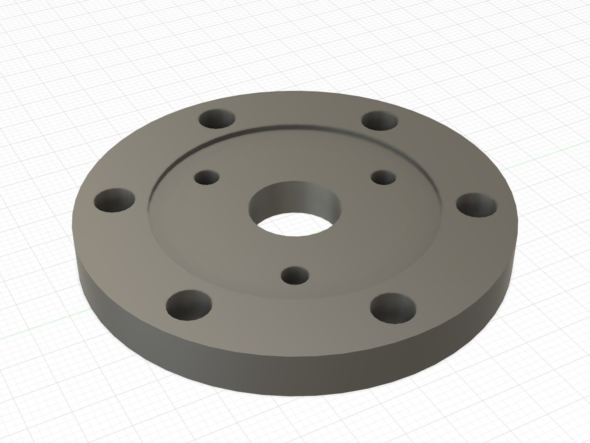
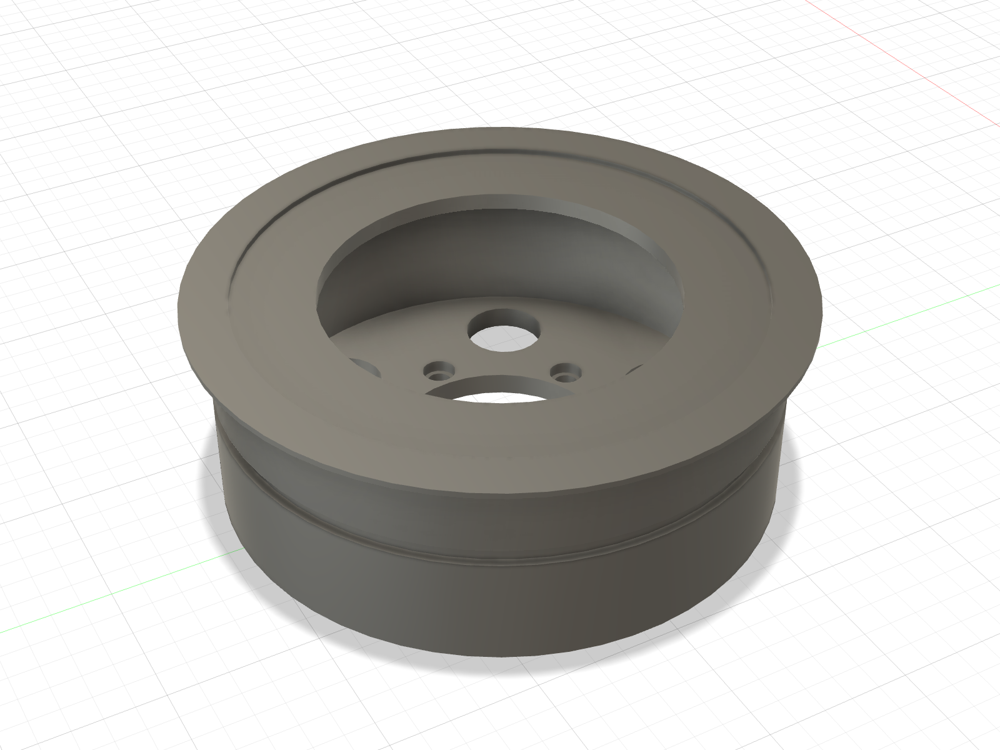

# Picture guide — printed threaded receivers

This is the installation map for every existing printed part that owns a
female thread. It separates receiver parts from clearance parts and records
the screw direction that remains accessible in the assembled robot.

The complete single-leg article is ABS. PA-CF coupons and structural prints
wait for the later two-leg build.

## Release status — 2026-09-07

The owner successfully printed and installed inserts in the Ø5.3 shoulder hub.
Keep it. The replacement proximal link clears two obstructed M4 head paths and
restores one incomplete seat; its five knee M3 mouths remain clear. The owner
is now using this replacement and confirms all six M4 screws seat properly.
[Physical acceptance](../../evidence/assembly/2026-09-07_owner_mockup/). Use the
[current print queue](../../README.md#current-print--convenience-link) and
[access audit](../../evidence/assembly/2026-09-05_access_fix/).
The wheel rim retains its independent printability hold.

## Insert redesign retained from 2026-09-03

- The shoulder and wheel M4 joints now use the owner's Kadriick M4 × 8 inserts;
  procurement of a separate short family is no longer required.
- The shoulder receiver runs through the full 8.0 mm flange.
- The wheel hub embeds 6.0 mm of the insert; the remaining 2.0 mm nests in six
  new `Wheel_Rim_L` reliefs without changing the frozen Y stack.
- The stand has five Voron-style M3 pockets instead of Ø5 clearance bores.
- Cable-cover inserts moved from the removable cover into the shoulder plate;
  all four screws are now reachable from outboard.
- The future chassis frame and deferred Mode-B carriage now have explicit
  receiver bosses/pockets.
- `RIG_Knee_Collar_L` is not a heat-set joint and is **not released**: its
  current geometry cannot retain the pin.

## Shoulder hub — six M4 inserts

- Status: **OWNER INSERT INSTALLATION AND SIX-SCREW SEATING PASS.** Retain the
  accepted hub and corrected proximal link; all six M4 screws work properly.
- Receiver: 6 × owner-selected Ø5.3 through the 8.0 mm flange.
- Insert: 6 × owner-held Kadriick M4 × 8, installed from the outboard/link
  face with a depth stop and flush at both ends.
- Fastener: 6 × M4 × 10 through the proximal-link root.
- Result: 6.2 mm thread engagement; screw tip stops 1.8 mm before the
  motor-side insert end.

The first legacy hub with Ø3.3 holes remains historical motor-fit evidence.
The owner has since printed and successfully inserted the corrected Ø5.3 hub.

## Shoulder plate and cable cover — four M3 inserts total

| Receiver: shoulder plate | Clearance part: cable cover |
|:---:|:---:|
|  |  |

- Install 4 × approved 5 mm Voron-style M3 inserts flush from the shoulder
  plate's **outboard** face. The plate receivers are Ø4.0 through 5.0 mm.
- Put **no inserts** in the cover. Its four holes are Ø3.4 clearance.
- Drive 4 × M3 × 10 from the cover's exposed outboard face. Each screw crosses
  6.5 mm of cover, engages 3.5 mm of brass and stops 1.5 mm before the plate's
  inboard face.
- This screw direction remains available after the stand or chassis frame is
  fitted. Remove the link before removing the cover. With revised cable post A,
  use two M3 × 12 through the upper cover positions; the lower two remain ×10.
  The added 2 mm post thickness preserves the same engagement and tip clearance.

## Proximal link — five M3 inserts

The image records the earlier Ø19.10 bearing-fit article. The owner now uses
the corrected Ø19.15 replacement, with all six M4 hub screw seats accepted.
The arm-B boss retains five Ø4.0 × 5.0 pockets: three for the knee stop plate
and two for the encoder bracket. These mouths are clear. The existing
[corrected-link traveller](../../first_article_stl/assembly_dry_fit/) retains
the bearing and insert instructions; no further link reprint is requested.

## Mode A stand — five M3 inserts

- Print:
  [`ABS_FA_RIG_Stand_M3_INSERTS_PRINT_ORIENTED.stl`](../../first_article_stl/mode_a/ABS_FA_RIG_Stand_M3_INSERTS_PRINT_ORIENTED.stl)
- Receiver: 5 × Ø4.0 × 6.0 blind pockets from the y = 42 mount face.
- Insert: 5 × approved 5 mm Voron-style M3.
- Fastener: 5 × M3 × 10 through the 5 mm shoulder plate.
- Clearance: 1.0 mm below the insert and a 6.0 mm printed floor.

## Wheel hub and rim — six owned M4 × 8 inserts

| Wheel hub — printed; physical checks pending | Rim — printability hold |
|:---:|:---:|
|  |  |

- Status: **hub PRINTED; insert installation/detached motor fit pending; rim
  DO NOT PRINT**. [Owner print completion](../../evidence/assembly/2026-09-07_small_parts_printed/).
  The rim's 14 mm inward
  ledge and outer flange overhang invalidate the former no-support instruction.
- Hub receiver: 6 × owner-selected Ø5.3 through 6.0 mm.
- Insert: 6 × owner-held Kadriick M4 × 8. Install from the motor face with a
  depth stop, leaving 2.0 mm projecting from the outboard/rim face.
- Rim: 6 × Ø6.0 × 2.2 coaxial reliefs from the hub-mating face, with a 1.0 mm
  ligament to the Ø38 web opening; it owns no
  inserts.
- Fastener: 6 × M4 × 8 through the 4.0 mm rim web.
- Result: 6.0 mm thread engagement, 2.0 mm screw clearance to the insert's
  motor-side end, 0.25 mm radial and 0.20 mm axial protrusion clearance.

After the screws are removed, the rim services straight outboard along the six
open coaxial reliefs. M4 × 10 was rejected because its additional 2.0 mm of
projection requires more rim relief without adding useful engagement.

## Deferred receivers already corrected in source

| Part | Receiver geometry | Status |
|---|---|---|
| `Chassis_Frame` | 10 × Ø4.0 × 6.0 M3 pockets in Ø10 × 6.5 bosses | Fusion verified; defer print to two-leg build |
| `RIG_Carriage` | 5 × Ø4.0 × 6.0 M3 plus 4 × source-updated Ø5.3 through M4 receivers for owned M4 × 8 | rebuild/verify in Fusion when Mode B returns |
| optional M2 satellite-PCB boss | no existing part | architecture decision remains open; do not invent receivers |

## Installation gate

1. Use the existing Ø4.0 ABS coupon for the exact owner-supplied M3 insert.
2. The owned M4 × 8 ladder is complete: Ø5.3 is the owner-confirmed ABS PASS.
   Use the same profile and vertical bore axis for the released hub files.
3. Heat inserts with a perpendicular, depth-controlled tip; stop flush and let
   the part cool without a screw installed.
4. Start every screw with fingers. Never use screw torque to seat a printed
   part or straighten an insert.
5. Keep the motors unplugged. The owner has completed the corrected link's
   six-screw seating check; use the existing traveller if repeating assembly.

For the complete shoulder order and link attachment, continue with the
[shoulder-to-proximal picture guide](shoulder_to_proximal_link.md).
