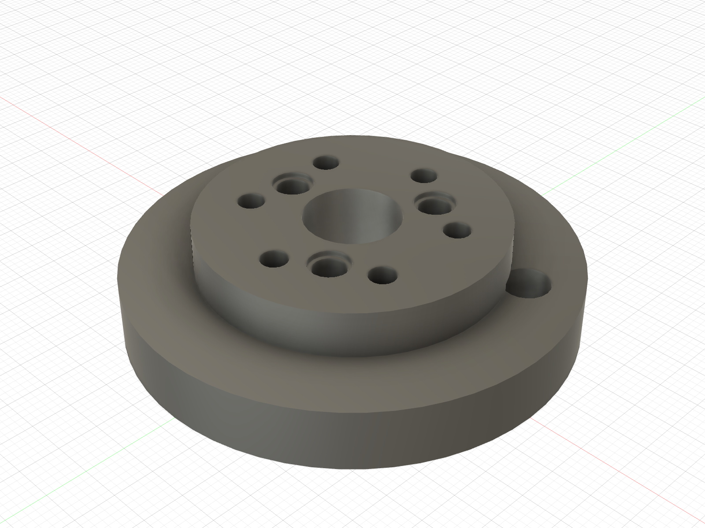
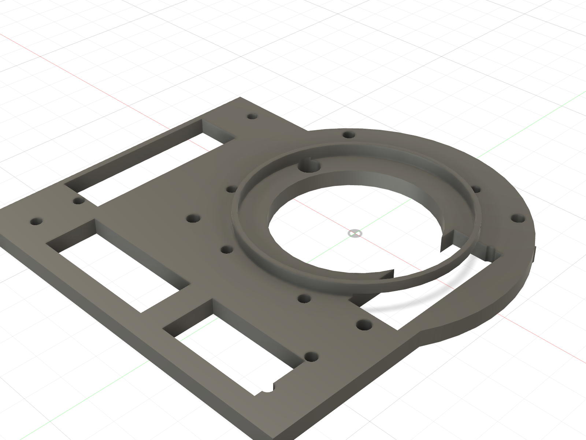
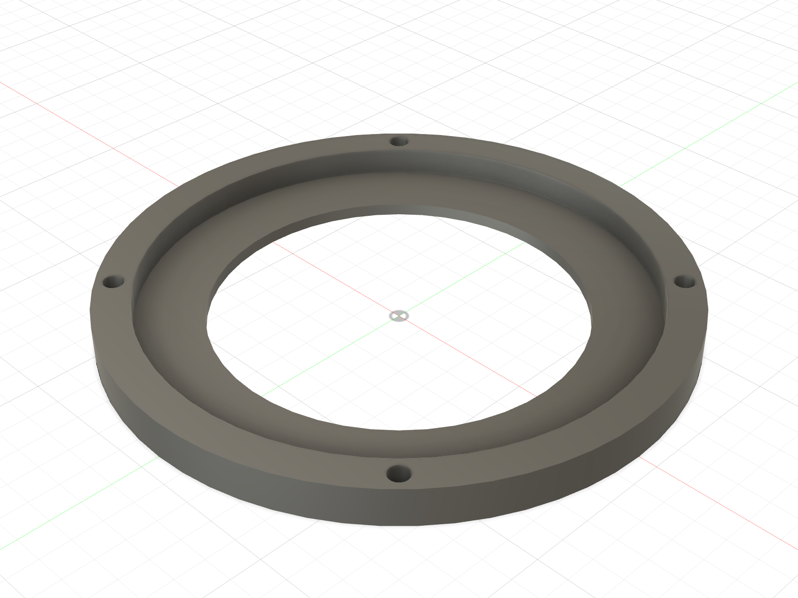
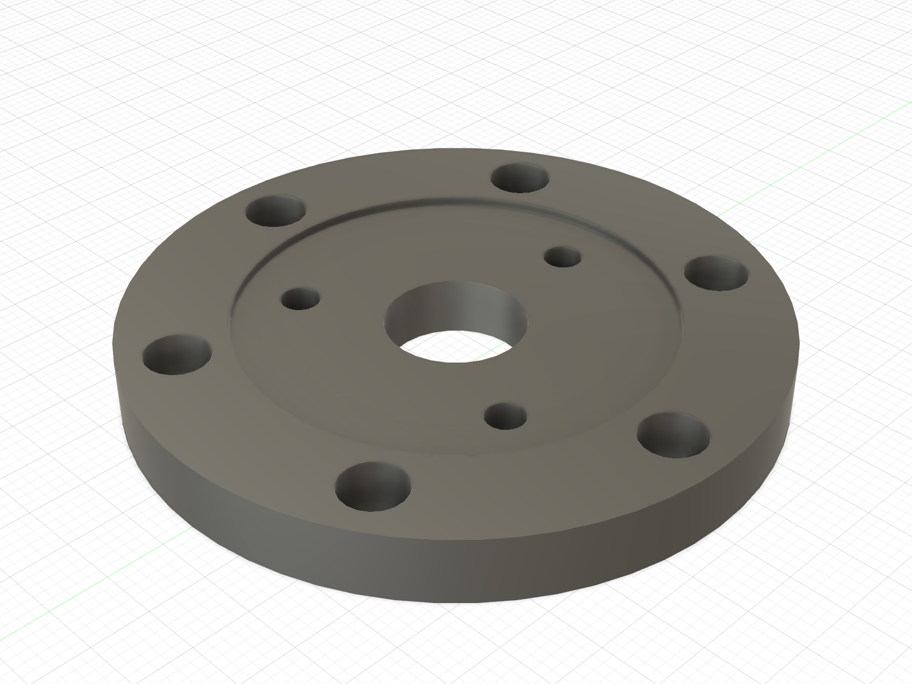

# Picture guide — printed threaded receivers

This is the installation map for every existing printed part that owns a
female thread. It separates receiver parts from clearance parts and records
the screw direction that remains accessible in the assembled robot.

The complete single-leg article is ABS. PA-CF coupons and structural prints
wait for the later two-leg build.

## What changed on 2026-09-02

- The corrected shoulder hub has six real M4 insert pockets.
- The wheel hub has six short-M4 through receivers and uses M4 × 8 rim screws.
- The stand has five Voron-style M3 pockets instead of Ø5 clearance bores.
- Cable-cover inserts moved from the removable cover into the shoulder plate;
  all four screws are now reachable from outboard.
- The future chassis frame and deferred Mode-B carriage now have explicit
  receiver bosses/pockets.
- `RIG_Knee_Collar_L` is not a heat-set joint and is **not released**: its
  current geometry cannot retain the pin.

## Shoulder hub — six M4 inserts

- Print:
  [`ABS_FA_Shoulder_Output_Hub_L_D4p15_PRINT_ORIENTED.stl`](../../first_article_stl/assembly_dry_fit/ABS_FA_Shoulder_Output_Hub_L_D4p15_PRINT_ORIENTED.stl)
- Receiver: 6 × Ø5.6 × 7.2 blind pockets in the outboard flange face.
- Insert: 6 × PSM Sonic-Lok `SL-B-M4-5.8`.
- Fastener: 6 × M4 × 10 through the proximal-link root.
- Clearance: 0.8 mm printed floor; screw tip stops 1.0 mm before it.

The already-printed Ø4.15 hub is not this part. Keep it as motor-fit evidence,
but do not attempt to melt inserts into its Ø3.3 holes.

## Shoulder plate and cable cover — four M3 inserts total

| Receiver: shoulder plate | Clearance part: cable cover |
|:---:|:---:|
|  |  |

- Install 4 × approved 5 mm Voron-style M3 inserts flush from the shoulder
  plate's **outboard** face. The plate receivers are Ø4.0 through 5.0 mm.
- Put **no inserts** in the cover. Its four holes are Ø3.4 clearance.
- Drive 4 × M3 × 10 from the cover's exposed outboard face. Each screw crosses
  6.5 mm of cover, engages 3.5 mm of brass and stops 1.5 mm before the plate's
  inboard face.
- This service direction remains available after the stand or chassis frame is
  fitted behind the plate.

## Existing proximal link — five M3 inserts

The physical Ø19.10 link is already correct and remains in use. Its arm-B boss
has five Ø4.0 × 5.0 pockets: three for the knee stop plate and two for the
encoder bracket. Keep the link and bearings; do not reprint merely to adopt the
future Ø19.15 bearing preference.

## Mode A stand — five M3 inserts

- Print:
  [`ABS_FA_RIG_Stand_M3_INSERTS_PRINT_ORIENTED.stl`](../../first_article_stl/mode_a/ABS_FA_RIG_Stand_M3_INSERTS_PRINT_ORIENTED.stl)
- Receiver: 5 × Ø4.0 × 6.0 blind pockets from the y = 42 mount face.
- Insert: 5 × approved 5 mm Voron-style M3.
- Fastener: 5 × M3 × 10 through the 5 mm shoulder plate.
- Clearance: 1.0 mm below the insert and a 6.0 mm printed floor.

## Wheel hub — six short M4 inserts

- Print:
  [`ABS_FA_Wheel_Hub_L_M4_INSERTS_PRINT_ORIENTED.stl`](../../first_article_stl/assembly_dry_fit/ABS_FA_Wheel_Hub_L_M4_INSERTS_PRINT_ORIENTED.stl)
- Receiver: 6 × Ø5.6 through the 6.0 mm hub.
- Insert: 6 × PSM Sonic-Lok `SL-B-M4-4.8`, flush from the rim face.
- Fastener: 6 × M4 × 8 through the 4.0 mm rim web.
- Result: 4.0 mm thread engagement and 2.0 mm clearance to the motor face.

The photographed generic M4 × 8 and ×10 inserts are too long. Do not
substitute them.

## Deferred receivers already corrected in source

| Part | Receiver geometry | Status |
|---|---|---|
| `Chassis_Frame` | 10 × Ø4.0 × 6.0 M3 pockets in Ø10 × 6.5 bosses | Fusion verified; defer print to two-leg build |
| `RIG_Carriage` | 5 × Ø4.0 × 6.0 M3 plus 4 × Ø5.6 × 7.2 M4 pockets | isolated Fusion build verified; Mode B deferred |
| optional M2 satellite-PCB boss | no existing part | architecture decision remains open; do not invent receivers |

## Installation gate

1. Use the existing Ø4.0 ABS coupon for the exact owner-supplied M3 insert.
2. Obtain the two specified short M4 families and print the same-profile
   [`Ø5.5/5.6/5.7 pocket ladder`](../../first_article_stl/insert_fit/README.md)
   before committing either hub.
3. Heat inserts with a perpendicular, depth-controlled tip; stop flush and let
   the part cool without a screw installed.
4. Start every screw with fingers. Never use screw torque to seat a printed
   part or straighten an insert.
5. Keep the motors unplugged and support the link during the shoulder dry fit.

For the complete shoulder order and link attachment, continue with the
[shoulder-to-proximal picture guide](shoulder_to_proximal_link.md).
