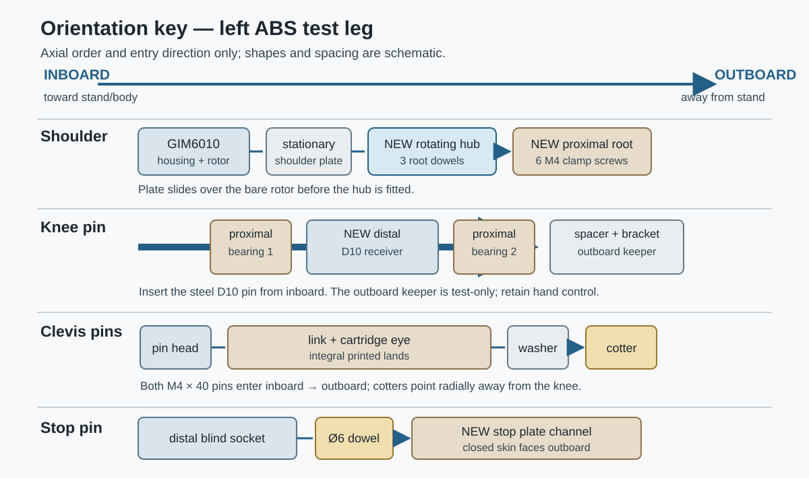
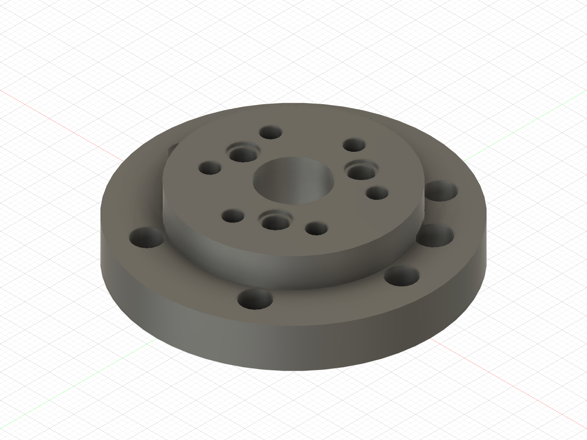
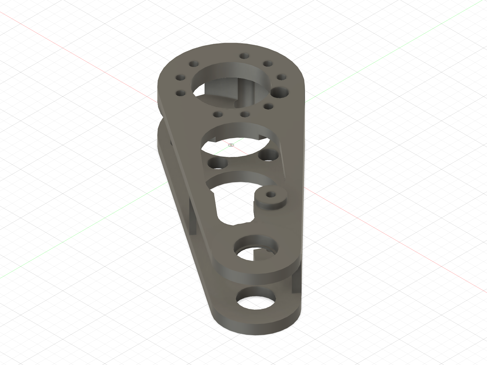
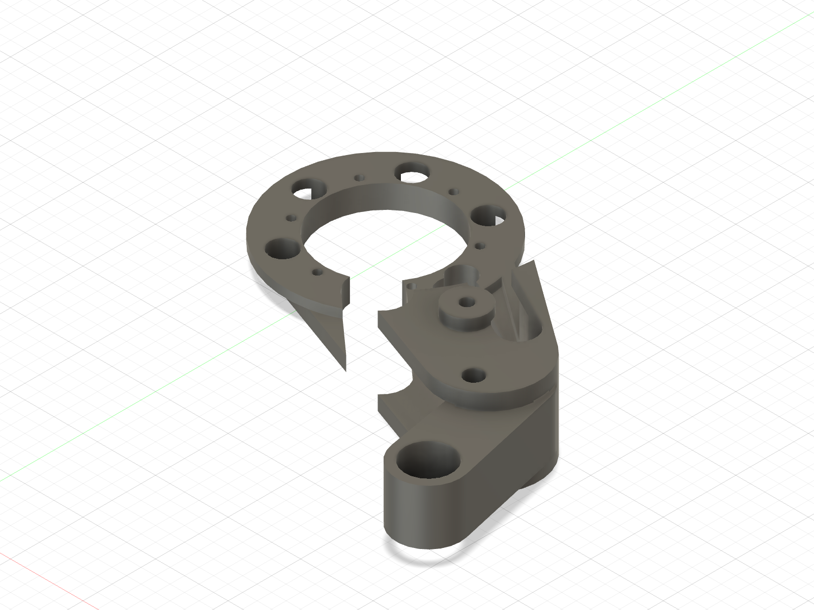
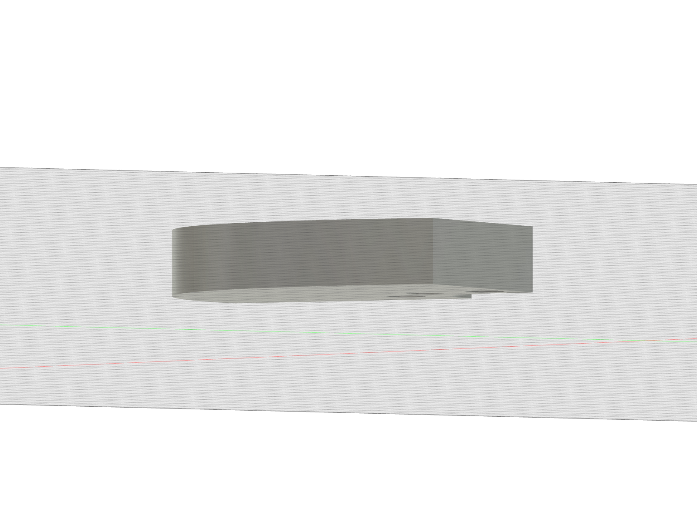
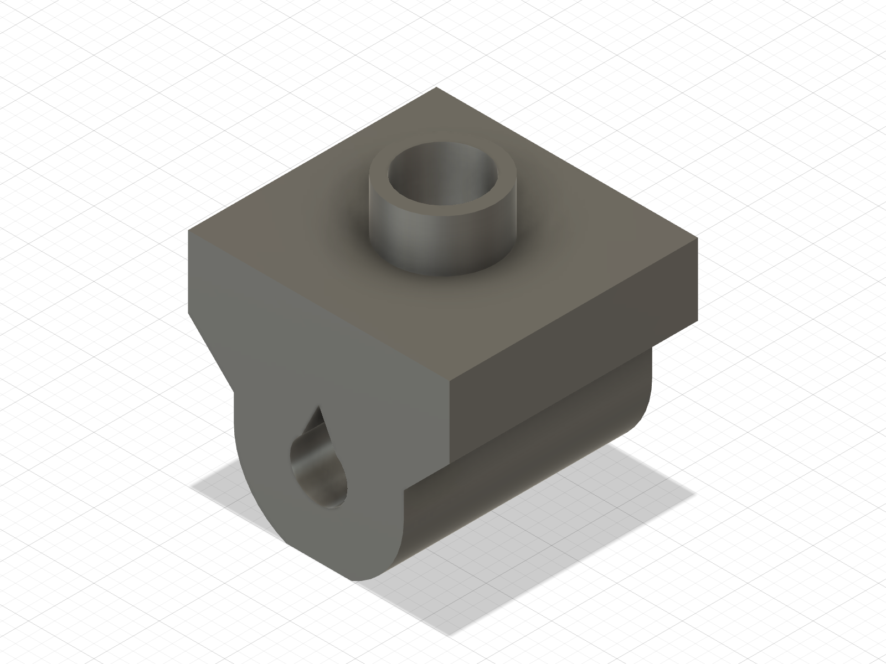
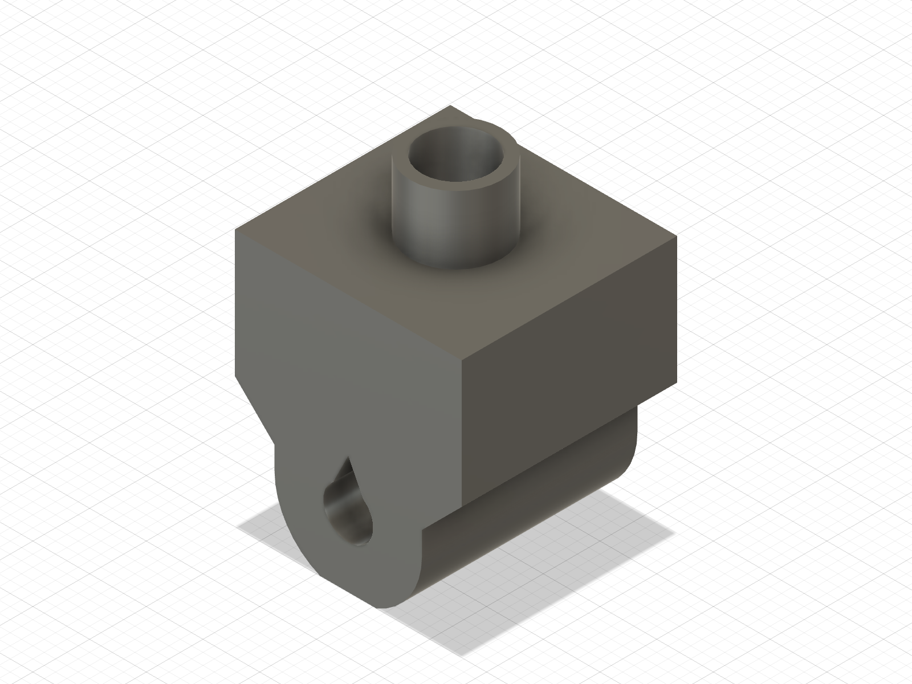
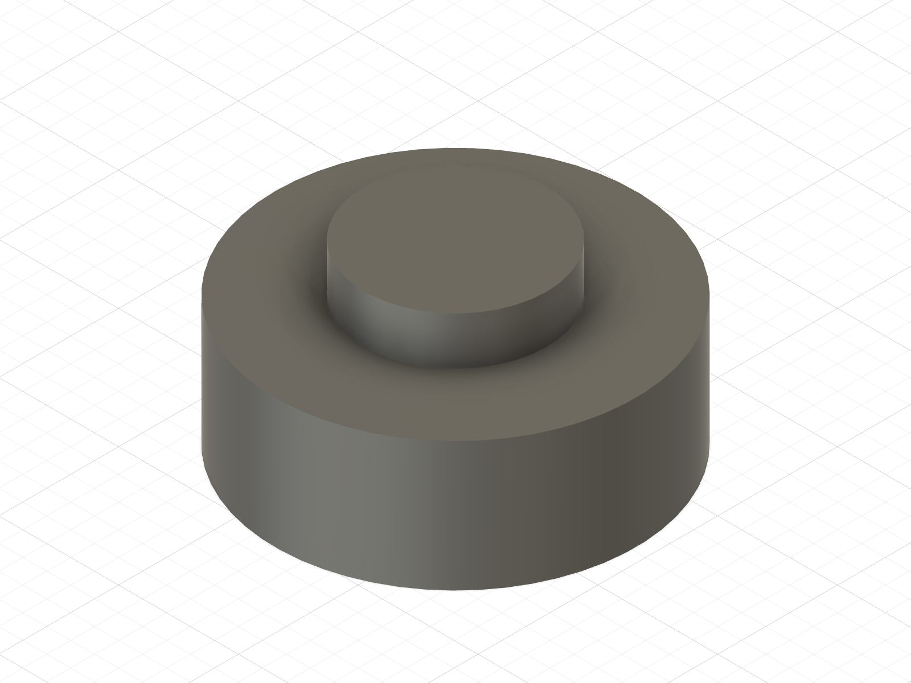
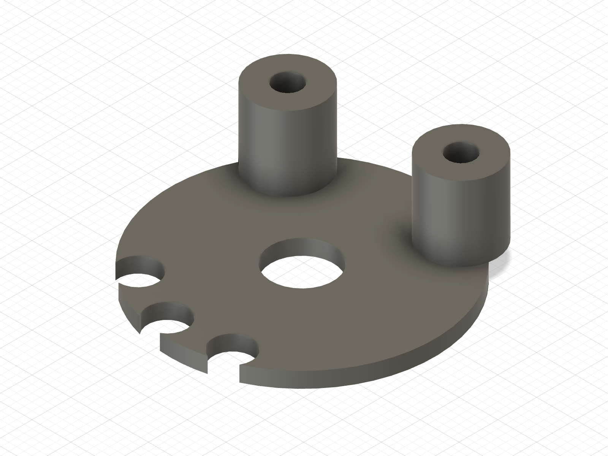
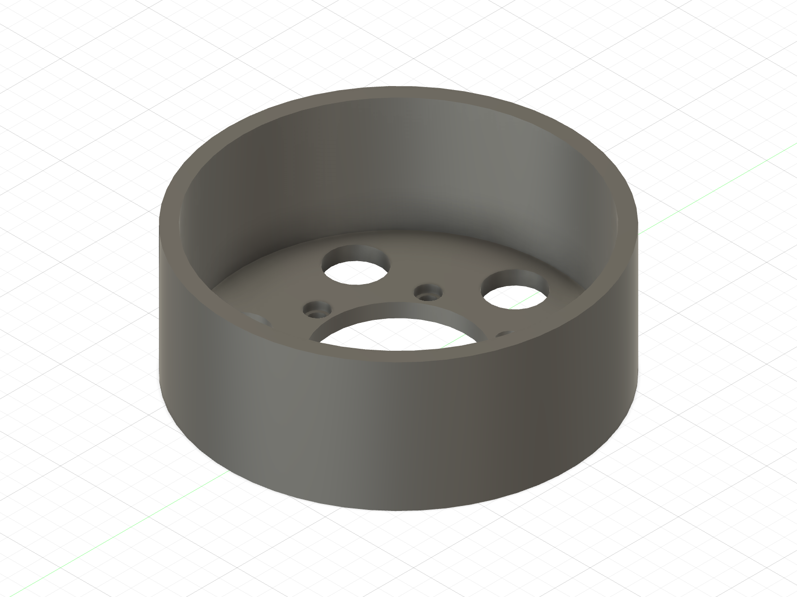

# Picture guide — ordered-pin ABS single-leg mechanical assembly

Use this guide for the **left Mode A, unpowered, wheel-clear ABS article**. The
[ordered-pin traveller](../../first_article_stl/ordered_pin_integration/README.md#ordered-assembly)
is the detailed fastener and acceptance record; this page shows which face
points where and what must be installed before access closes. The owner reports
the four revised parts and earlier mechanical-test batch printed, and the
Amazon pins received. **None of the new final-part fits or insert installations
has been reported as passed.** No pin measurement is needed.

The CAD pictures below show released parts. The three shoulder *sequence*
pictures predate the ordered-pin hub: use them to see plate/rotor order, but use
the **new hub pictured below** in the physical build. The line diagram is
schematic, not a dimensional drawing.

**Inboard** means toward the stand/body; **outboard** means away from it,
toward the knee keeper bracket. Do not infer pin direction from left/right in
an isometric picture. Both motor power and communication cables remain
unplugged for this entire guide.

## 0. Put the correct prints on the bench

| Use the **new** ordered-pin parts | What identifies their job |
|---|---|
|  | **Shoulder hub.** The broad outer flange goes against the GIM6010 output; the raised face receives the proximal root and three Ø4 × 10 dowels. |
|  | **Proximal link.** Large six-screw round root at the shoulder; two bearing ears at the knee. The raised small boss is the upper cartridge clevis land. |
|  | **Distal link.** Wheel-motor ring at one end; D10 knee receiver and the lower cartridge land at the other. |
|  | **Stop plate.** Its curved channel captures the Ø6 × 10 dowel; the thin, unbroken outer skin faces outboard. |

Keep the **earlier** hub, proximal link, distal link and stop plate out of this
assembly. Reuse the earlier **upper and lower cartridge eyes, guide bar, D10
outboard spacer, bracket keeper and no-tyre wheel shell** after inspection.
The already printed cable cover, front post and wheel hub are also candidates
for reuse after their pending fit/insert checks.

Before proceeding:

- [ ] Confirm any printed **stand and shoulder plate** came from the current
  Ø4.5 M3-receiver files; if the print version is unknown, check the slicer
  record rather than guessing from a hole or installing an insert.
- [ ] Set out **2 × ISO 7089 M4 steel washers** for the two clevis cotters.
  Their availability has not been confirmed. Do not close a clevis joint
  without them.
- [ ] Inspect the four new prints for cracks, raised/warped mating faces,
  blocked bores, damaged bearing lips and an intact stop-plate skin. Keep the
  spring and tyre off the leg for now.

## 1. Prove the loose fits before heating or closing a joint

In the **new proximal fork**, thumb-seat each 6800 bearing by pressing its
*outer race*. It must be square without perceptible rock. If bearings are in
the old link, transfer them only if they come out undamaged. Pass the bought
steel D10 knee pin through **each bearing separately**. Then offer the new
distal receiver between the two bearing ears and try the complete pin from
inboard: firm-thumb insertion, full seating, hand withdrawal, no free spin or
radial rock in the printed receiver, and acceptable axial play. The earlier
nominal-Ø10 shin seized a pin, so a tight final receiver is a stop, not a cue
to drive it harder.

Check that all six M4 × 10 shoulder-root screws can pass the new link's access
holes and sit flat. Also dry-fit the two cartridge eyes on their M4 × 40 pins,
the guide through the *round axial holes* in the eye pilots, the spring over
both pilots, and the spacer locator into the bracket's center hole. The
[detached-fit list](../../first_article_stl/mechanical_spring_test/README.md#detached-fit-checks)
gives the exact pass/fail observations. **Stop for any failed fit**; do not
drill, file, hammer or use a screw/pin to pull ABS into place.

## 2. Install inserts; then prepare the shoulder-root dowels

Use the [picture insert map](heatset_receiver_map.md) for the iron approach,
depth stop and screw direction. In the **new detached hub**, install six M4 × 8
inserts from the outboard/link face. In the **new proximal link**, install five
M3 inserts: three for the stop plate and two for the bracket. Fit current
stand/plate and wheel-hub inserts if not already present. The new distal link,
stop plate, cartridge eyes and cable cover receive **no inserts**. Let every
insert cool and reject proud, tilted or loose inserts.

With the hub supported flat and the iron away from the root sockets, thumb-
seat three Ø4 × 10 dowels **5.0 mm into the hub's blind sockets**. About half
of each pin remains exposed. Offer the proximal root onto them once, before
mounting the hub: the two mating faces must meet **by hand**. Remove the link
again so the cable cover and shoulder fasteners remain accessible.

**Pass to continue:** no whitening or split at a dowel; no screw force needed
to close the root faces.

## 3. Build the stationary shoulder before the rotating hub

The shoulder plate goes over the **bare GIM6010 output rotor** from the front.
The motor housing stays behind the plate; it does **not** pass through the
central opening. The plate's flat panel face goes toward the stationary
housing, and its raised cable-spiral lip faces away from the motor.

| Plate first — bare rotor | Hub second — sequence illustration only |
|:---:|:---:|
|  |  |

1. Fasten the plate to the stationary housing with **8 × M3 × 8**. M3 × 10
   bottoms at this interface. Attach the plate to the clamped stand with
   **5 × M3 × 10**.
2. Route the real harness in the plate's spiral. If using the printed cover
   and front post, install them **before the proximal link closes access**:
   upper two post/cover screws **M3 × 12**, lower two **M3 × 10**. Confirm the
   cable and tie clear the rotor by hand; do not energize it.
3. Bring the **new dowel-equipped hub** straight onto the GIM6010's three
   *factory* output pins. It must reach the metal output face by hand, then
   take **6 × M3 × 10** output-hub screws. The three bought dowels point
   outward toward the new proximal root; they are a different pin set from
   the motor's three factory pins.

**Pass to continue:** stationary plate behind rotating hub; hub flat on metal
output face; no trapped cable; all screws finger-start without pulling parts
together. [Shoulder close-up](shoulder_to_proximal_link.md) has the service
order if access is unclear.

## 4. Add the proximal link to the hub

Support its forked knee end. Bring the large round root straight onto the
three exposed Ø4 dowels. The new root's six counterbores face outboard where
the driver can reach them. **Confirm face-to-face contact before any screw**;
then finger-start **6 × M4 × 10** into the hub inserts and confirm each head
sits flat. The screws clamp the joint and trap the dowels axially; they are
not alignment tools. Remove and refit once if needed to prove the service
path.

## 5. Prepare the wheel motor on the detached distal link

Keep the distal link separate while attaching the unplugged **GIM4305**. The
large open ring in the new distal link is the wheel-motor mount—not the
shoulder-root face. Install **6 × M2.5 × 12 from inboard**. Fit the previously
printed wheel hub to the motor output with **3 × M3 × 8** after confirming its
six M4 inserts are installed from its motor face. Keep the no-tyre shell off
until the knee, stop and cartridge fit checks pass.

| New distal wheel-motor ring | Printed wheel hub — inspect before reuse |
|:---:|:---:|
|  |  |

## 6. Close the knee, then capture the stop pin — still no spring

Offer the detached distal receiver into the **gap between the two installed
6800 bearings** in the proximal fork. Insert the steel D10 pin **from inboard**
by firm thumb pressure and confirm hand withdrawal again. Keep the distal
side supported; this is not final powered knee-pin retention.

Put **1 × Ø6 × 10 dowel** in the new distal link's blind stop socket. Bring
the **new** stop plate over it with its curved channel toward the dowel and
its unbroken skin outboard. Bolt the plate to the **proximal link's three M3
inserts**, not to the distal link, using **3 × M3 × 10**. The plate is what
captures the dowel; do not glue or press-fit this stop pin.

Hand-pose the supported, **spring-free** knee. It must reach positive stops
at **−8° and +15°** without bypass or binding. Do not proceed if the plate
marks, the pin moves, or the knee pin cannot be hand-withdrawn.

## 7. Install the cartridge at the −8° extension stop

The raised **round Ø8 pilots face each other across the spring**. Their round
axial center holes carry the square guide. The pointed-roof *side* holes take
the M4 clevis pins; the guide does **not** go through those holes.

| Upper eye: round pilot above, clevis passage across the side | Lower eye: same hole roles, pilot faces upper pilot in assembly |
|:---:|:---:|
|  |  |

1. Rest the supported knee on its **−8° stop**. Insert the **upper** eye
   radially into the proximal clevis. Pass one **M4 × 40** clevis pin
   **inboard → outboard**, put one ISO 7089 M4 steel washer against the
   printed outboard face, then fit its supplied cotter. Orient the cotter
   radially away from the knee.
2. Slide the removable guide into the *round center* of the upper pilot,
   then the free 50 mm spring over the guide and onto that pilot.
3. Face the **lower** eye's pilot toward the spring's other end, slide its
   round center over the exposed guide, and bring its pivot into the distal
   clevis. Its M4 × 40 pin must enter with fingertip pressure. Add the second
   steel washer and cotter, again radially away from the knee. Seat the
   supplied cotters fully without reshaping them. Add **no printed spacers**.

**Stop if the lower eye needs more than slight hand compression**. Do not
pull it in using the pin, a screw, a clamp or a tool. The
[spring-test traveller](../../first_article_stl/mechanical_spring_test/README.md#assembly-order)
contains the detached eye/guide checks.

## 8. Keeper, suspended shell and hand test

The printed D10 spacer's small locator goes in the **center hole of the
outboard bracket**. Fasten that bracket to the proximal link's two M3 inserts
with **2 × M3 × 16**. It limits outboard knee-pin travel; keep a hand on the
distal side because inboard escape is not finally retained in this test.

| Spacer locator faces the bracket | Bracket center receives locator | No-tyre shell is suspended only |
|:---:|:---:|:---:|
|  |  |  |

Fit the no-tyre shell to the accepted wheel hub with **6 × M4 × 8**. Leave
the TPU tyre off. Clamp or bolt the stand to the bench; the wheel must clear
both bench and floor. Both motors stay unplugged. With one hand containing
the distal side, move slowly through **−8°, 0°, +5°, +10°, +15°**, never
past a stop. Watch for smooth motion and whether the leg settles or returns.
Stop immediately for binding, cracking/whitening, coil contact, guide escape,
pin migration, loose cotter, stop bypass or an uncontrolled link.

This result is a self-weight observation only: no motor power, ground contact,
added mass, bounce, intentional preload or structural proof. Record the actual
hand-fit and motion outcomes before marking the physical assembly verified.
