# R2A single-leg assembly guide (ABS article)

Status: **every step below is `CAD PATH VERIFIED`** in Fusion
`Beni_R2A_SingleLeg` (33 of 33 insertion, tool and service paths,
[`assembly_paths.json`](../../evidence/r2a/2026-09-27_digital_gate/assembly_paths.json)).
**Nothing has been rehearsed on hardware yet.** Promote a step to
`PHYSICAL ASSEMBLY VERIFIED` only after the owner completes it without force,
rework or fastener pull-down ([gate](../../ASSEMBLY_VERIFICATION.md)). The
step IDs in brackets are the Fusion path records.

Pictures are exported from the live Fusion model by
[`r2a_images_fusion.py`](../../r2a_images_fusion.py). Exploded offsets show the
insertion direction; they are not to scale in time or order.

Keep **both actuators unplugged** throughout. Powered steps are in the
[test traveller](r2a_test_traveller.md), not here.

## 0. Before you start

- **Coupons passed.** Batch 1 in [`r2a_stl/`](../../r2a_stl/README.md) must
  pass on the real pins, dowels, rod end and knee actuator before batch 2 is
  printed.
- **Parts.** The batch 2 prints, the reused printed parts listed there, and the
  hardware in the [ordering guide](../../procurement/r2a_ordering_guide.md).
  `R2A_Encoder_Bracket_L` is on hold, so step 12 stops short of the AS5048A.
- **Tools.** Hex keys 2.0 mm (M2.5), 2.5 mm (M3) and 3.0 mm (M4); the
  depth-controlled heat-set tip; calipers or a steel rule for the pushrod
  length; bench clamps.
- **Torque.** Snug each screw with the short arm of the key. The legacy
  starting torques ([BOM §9](../../beni_prototype1_bom_and_assembly.md)) are
  for PA-CF and 7075, not for this ABS article. Never use a screw to pull a
  part into place.
- **Take down the legacy article.** Unplugged, remove in this order: the
  encoder bracket / pin keeper, the Ø10 knee pin, the legacy distal link (keep
  the wheel motor and hub on it for now), the six M4 × 10 and the legacy
  proximal link. **Leave `Shoulder_Output_Hub_L`, the shoulder plate, cable
  cover, cable post and stand assembled.** Then take the wheel motor off the
  legacy distal link (6 × M2.5 × 12); the wheel hub can stay on the motor
  output. Use a new pair of 6800-2RS unless the old pair leaves the legacy link
  undamaged.
- **Stand position.** The R2A leg reaches below the bench top once α passes
  about 92° with the shoulder at 0 (`r2a_calc.py` §8). Clamp the stand with the
  leg side overhanging a bench edge: the bench edge must lie between the
  stand's outboard face (y 42.0, fully supported) and y 54.5. The clamping
  requirement itself is unchanged from Mode A
  ([PROJECT_STATUS](../../PROJECT_STATUS.md), stand hold-down).

## 1. Heat-set inserts (detached parts)

Twelve Voron-style M3 × 5 in the Ø4.5 receivers, flush. The list and face of
entry are in the [print traveller](../../r2a_stl/README.md#acceptance-tests).
Do this before any bearing or plug goes in.

## 2. Outboard half: bearing and plugs

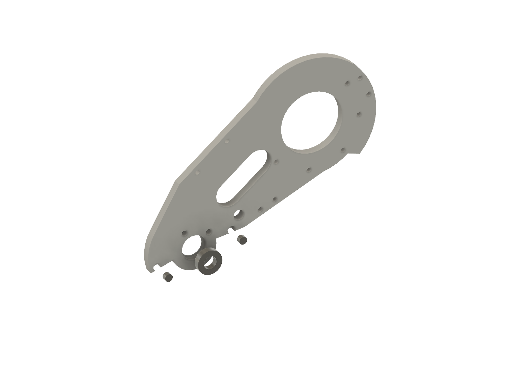

Press bearing B into the Ø19.15 seat from the outer (y 91.1) face with thumb
pressure on the outer race until it stops on the Ø17 lip. Press the two Ø6 TPU
plugs to the bottom of their blind bores from the same face.

## 3. Knee actuator [B1, B2, B2k]

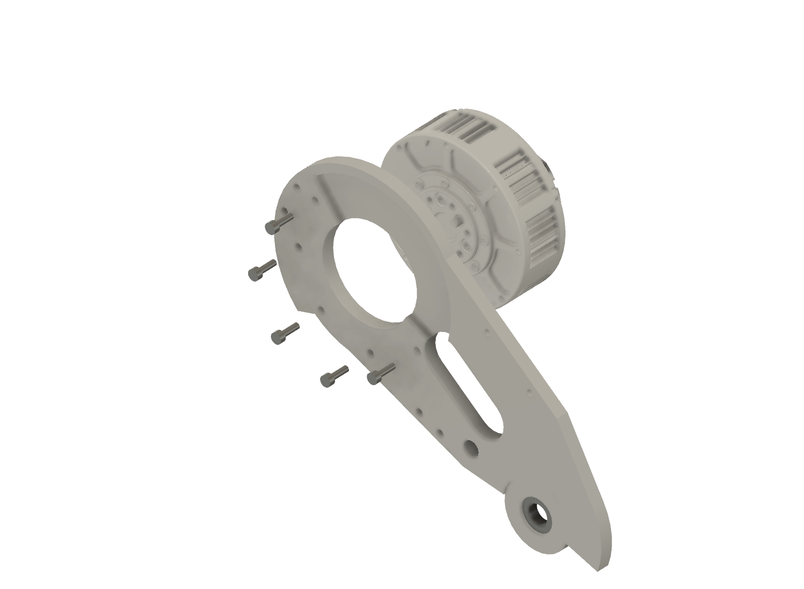

Offer the knee GIM6010-8 to the outer face from outboard, output first, with
its driver-cover lead pointing toward the root's back wall as in the picture.
In that clocking five of its eight housing threads line up with the five
clearance holes; the other three sit inside the crank sweep and stay empty.
Fit **5 × M3 × 10** from the channel side.

M3 × 10, not × 12: the housing thread is ~4.0 mm deep and a 5 mm protrusion
bottoms (legacy delivered-actuator test). Through the 6.6 mm cheek, × 10 engages
3.4 mm and stops 0.6 mm short
([engagement record](../../evidence/r2a/2026-09-27_digital_gate/README.md)).

## 4. Crank [B3, B4, B4k]

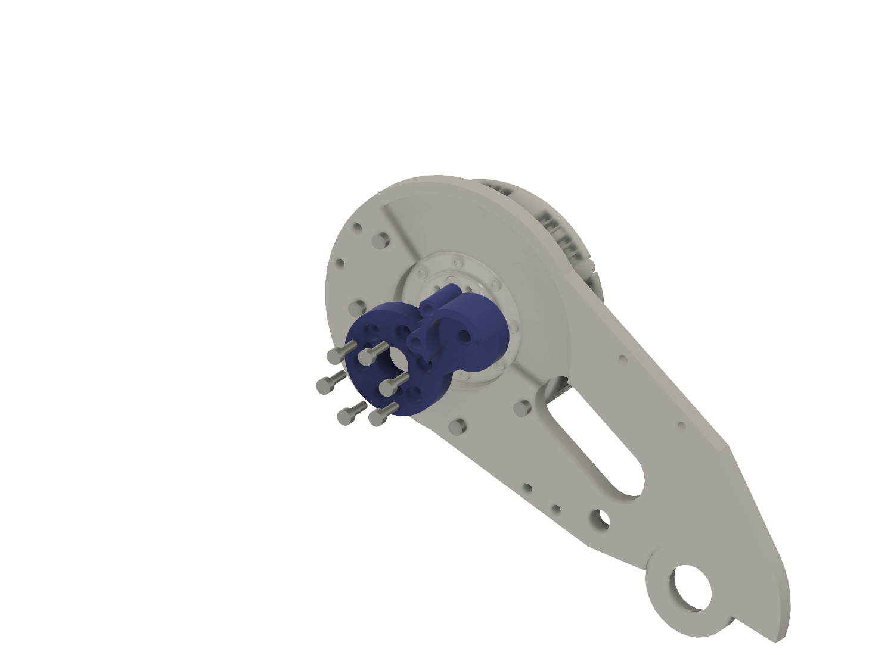

Hold the crank at its build angle, as pictured, so every screw has a straight
key path. Seat it on the output over the three factory pins **by hand, flat,
with no rock**, then fit **6 × M3 × 10**. This is the shoulder-hub stack: the
screw tips reach the floor of the output's 5 mm holes. If a screw stops before
the crank is clamped, stop.

## 5. Pushrod

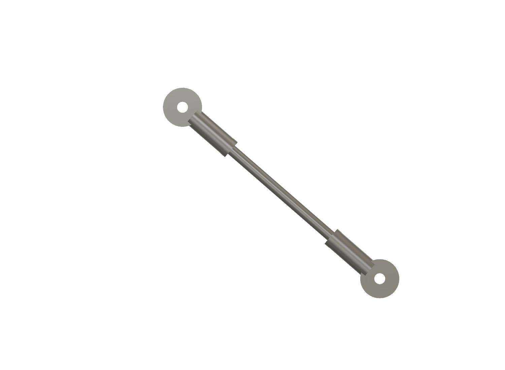

Cut the M5 rod to **86.0 mm**. Run a jam nut and a rod end onto each end and
set **120.0 mm between the eye centres**, eyes parallel. With a steel rule,
measure from the left edge of one eye bore to the left edge of the other: that
is the centre distance. On a plain right-hand rod the eyes index every half
turn, 0.4 mm of length per end. Lock both jam nuts against the rod ends. Gate 4
checks the result end to end.

## 6. Upper rod end to the crank [B5, B6, B6p]

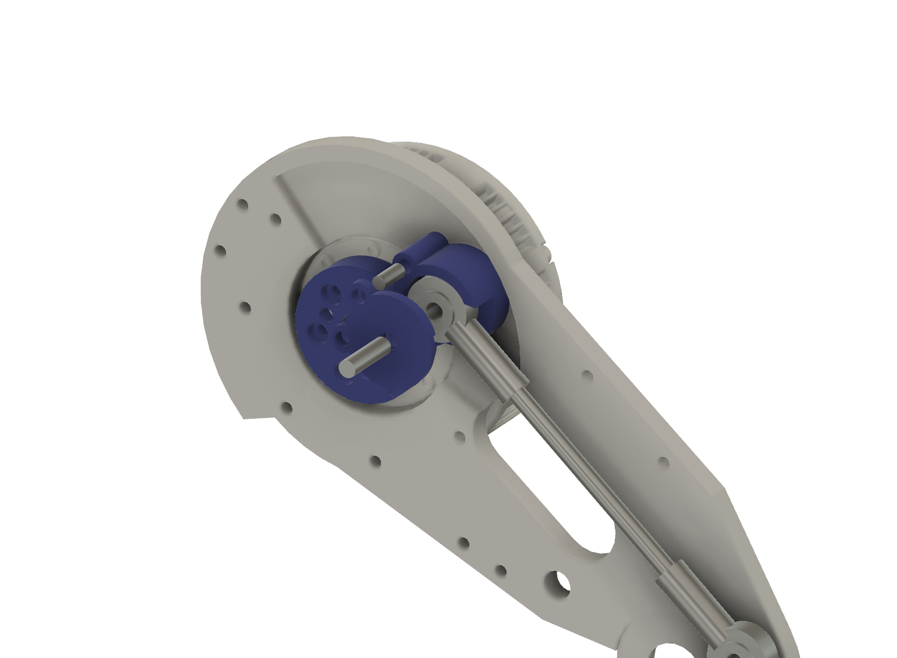

Press two Ø4 × 10 dowels into the crank's Ø4.25 sockets. Put the upper rod-end
ball into the 8.4 mm gap with the cap off, press the crank cap onto the dowels,
and slide the **Ø5 × 18 pin** in from the inboard (cap) side. The pin floats:
it is retained later by the inboard half's channel face, so nothing clips it.

## 7. Wheel end on the detached distal link [W1, W1s, W1k, W2, W2k]

Fit the wheel motor into the distal wheel end from outboard (its driver cover
nests in the Ø41.5 opening) and fasten it with **6 × M2.5 × 10** from the
inboard face. Fit the wheel hub to the motor output with 3 × M3 × 8 if it is not
already on.

M2.5 × 10, not the legacy × 12: through the 8.0 mm plate a × 12 runs 1.0 mm past
the floor of the motor's Ø2.0 × 3.0 holes in the STEP; × 10 stops 1.0 mm short.
If only × 12 are in hand, a screw that stops turning before the motor is
clamped is bottoming: stop.

## 8. Lower rod end to the distal lever [B7, B8, B8p]

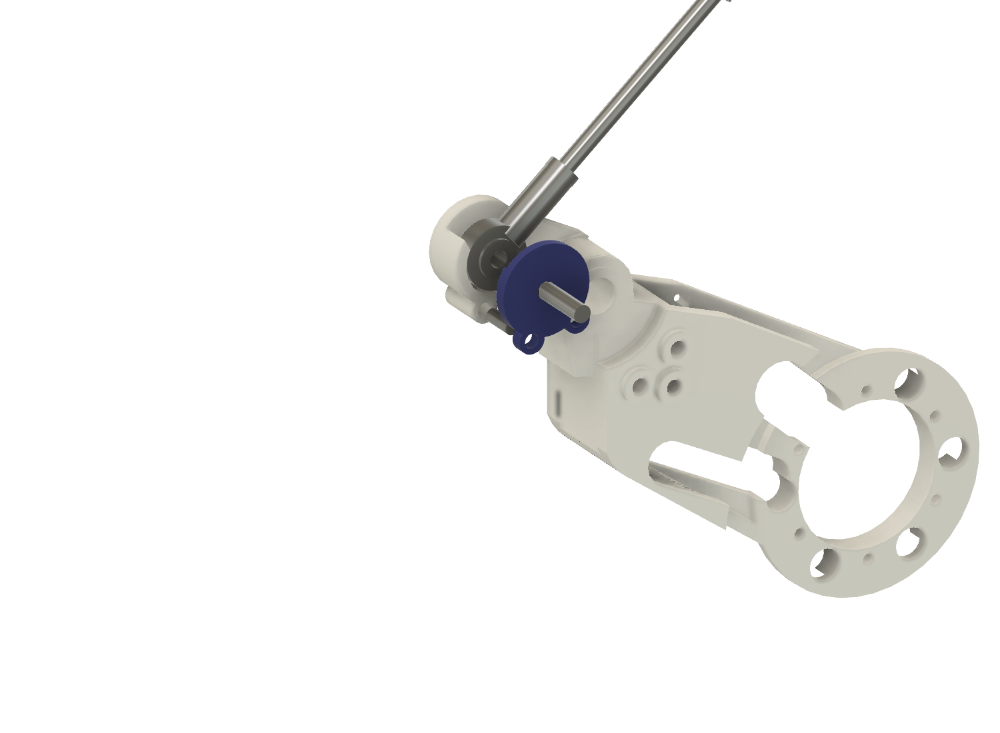

Press two Ø4 × 10 dowels into the lever's sockets and one Ø4 × 10 into the
encoder-arm socket on the distal outboard pad. Support the distal link, put the
lower rod-end ball into the lever clevis, press the lever cap onto its dowels
and slide the second Ø5 × 18 pin in from the outboard (cap) side. The
outboard half, knee actuator, crank, pushrod, distal link and wheel motor are
now one **knee module**. Neither Ø5 pin is retained until step 10 closes the
box around it: keep the module level and hold both pins while moving it.

## 9. Inboard half onto the shoulder hub [S1, S2, S2k, S5, S5k]

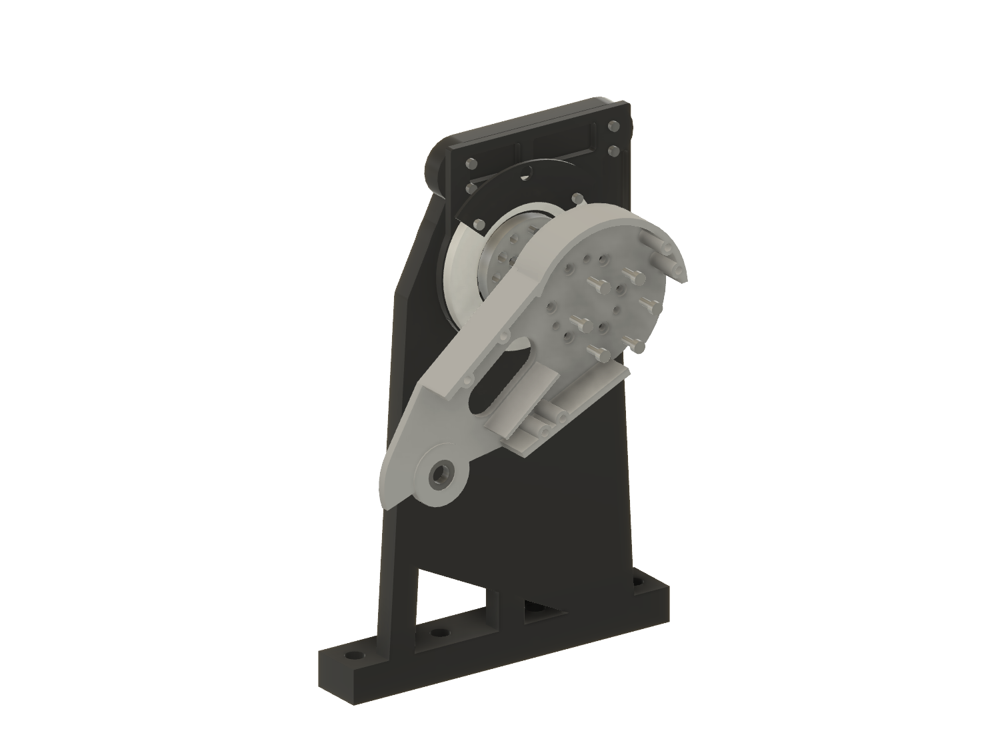

With bearing A and the two inboard TPU plugs already pressed in from the
inboard face, and three Ø4 × 10 root dowels seated in the hub, bring the
inboard half onto the hub from outboard until the faces meet **by hand**. Then
fit **6 × M4 × 10** from the channel side; the heads stand in the legacy
counterbores below the crank cap. Fit the knee-pin cap to the inboard face with
**2 × M3 × 6**.

## 10. Knee module onto the inboard half [S3w, S4, S4k]

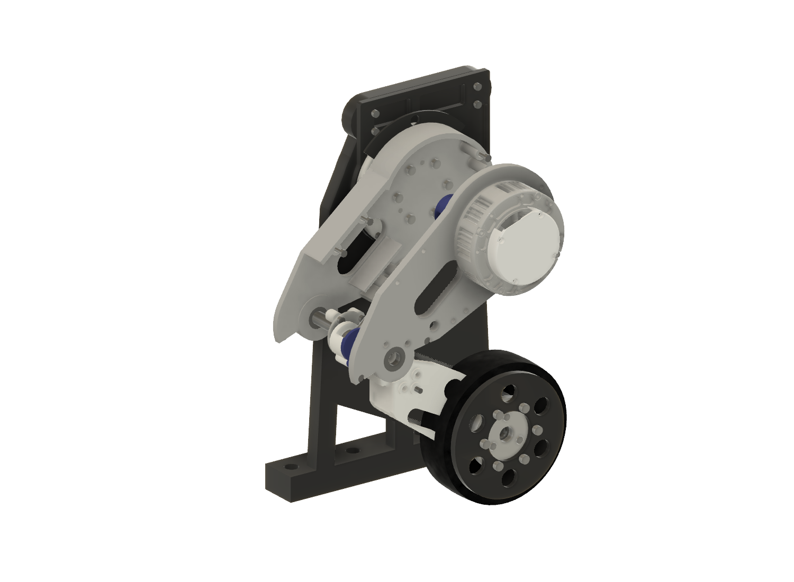

Bring the whole module in from outboard, rod and crank inside the channel, and
line the distal knee bore up with bearing A. The wall tops meet the outboard
half by hand. Fit **6 × M3 × 12** perimeter screws from outboard into the
inboard half's inserts.

## 11. Knee pin [S6]

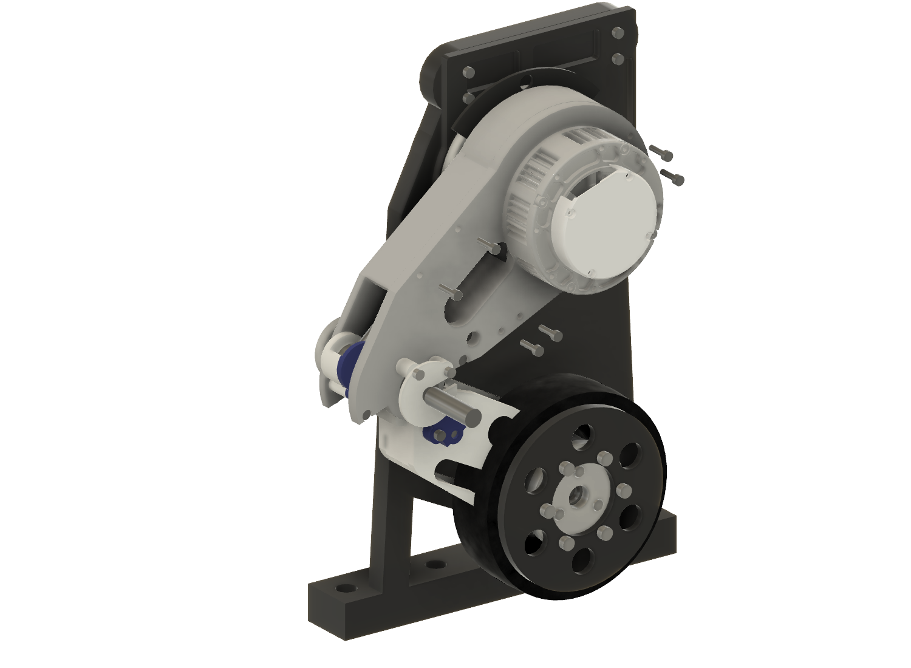

Slide the Ø10 × 35 pin in from outboard through bearing B, the distal
Ø10.30 × 20.0 receiver and bearing A until it meets the cap pocket. It must go
in by firm thumb pressure and come out by hand.

## 12. Encoder arm [S7, S7k] — and the AS5048A, on hold [S8, S8k]

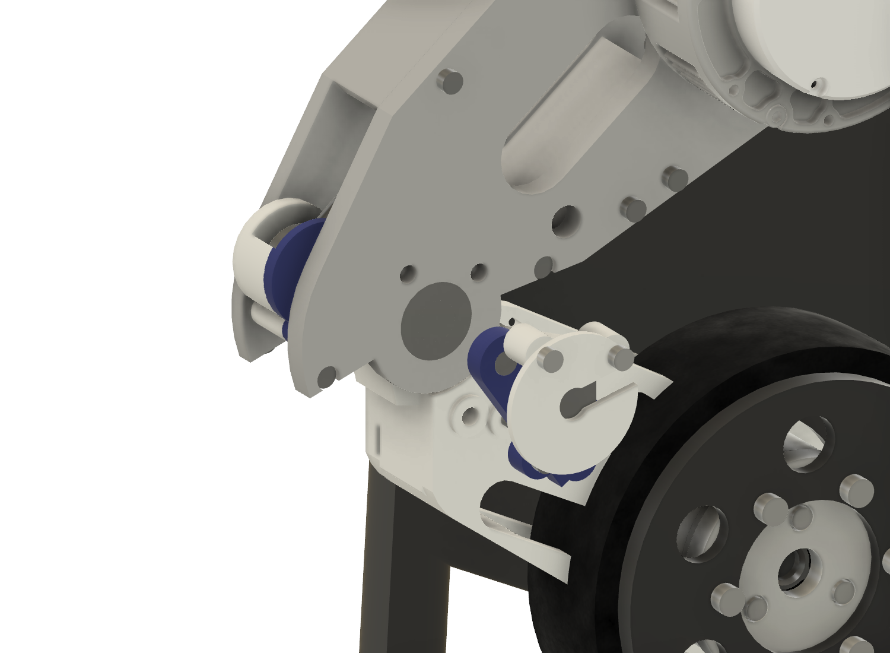

Press the diametric magnet into the arm's pocket and fit the arm to the distal
outboard pads over its dowel with **2 × M3 × 10**. The arm turns with the
distal link and also keeps the knee pin from walking outboard. The AS5048A
board and `R2A_Encoder_Bracket_L` (2 × M3 × 16) are modelled and path-checked,
but the bracket is not released.

## 13. Wheel shell [W3, W3k]

Fit the no-tyre ABS wheel shell to the hub from outboard with **6 × M4 × 8**.
The TPU tyre stays off the ABS article.

## 14. Cables

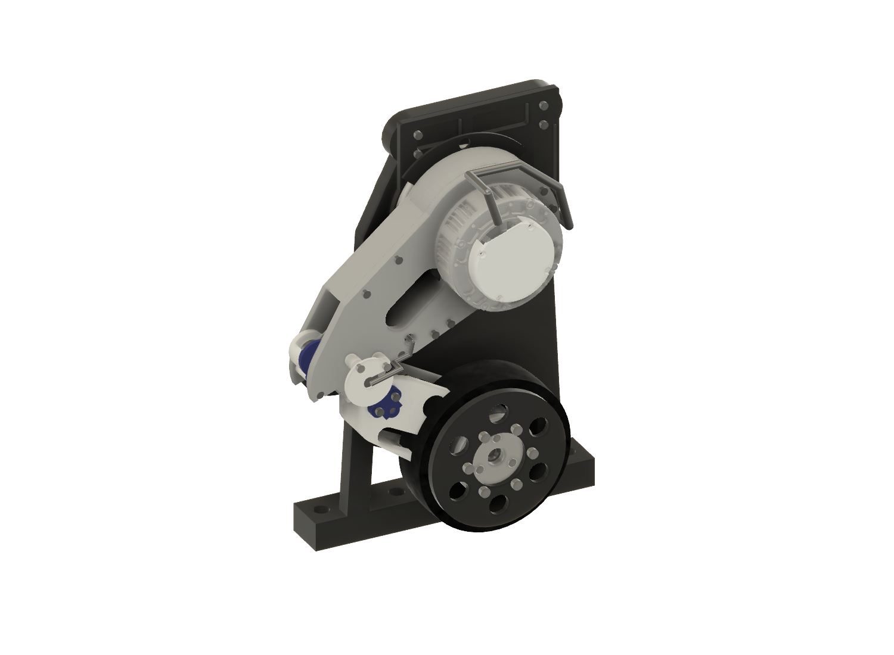

The Fusion model carries Ø6 reference envelopes that stay clear through the
140-pose sweep; connectors, ties and bend radius are physical checks.

- **Wheel cable:** along the distal link's inboard face, a free loop around the
  knee-pin cap (reserve annulus Ø38…Ø60), in through the inboard duct entry,
  along the shin-side duct inside the proximal box, and out through the root
  past the back wall.
- **AS5048A cable:** out through the bracket-plate notch, down to the outboard
  face, in through the outboard duct entry, into the same duct.
- **Knee-actuator lead:** from the driver cover, over the housing and round
  the root to the same exit.
- All three leave the root as one service loop to the stand's cable post and
  anchor. The shoulder stays within ±120° in software
  ([electronics/02](../../electronics/02_harness_and_routing.md)).

## Service

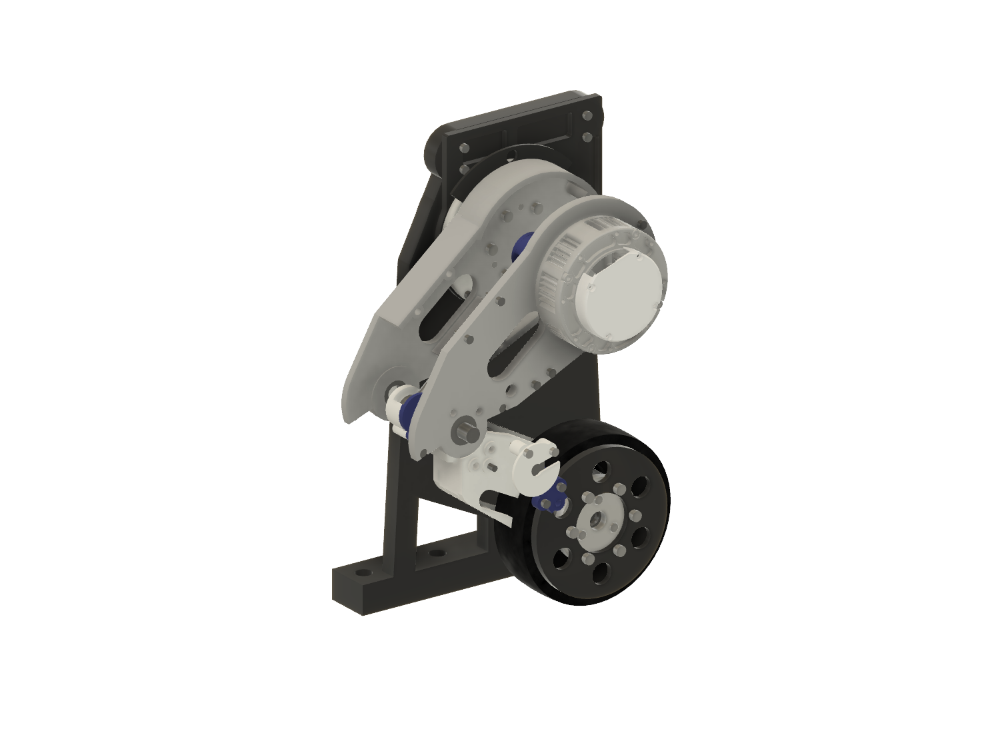

1. Encoder bracket (when fitted) and encoder arm off outboard.
2. Knee pin out outboard [S6 reversed].
3. Six perimeter screws out; the knee module lifts off outboard with the
   actuator, crank, pushrod, distal link and wheel motor attached [S3w
   reversed].
4. On the bench: the lever pin slides out outboard and the crank pin inboard,
   freeing the pushrod. The pressed caps stay on their dowels.
5. The actuator screws can be reached with the crank fitted (their holes lie
   outside the crank sweep); the crank screws need the crank at its build
   angle.

Negative controls confirm the order matters: with the halves closed, the key
path to the actuator screws is blocked (59.7 mm³ per screw), and the module
cannot move inboard past the inboard half
([record](../../evidence/r2a/2026-09-27_digital_gate/assembly_path_negative_controls.json)).
