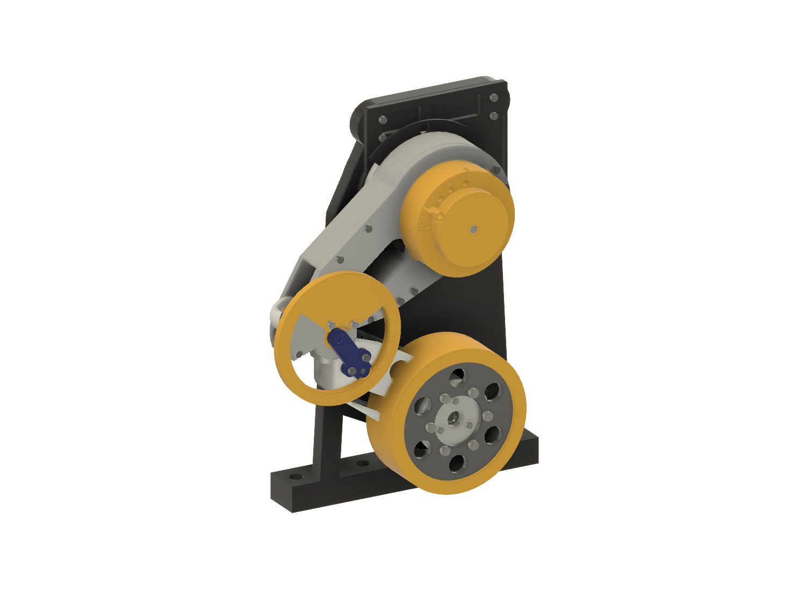
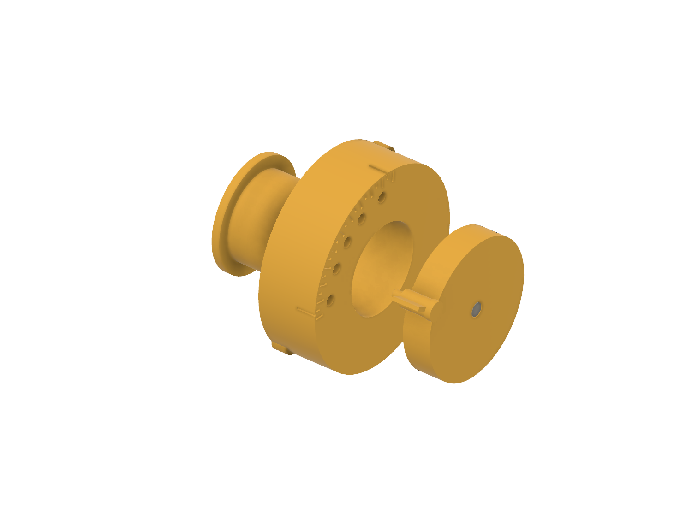
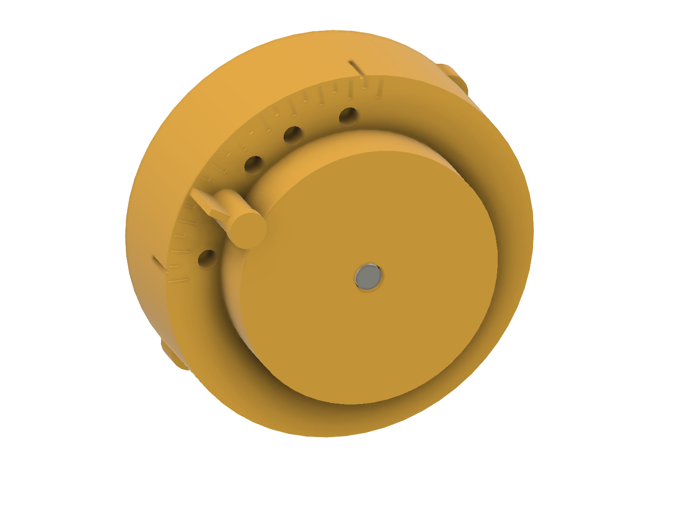
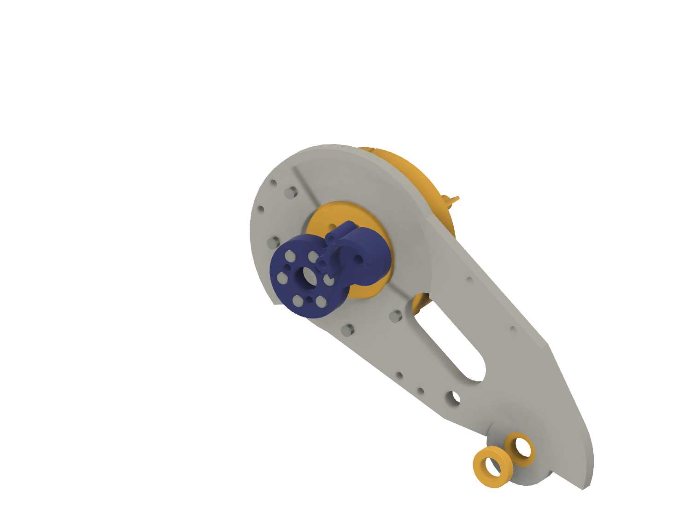
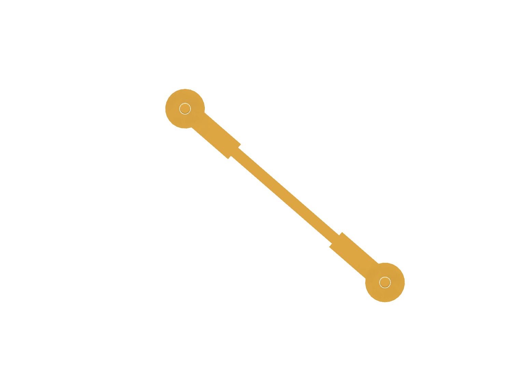
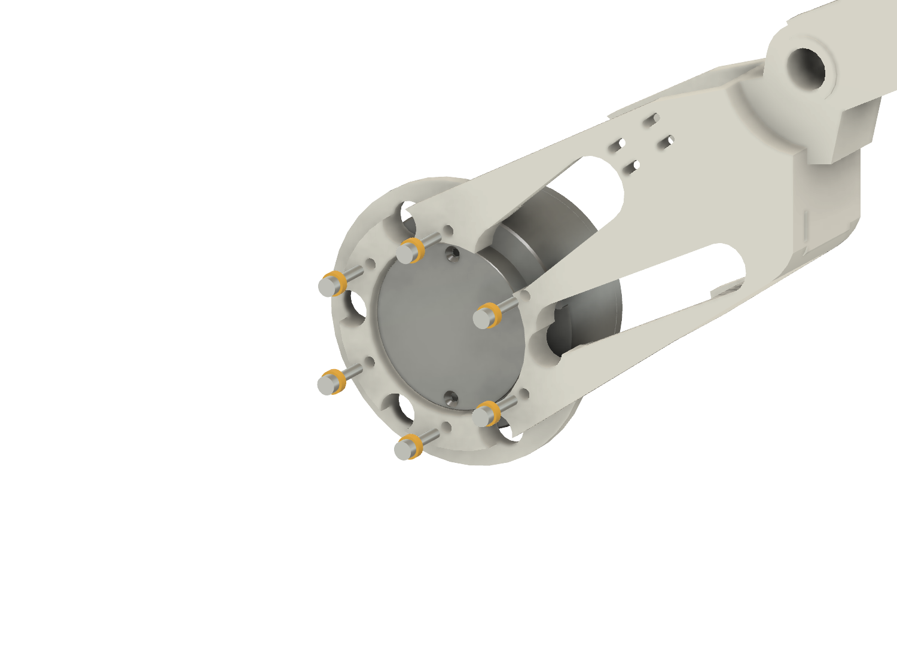
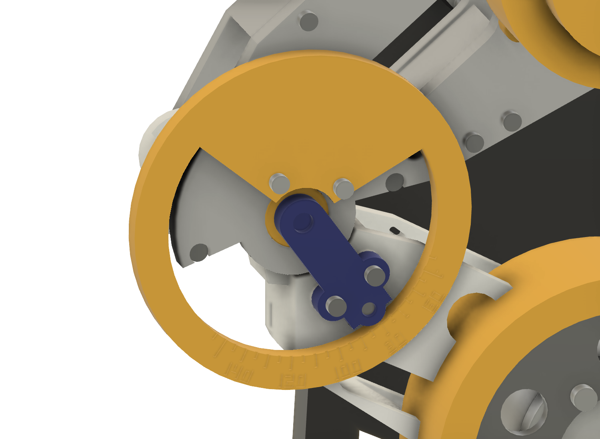
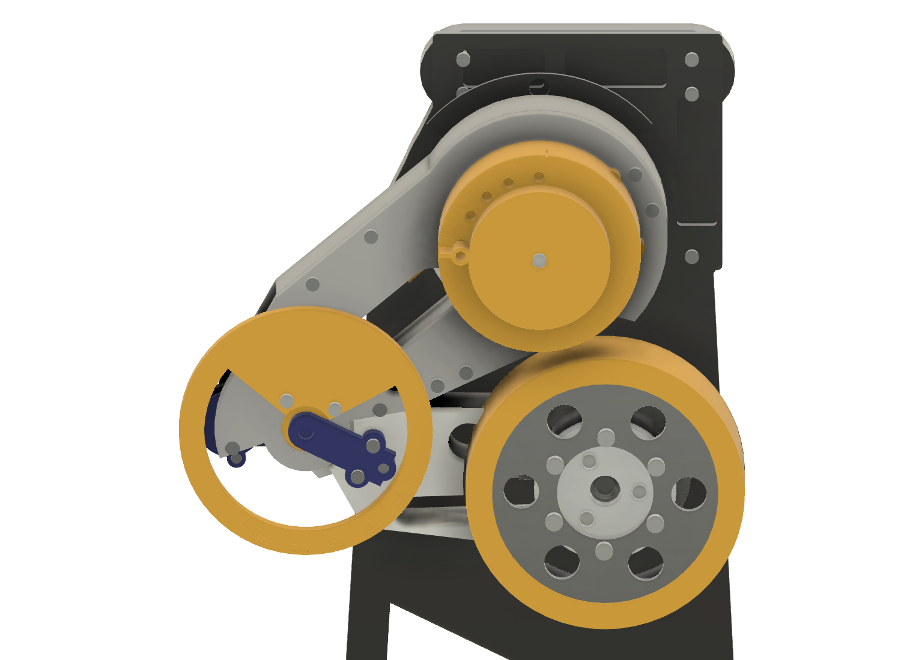
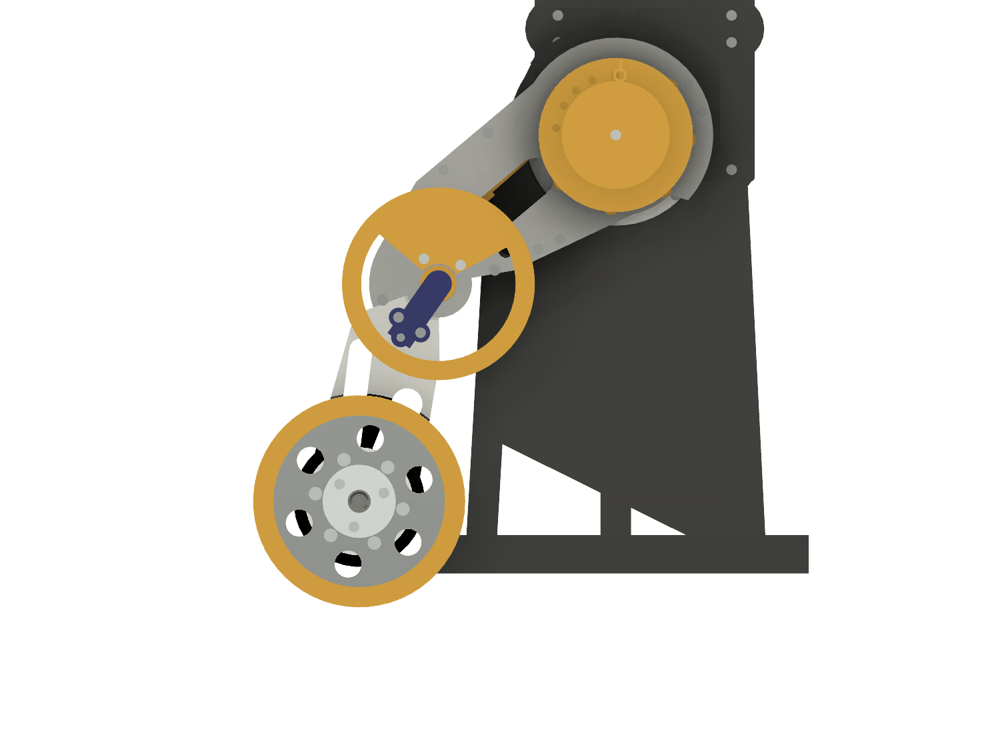
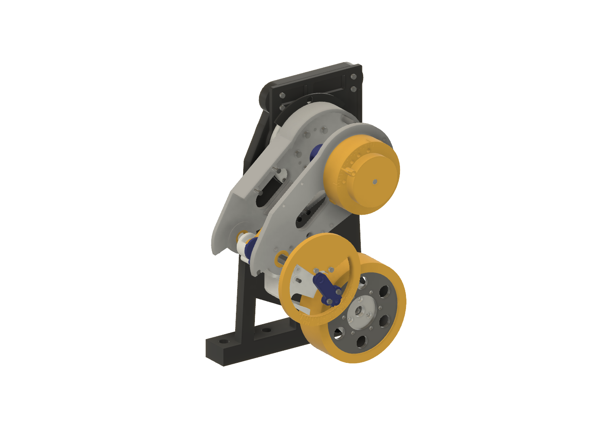

# R2A proof of concept — all-printed build and demonstration guide

Status: **`CAD PATH VERIFIED` only; nothing has been built.** This guide
builds the complete R2A single leg from **owned hardware plus prints**, with
printed stand-ins for every part that would have to be bought, and then shows
by hand that the R2A mechanics work. It is the step before ordering
([R2A plan](../design/active_knee_revision2_plan.md) §10). The CAD evidence is
in [`evidence/r2a/2026-09-28_poc/`](../../evidence/r2a/2026-09-28_poc/README.md).

The step IDs in brackets are the Fusion path records in
[`assembly_paths.json`](../../evidence/r2a/2026-09-28_poc/assembly_paths.json).
Pictures are exported from the live Fusion model by `r2a_poc_fusion.images()`;
printed stand-ins are yellow.

## Safety scope — read first

- **Unpowered.** Do not connect any actuator lead, the bench supply or the
  Teensy. Every actuator lead stays unplugged for the whole demonstration.
- **No load.** Hand motion and the leg's own weight only (CLAUDE.md rule 7): no
  spring, preload, added mass, torque arm, ground contact, drop or jump.
- **Clamp the stand at a bench edge.** The leg reaches below the stand's base
  plane once α passes 91.8° with the shoulder at 0, and 59.5 mm below it at
  the extension stop (`r2a_calc.py` §8). Clamp the stand with the leg side
  overhanging the edge, the edge between the stand's outboard face (y 42.0)
  and y 54.5 ([assembly guide §0](r2a_assembly_guide.md#0-before-you-start)).
- **The real motors are backdriven only gently.** The brake chopper is
  deferred. Turning an unplugged motor makes voltage on its open leads; turn
  it slowly and never spin it.
  - *Shoulder:* hold the proximal link near the root, not the wheel, and turn
    it slowly by hand, a few seconds per 30°. Never swing the leg or let it
    fall.
  - *Wheel:* the GIM4305-10 is only a mass here. Do not spin the tyre gauge
    or shell.
- A printed part that cracks, whitens or bows ends the demonstration. Record
  it; do not repair it.

## 1. Parts

### Owned hardware (nothing to buy)

| Item | Qty | Use |
|---|---:|---|
| GIM6010-8 on the shoulder plate and `RIG_Stand`, with the printed hub, cable cover, cable post and 3 Ø4 × 10 root dowels | 1 set | Unchanged, unpowered |
| GIM4305-10 with the printed wheel hub and no-tyre shell | 1 set | Wheel module, a mass only |
| Ø10 × 35 steel knee pin | 1 | Take it from the legacy article |
| Ø4 × 10 dowel | 9 new (+ coupon use) | 2 crank cap, 2 lever cap, 1 encoder arm, **3 mock output pins, 1 knob key** |
| M3 × 5 heat-set insert (Ø4.5 receiver) | 24 (+ coupon use) | The article's 12, **5 mock mount, 6 mock output, 1 knob** |
| M3 × 10 SHCS | 16 | 5 mock mount, 6 crank, 2 encoder arm, **1 knob, 2 protractor** |
| M3 × 12 / M3 × 6 / M4 × 10 SHCS | 6 / 2 / 6 | Perimeter / knee-pin cap / hub joint, as the article |
| M3 × 8 / M4 × 8 SHCS | 3 / 6 | Wheel hub / shell, as the legacy wheel |
| M2.5 × 12 SHCS | 6 | Wheel motor, the legacy screws, **with the printed 2.0 mm washers** |
| ABS, TPU 95A | — | Prints; TPU for the 4 stop plugs |

Counts marked "OWNED — VERIFY" in the
[ordering guide](../../procurement/r2a_ordering_guide.md) still apply. The two
owned 6800-2RS bearings stay in the legacy link: the POC uses printed
bushings rather than pressing them out past their Ø17 lips.

### POC prints ([`r2a_poc_stl/`](../../r2a_poc_stl/README.md))

| Part | Qty | Replaces |
|---|---:|---|
| Mock knee actuator: housing, rotor, knob, lock pin | 1, 1, 1, 2 | Knee GIM6010-8 |
| Pushrod, 120.0 mm pin to pin | 1 | Two M5 rod ends, M5 rod, two jam nuts |
| Eye thrust washer Ø11 × 1.5 | 6 (4 used) | The rod-end balls' width |
| Clevis pin Ø4.75 × 18 | 4 (2 used) | Two Ø5 × 18 dowels |
| Knee bushing | 3 (2 used) | Two 6800-2RS |
| Washer M2.5, 2.0 thick | 8 (6 used) | Lets M2.5 × 12 stand in for M2.5 × 10 |
| Knee protractor | 1 | Reads α; uses the held encoder bracket's inserts |
| Tyre gauge ring Ø110 | 1 | The Ø110 tyre, for the flexion-stop clearance |
| Feeler 4.0 / 5.0 | 1 | Checks the tyre gap |
| Five POC coupons | 1 each | Batch P1 |

### Article prints ([`r2a_stl/`](../../r2a_stl/README.md), unchanged)

Both proximal halves, crank, crank cap × 2 (one for coupon 3), distal link,
lever cap, encoder arm, knee-pin cap, four TPU plugs, and the article coupons
1–3. Not `R2A_Encoder_Bracket_L` (held).

## 2. Print order

1. **Batch P1, coupons:** the article coupons 1–3 and the POC coupons, pins,
   thrust washers and bushings. Run every acceptance test in
   [`r2a_poc_stl/`](../../r2a_poc_stl/README.md#acceptance-tests). Stop on a
   failure; a failed fit is a re-release.
2. **Batch P2 and the article batch 2:** the POC parts and the article parts,
   with the article's detached checks
   ([`r2a_stl/`](../../r2a_stl/README.md#acceptance-tests)), except that the
   printed bushing replaces the bearing check.

## 3. Assembly

Keep every actuator lead unplugged. Snug screws with the short arm of the
key; never use a screw to pull a part into place.

**0. Take down the legacy article** as in
[assembly guide §0](r2a_assembly_guide.md#0-before-you-start). Keep the
shoulder stack, stand, wheel motor and hub; keep the Ø10 pin; leave the
bearings in the legacy proximal link.

**1. Inserts and dowels (detached parts).** The article's 12 inserts as in
the [print traveller](../../r2a_stl/README.md#acceptance-tests). On the mock:
press the three Ø4 × 10 output dowels into the rotor's output face until they
bottom (3.5 mm proud) [M0], *then* fit its six output inserts from the same
face and one insert in the pilot end; fit five inserts in the housing's mount
face bosses. Press the knob key dowel into the rotor's end face [M2].

**2. Mock actuator sub-assembly [M1, M3, M3s, M3k].**

Slide the rotor into the housing from the mount face. Fit the knob over the
pilot and key and fit the M3 × 10 knob screw. The rotor must turn freely by
fingertip. Drop the lock pin through the knob boss into each of the five dial
holes in turn.

The dial reads crank angle θc against the thigh: ticks every 5° from 40° to
140°, long every 10°. The five holes are the check points below. The two
side notches in the housing rim mark θc at the stops (43.1° and 134.1°).

**3. Outboard half [A2].** Press printed bushing B into the Ø19.15 seat from
the outer face until it stops on the lip, and the two TPU plugs.

**4. Mock onto the outboard half [B1, B2, B2k].** Offer the mock to the outer
face from outboard; five of its boss inserts line up with the five clearance
holes. Fit **5 × M3 × 10** from the channel side, as for the real actuator.

**5. Crank [B3, B4, B4k].** Turn the rotor so the crank arm will point away
from the V-notch on the rotor rim, seat the crank over the three dowels by
hand, flat and without rock, and fit **6 × M3 × 10**.

**6. Upper pushrod eye [B5a, B5, B5b, B6, B6p].** Press two Ø4 × 10 dowels
into the crank. In the crank's ball gap stack a thrust washer, the pushrod's
upper eye and a second washer, press the crank cap onto its dowels and slide
a printed pin in from the cap side.

**7. Wheel end [W1s, W1k].** Fit the wheel motor to the distal link with
**6 × M2.5 × 12, each over a printed 2.0 mm washer**. This engages 2.0 mm and
stops 1.0 mm short of the hole floor, exactly as the article's M2.5 × 10. Fit
the hub if it is off.

**8. Lower pushrod eye [B7a, B7, B7b, B8, B8p].** Press two dowels into the
lever and one into the encoder-arm socket. Stack a washer on the lever's
inboard ear, the lower eye and a second washer, press the lever cap on and
slide the second printed pin in from the cap side. Neither pin is retained
until step 10: keep the module level.

**9. Inboard half [A1, S1, S2, S2k, S5, S5k].** Press printed bushing A into
the inboard half from its hub face, and the two inboard TPU plugs. Fit it to
the hub over the root dowels, **6 × M4 × 10**, then the knee-pin cap with
**2 × M3 × 6**.

**10. Knee module [S3w, S4, S4k].** Bring the whole module (outboard half,
mock, crank, pushrod, distal link, wheel motor) onto the inboard half from
outboard. Fit **6 × M3 × 12** perimeter screws; the key reaches them with the
mock fitted.

**11. Knee pin [S6].** Slide the Ø10 × 35 pin in from outboard through
bushing B, the distal Ø10.30 receiver and bushing A. It enters the receiver by
firm thumb pressure and turns in the bushings.

**12. Encoder arm [S7, S7k]** with **2 × M3 × 10** (no magnet needed).

**13. Protractor [P1, P1s, P1k].** Seat the protractor on the outboard face
over the two encoder-bracket inserts with **2 × M3 × 10**. The encoder arm's
rounded tip is the pointer: its centreline points at α on the ring.

**14. Wheel shell and tyre gauge [W3, W3k, G1].** Fit the no-tyre shell with
**6 × M4 × 8**, then slide the tyre gauge over its drum from outboard until
the lip meets the drum end.

**15. Cables.** Route the wheel motor's own leads, unplugged, as in
[assembly guide §14](r2a_assembly_guide.md#14-cables). There is no knee
actuator or encoder cable.

## 4. Demonstration checklist

Record each result, with photographs, as a dated observation under
`evidence/`. Every item needs its pass criterion; a failure ends the
demonstration at that item.

**(a) Designed assembly path.** Pass: every step of §3 went together by hand
along its designed direction, with no forcing, no rework and no screw drawing
a part into place. Record any step that needed more than hand pressure.

**(b) Knob drives the knee through the linkage map.**
1. Shoulder hanging. Turn the knob slowly from the flexion stop to the
   extension stop and back, three times. Pass: smooth all the way, no catch
   or grinding, and the knee reaches both stops.
2. At each of the five check points, lock the knob with the lock pin, press
   the wheel gently toward the shoulder to take up the play, and read α on
   the protractor:

   | Lock hole | θc | α expected |
   |---|---:|---:|
   | 1 | 46.6° | 55° |
   | 2 | 69.4° | 80° |
   | 3 | 88.1° | 100° |
   | 4 | 106.8° | 120° |
   | 5 | 129.7° | 145° |

   The θc and α pairs are the [firmware map](../../firmware/r2a/README.md)
   (`r2a_calc.py` §3 and §10).
   - Pass, absolute: every reading within **±7.5°** of α expected.
   - Pass, consistency: the largest minus the smallest of the five
     (reading − expected) values is at most **4.5°**.
   - Both tolerances are the nominal worst case of the POC's printed
     clearances and reading resolution, computed in `r2a_calc.py` §10
     (DESIGN CHOICE). A wrong crank clocking, a wrong lever or a pushrod
     several millimetres off fails them by a wide margin.
3. At each stop, read θc on the dial by the pointer. Pass: 43.1° ± 2° at the
   flexion stop and 134.1° ± 2° at the extension stop, the side notches.
   ±2° is the dial reading (0.5°) plus the rotor and pin play (DESIGN CHOICE).

**(c) The stops engage first; the tyre clears.**
- Pass: at each end the TPU plugs touch first and the rigid stop faces then
  meet squarely, with nothing else touching: no crank on the proximal halves,
  no pushrod on a boss or cap, no tyre gauge on anything.
- At the flexion stop, the **5.0 mm** end of the feeler passes between the
  tyre gauge and the outboard half (CAD 5.49 mm). Record whether it passes;
  if only the 4.0 mm end passes, the gap is below the 5 mm rule and the finding
  goes to `PROJECT_STATUS.md`.

**(d) The knee coordinate is independent of the shoulder.** Lock the knob at
hole 3 (α 100°). Read α. Turn the shoulder slowly to −120°, back through 0 to
+120°, and back to 0, holding the proximal link near the root. Read α at
−120°, 0 and +120°. Pass: all readings within **2°** of the first
(protractor reading plus the knee-pin play, DESIGN CHOICE). The knee actuator
rides on the proximal link, so there is no shoulder term.

**(e) The linkage is reversible.** Remove the lock pin. Push the wheel gently
toward the shoulder, then let it return. Pass: the knob turns by itself as
the knee flexes and extends, without binding. This is the backdrivability the
powered article relies on at landing.

**(f) Witness marks at the tight spots.** Before the checks, colour these with
a dry-erase marker or chalk:
- the pushrod's neck and rod near the crank, and the crank's cap and slab
  edges around the neck relief (CAD 2.80 mm at the extension stop; the
  article's rod ends have 1.95 mm there, below the 2.0 mm rule);
- the pushrod's rod near the lever and the distal link's lever relief floor
  (CAD 3.49 mm at the flexion stop; article 2.80 mm).

Cycle the knee ten times stop to stop. Pass: no marker transferred or
scuffed at either spot. Also inspect the 0.8 mm crank-to-cheek gap and the
0.5 mm distal-to-cheek gap for rubbing.

**(g) Service path.** Remove the protractor, the encoder arm and the knee pin,
take out the six perimeter screws and lift the knee module off outboard with
the mock, pushrod, distal link and wheel motor attached [S3w reversed]; on
the bench, slide the lever pin out outboard and the crank pin out inboard.
Refit everything. Pass: nothing forced, nothing damaged, and (b) repeats
within its tolerance.

## 5. What the POC proves, and what it does not

**Proves, once (a)–(g) pass:** the released article prints fit and assemble in
the designed order; the crank-and-pushrod geometry moves the knee over the
full 51°…150° range as mapped, with the stops engaging first and the tyre
clear; the knee coordinate does not depend on the shoulder; the linkage
backdrives; the knee module services as designed.

**Does not prove:** anything about the purchased rod ends, the real knee
actuator (torque, encoder, CAN), loads, stiffness, backlash under load or the
PA-CF build. Record the POC result in `PROJECT_STATUS.md`, then order from the
[ordering guide](../../procurement/r2a_ordering_guide.md) and run the
article's [test traveller](r2a_test_traveller.md) gates 2–4.
