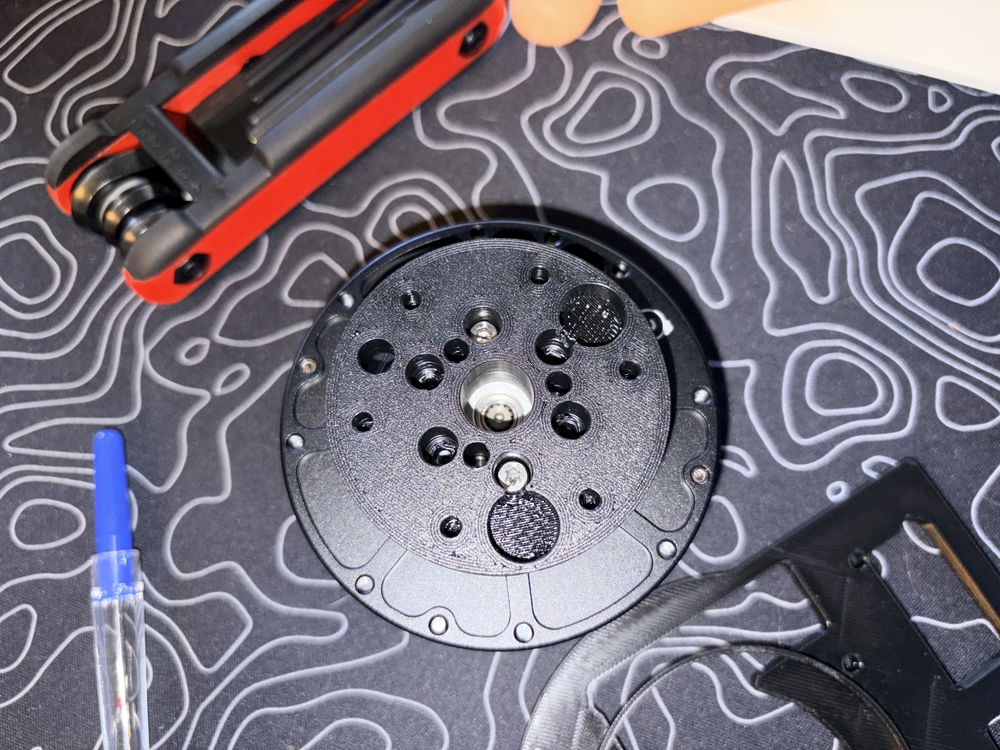
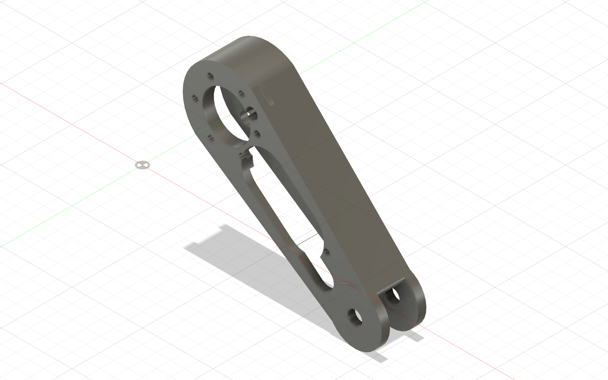

# Picture guide — GIM6010 shoulder to proximal link

This is the visual dry-fit sequence for the **left ABS single-leg article**. It
shows where the printed proximal link goes and which motor it belongs to.

> **Use the GIM6010-8 shoulder motor. Do not try this link on the GIM4305-10
> wheel motor.** Keep the motor unplugged, leave the two 6800 bearings in the
> link, and support the knee end so the printed parts do not carry the link as a
> cantilever. This is a fit check, not a powered or load test.

The canonical fastener schedule and final assembly requirements remain in
[`beni_prototype1_bom_and_assembly.md`](../../beni_prototype1_bom_and_assembly.md#b-leg-build).

## Parts used in this check

- GIM6010-8 shoulder motor
- `Chassis_Shoulder_Plate_L`
- `ABS_FA_Shoulder_Output_Hub_L_D4p15`
- the printed face-flat proximal link with both 6800-2RS bearings installed
- 8 × M3 × 8 housing screws
- 6 × M3 × 10 shoulder-output-hub screws
- 6 × M4 × 10 proximal-link-to-hub screws

For the initial dry fit, only finger-start the screws. Do not apply final torque
or use screws to pull parts together.

## 1. Start with the output hub removed

The shoulder plate goes over the **bare output rotor** from the motor's front
side. The Ø80 motor housing stays behind the plate; it is not supposed to pass
through the plate opening.

Hold the plate with its raised cable-spiral lip facing away from the motor and
its flat panel face toward the stationary motor housing.

## 2. Seat the plate on the stationary housing

Finger-start two opposite **M3 × 8** housing screws, then verify that the other
six start freely. Do not substitute M3 × 10 screws here: they bottom before the
5 mm plate is clamped.

If you are routing the real harness, place it in the plate's cable spiral before
the output hub and proximal link cover this area.

## 3. Install the printed output hub second

Align the hub with the GIM6010's three factory pins and move it straight onto
the output face. The pins must enter with light finger pressure and the hub must
reach the metal face without screw force.

Once seated, finger-start the six **M3 × 10** output-hub screws.

The photograph below confirms only the hub-to-real-motor fit. The shoulder
plate is not installed in this photograph, so use it as fit evidence—not as the
assembly order:

## 4. Confirm the shoulder stack before adding the link

At this point the stationary plate is behind the printed rotating hub. Nothing
should be pinched between the hub and plate.

## 5. Identify the proximal-link root

The **large circular end with six counterbores and the Ø34 centre access** is the
shoulder end. The forked end containing the two installed 6800 bearings points
away from the shoulder motor toward the knee.

Do not put either end of this link against the GIM4305 wheel motor. That motor
eventually mounts to the unreleased distal link.

## 6. Fit the proximal link to the shoulder hub

Support the bearing end on a block or folded towel. Bring the link's large root
face squarely onto the hub's outboard flange and align the six Ø44 bolt-circle
positions.

1. Finger-start two opposite **M4 × 10** screws through the link into the hub.
2. Confirm the remaining four screws also start freely.
3. Confirm the root face sits flush all the way around.
4. Confirm the hub screws remain reachable through the link's Ø34 centre access
   and the M4 driver path is clear through the link's Ø9 access holes.
5. Stop at the dry-fit state; keep the motor unplugged and the link supported.

The final orientation looks like the upper link in this complete-leg view:

## Pass / stop decision

**PASS** when the link reaches the hub face without force, all six M4 screws
finger-start, the faces remain flush, and the link clears the stationary plate
and cable path.

**STOP** if a screw is needed to draw the link into position, a screw starts
crooked, the root rocks, or the link touches the stationary plate. Photograph
the exact interference and remove the link rather than forcing it.

After this check, the distal-link build remains on hold until a real Ø10 h6/h5 ×
35 mm steel knee pin passes the recorded fit gate. Do not energize the shoulder
with only the proximal link cantilevered from it.
