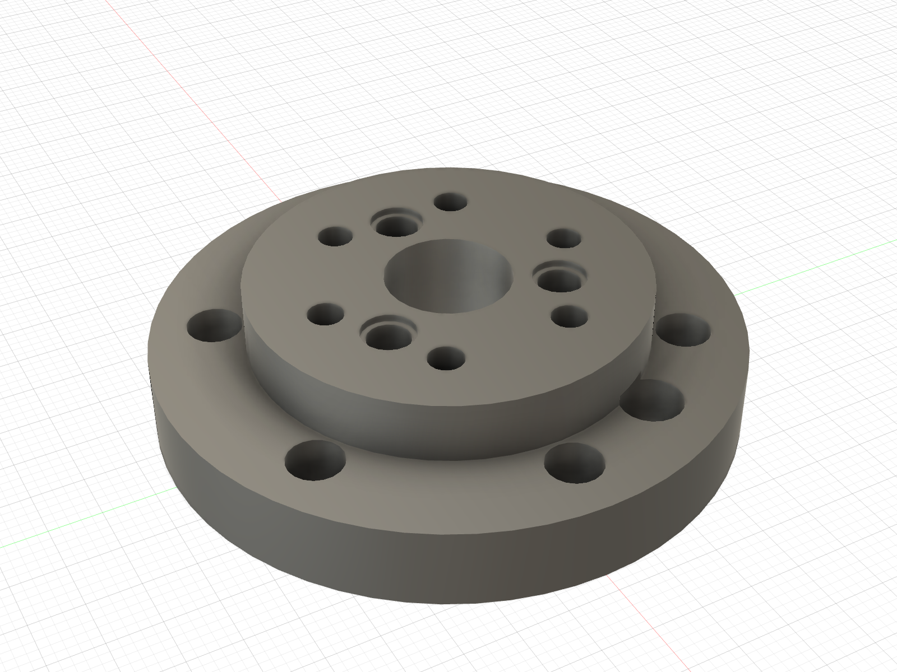

# Picture guide — GIM6010 shoulder to proximal link

This is the visual dry-fit sequence for the **left ABS single-leg article**. It
shows where the printed proximal link goes and which motor it belongs to.

> **Use the GIM6010-8 shoulder motor. Do not try this link on the GIM4305-10
> wheel motor.** Keep the motor unplugged, leave the two 6800 bearings in the
> link, and support the knee end so the printed parts do not carry the link as a
> cantilever. This is a fit check, not a powered or load test.

> **Updated 2026-09-05:** the owner successfully printed the corrected hub and
> installed its inserts. Keep it. Use the replacement proximal link in the
> [print queue](../../README.md#current-print--convenience-link): two blocked
> head paths and one incomplete M4 screw seat are corrected. Physical rehearsal
> of the new link is still required.

The canonical fastener schedule and final assembly requirements remain in
[`beni_prototype1_bom_and_assembly.md`](../../beni_prototype1_bom_and_assembly.md#b-leg-build).

## Parts used in this check

- GIM6010-8 shoulder motor
- `Chassis_Shoulder_Plate_L`
- the coupon-selected `ABS_FA_Shoulder_Output_Hub_L_D4p15` replacement
- the corrected Ø19.15 face-flat proximal link and two 6800-2RS bearings
- 8 × M3 × 8 housing screws
- 6 × M3 × 10 shoulder-output-hub screws
- 6 × owner-held Kadriick M4 × 8 heat-set inserts and
  6 × M4 × 10 proximal-link-to-hub screws

For the initial dry fit, only finger-start the screws. Do not apply final torque
or use screws to pull parts together.

## 1. Start with the output hub removed

The shoulder plate goes over the **bare output rotor** from the motor's front
side. The Ø80 motor housing stays behind the plate; it is not supposed to pass
through the plate opening.

Hold the plate with its raised cable-spiral lip facing away from the motor and
its flat panel face toward the stationary motor housing.

## 2. Seat the plate on the stationary housing

Finger-start two opposite **M3 × 8** housing screws, then verify that the other
six start freely. Do not substitute M3 × 10 screws here: they bottom before the
5 mm plate is clamped.

If you are routing the real harness, place it in the plate's cable spiral before
the output hub and proximal link cover this area.

## 3. Install the printed output hub second

Align the hub with the GIM6010's three factory pins and move it straight onto
the output face. The pins must enter with light finger pressure and the hub must
reach the metal face without screw force.

Once seated, finger-start the six **M3 × 10** output-hub screws.

The photograph below confirms only the hub-to-real-motor fit. The shoulder
plate is not installed in this photograph, so use it as fit evidence—not as the
assembly order:

## 4. Confirm the shoulder stack before adding the link

At this point the stationary plate is behind the printed rotating hub. Nothing
should be pinched between the hub and plate.

## 5. Identify the proximal-link root

The **large circular end with six counterbores and the Ø34 centre access** is the
shoulder end. The forked end containing the two installed 6800 bearings points
away from the shoulder motor toward the knee.

Do not put either end of this link against the GIM4305 wheel motor. That motor
eventually mounts to the unreleased distal link.

## Where the heat inserts go

The proximal link does **not** bolt into the shoulder plate. Its six M4 screws
pass through the link's root counterbores and thread into six inserts installed
from the outboard face of the **rotating shoulder hub**.

The picture shows the Fusion-exported **Ø5.3 ABS receiver** selected by the
owner's passing ladder. Install six M4 × 8 inserts in the detached hub from the
outboard/link face with a depth stop. Each occupies the full 8.0 mm flange.
M4 × 10 link screws have 6.2 mm thread engagement and 1.8 mm end clearance in
the final pose. The corrected link has continuous head and driver access.

The four smaller M3 inserts in the shoulder area belong in the **stationary
shoulder plate**, only for the removable cable cover. The cover itself has four
Ø3.4 clearance holes and no inserts; its M3 × 10 screws are installed from the
accessible outboard face.

| Shoulder plate — four M3 receivers | Cable cover — four clearance holes |
|:---:|:---:|
|  |  |

## 6. Rehearse the corrected link, then attach it

Use `ABS_FA_Proximal_Link_L_D19p15_M4_ACCESS_FIXED_PRINT_ORIENTED.stl`.
Before fitting the link, pass each of the six M4 × 10 screws through its outer
access hole. Every head must rest flat on its counterbore floor without force.
The lightening opening now stops short of the previously clipped seat.

Rehearse both bearing seats with outer-race thumb pressure. Both bearings must
sit square and have no perceptible radial rock. Reuse old bearings only if they
can be removed without damage. The active replacement has five verified Ø4.5
M3 pockets selected from the same-profile ABS ladder. Install no M3 inserts in
the prior printed Ø4.0 revision.

Support the knee end. Move the link straight onto the accepted hub, finger-start
all six M4 × 10 screws, and check each head clamps flat. Do not use screws to
draw the link into place. Remove and refit it once to confirm the service path.

If fitting front cable post A, put it on the outside of the cover first. Its
upper two screws are **M3 × 12**, replacing the two upper cover M3 × 10;
the lower two remain ×10. The post's eye projects beyond the cover edge. Route
the tie and harness before the link, then hand-check clearance with the knee
supported. Remove the link before servicing the cover; remove cover/post before
accessing the housing screws.

[Exact Fusion audit and physical acceptance](../../evidence/assembly/2026-09-05_access_fix/).
The distal-link build still awaits the real Ø10 × 35 steel pin, verified
retention and printability. Keep both motors unplugged for this rehearsal.
