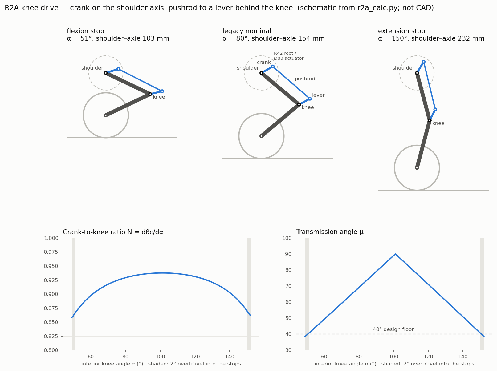

# Active-Knee Revision 2 plan (R2A)

Status: **digital gate closed 2026-09-27; ABS single-leg print set released;
all-printed proof of concept CAD-verified and released 2026-09-29; nothing
physically verified.** R2A work lives on the `r2a-active-knee` branch.
The Fusion model is `Beni_R2A_SingleLeg` (v5); its measurements are in the
[digital-gate record](../../evidence/r2a/2026-09-27_digital_gate/README.md).
Every mechanism, load and capability figure below is printed by
[`r2a_calc.py`](../../r2a_calc.py), which now loads the modelled geometry from
that record. Rerun the script rather than editing a figure here.

The name **R2A** distinguishes this architecture reset from the repository's
older `Beni_Prototype1` “revision 2,” which was a production-readiness revision
of the passive-knee model.

## 1. Decision

On 2026-09-27 the owner directed that R2A copy the knee mechanics seen in the
[Beni teardown](../../evidence/reference/2026-09-25_beni_teardown/README.md),
reuse the owned actuators and electronics, and add one actuator per leg.

- **Knee:** a second **GIM6010-8** rides on the proximal-link root, coaxial
  with the shoulder axis, with its output facing inboard. A crank on its output
  turns inside the link. A rod-end pushrod runs down the former spring channel
  to a lever on the distal link behind the knee. The result is a four-bar whose
  ground link is the proximal link itself.
- **Shoulder:** unchanged. The owned GIM6010-8 drives the leg directly through
  the existing plate and printed output hub.
- **Wheel:** unchanged. The owned GIM4305-10 and the wheel module stay as they
  are.

Each leg therefore has three commanded axes: shoulder, knee crank and wheel.
The loose spring, cartridge eyes, guide bar and spring clevises are not part of
R2A.

## 2. What is copied from Beni, and what is not

| Beni (frame review) | R2A | Why |
|---|---|---|
| Hip-coaxial crank inside the thigh root, link along the thigh, lever on the shin behind the knee axle | **Copied** | The knee motor sits on the shoulder axis, so its weight adds no static shoulder torque and little leg inertia. The drive is stiff and slip-free, and it needs no tensioner. |
| Knee motor carried on the hip assembly (best-supported reading) | **Copied**: the knee actuator stator bolts to the proximal link | The knee coordinate is referenced to the proximal link, so there is no shoulder/knee coupling term. The knee reaction torque stays inside the leg. |
| Hip driven by an offset body motor through a short 2M belt to a large hip ring | **Not copied** | The owned GIM6010-8 already has an 8:1 planetary and drives the shoulder directly. A belt stage would add a ring pulley, a large bearing, a tensioner and backlash to a joint that does not need them. |
| Pancake motor inboard of the main hip bearing | **Not possible** | The GIM6010-8 output is solid ([design record §2.1](../../beni_prototype1_design_record.md)), so nothing can pass through the shoulder axis. The knee actuator goes outboard of the link root instead. |
| Wheel drive in the shin-end housing; wheel cable through the knee window | Wheel module unchanged; cable crosses the knee on the inboard side | The existing wheel interface is kept. |

The Beni frames do not settle which of its two hip drives turns the knee crank.
That question does not affect R2A, because R2A's knee crank is driven by its
own actuator on the proximal link.

## 3. Mechanism

The schematic is drawn by `python3 r2a_calc.py --plot`; it is not CAD. The CAD
views are on the [project homepage](../../README.md). Frame: the shoulder axis
S and knee axis K lie on the proximal link, and α is the interior knee angle
(legacy φ = 80° − α).

| Item | Value |
|---|---|
| Crank, shoulder axis → crank pin | **32 mm** |
| Pushrod, pin to pin | **120 mm** (equal to L1) |
| Lever, knee axis → lever pin | **30 mm** |
| Lever position on the distal link | +168° from the distal-link direction: 12° short of straight through the knee |
| Working range | α = **51°** (flexion stop) … **150°** (extension stop); shoulder–axle 103.3 … 231.8 mm. Fusion stop contact: 51.00° / 150.00° |
| Leg-length stroke | **128.5 mm**; the legacy passive 0 → +25° stroke was 46.1 mm |
| Crank travel | 94.4° for 103° of knee, including 2° overtravel at each stop |
| Knee-to-crank ratio N = dθc/dα | 0.866 at the stops … 0.937 mid-range |
| Transmission angle μ | ≥ 40.4° over the working range; 38.5° at full overtravel |
| Crank margin from toggle | 42.8° |
| Rod clearance to the distal knee boss | 3.1 mm in the script (rod and jam-nut envelope R4.62 to the Ø22 boss, clear of the R9.0 eyes); **2.80 mm in Fusion** (rod and jam nuts to the distal link, α ≤ 55°) |
| Tyre to the wall around the crank sweep | 45.8 mm |

Linkage map for firmware. θc is measured from the shoulder→knee line, positive
toward the side away from the distal link. Fusion measured the same θc to
0.001° at 11 knee angles with pin-to-pin 120.000 mm in every pose, so this map
is the CAD map ([firmware table](../../firmware/r2a/README.md)):

| α | θc | N | μ | Crank torque to stand, 4.768 kg robot | Rod force at 1.5 × stall |
|---:|---:|---:|---:|---:|---:|
| 51° | 43.1° | 0.866 | 40.4° | 3.08 N·m | 735 N |
| 65° | 55.6° | 0.909 | 54.2° | 2.74 N·m | 616 N |
| 80° | 69.4° | 0.929 | 69.0° | 2.43 N·m | 547 N |
| 100° | 88.1° | 0.937 | 89.0° | 2.02 N·m | 516 N |
| 120° | 106.8° | 0.931 | 71.0° | 1.59 N·m | 542 N |
| 140° | 125.2° | 0.903 | 50.8° | 1.12 N·m | 641 N |
| 150° | 134.1° | 0.870 | 40.6° | 0.88 N·m | 735 N |

Design reasoning:

1. **Flexion stop.** The tyre reaches the parts on the shoulder axis before
   anything else. The outboard cheek that holds the actuator's 8 × M3 on Ø74 PCD
   needs R42.0, and the tyre shares 6.6 mm of its Y band. Leaving 5 mm of
   clearance gives d ≥ 102.0 mm, so α ≥ 50.30°; the stop is at 51°. Fusion
   measures 5.49 mm of tyre clearance at the stop contact. The tyre against the
   link underside would allow 35.7°, so it does not govern.
2. **Extension stop.** It keeps the leg 30° from straight, so the knee retains
   moment arm and stays away from the straight-leg singularity.
3. **No useful reduction is available.** The classical 40° transmission-angle
   floor across roughly 100° of knee travel leaves almost no room for a variable
   ratio.
   - All 421 feasible geometries out of 222,794 searched are near-parallelograms.
   - The idealised push-off is flat across them, at 132–134 mm CoM rise.
   - Designs with N up to 2.2 exist but need 1229–1579 N of rod force for no
     gain.

   The knee actuator must therefore supply roughly the full knee torque, and
   that sets its class (§5).
4. **Selection.** Among designs within 3% of the best push-off, the pin
   envelope is limited to 41 mm from the link line (32 mm pin centres plus the
   R9.0 modelled rod-end eye), and the lowest rod force wins: 761 N at the
   design case.
5. **The rod is in tension whenever the leg carries weight.** Standing,
   push-off and landing all load it in tension. Only flexion torque, such as
   retracting the wheel, compresses it. An M5 steel rod over 120 mm has an Euler
   load of 1965 N against the 761 N design force, a factor of 2.58.
6. **Two-force member.** With spherical rod ends at both ends the pushrod
   carries only axial load. It tolerates small misalignment and puts no bending
   into the printed crank or lever. The crank and lever clevises are coplanar at
   **y = 75.5**, 1.0 mm outboard of the concept's cartridge plane, so the crank
   cap clears the M4 hub-screw heads (§7).
7. **Impact path.** Knee stops carry impacts directly between the proximal and
   distal links. The linkage sees at most the actuator's current-limited
   torque.

## 4. Lateral stack (left leg)

Datums inboard of y = 59.5 are unchanged from
[design record §3](../../beni_prototype1_design_record.md). Values are the
Fusion model's (`stack_y_mm` in the gate record).

| y (mm) | Feature |
|---:|---|
| 5 … 59.5 | **Unchanged:** shoulder GIM6010-8, `Chassis_Shoulder_Plate_L`, printed `Shoulder_Output_Hub_L` with 6 × Kadriick M4 × 8 inserts on Ø44 PCD |
| 53.6 … 59.5 | Knee-pin cap on the inboard face (the knee end only) |
| 56.1 … 91.1 | Ø10 × 35 knee pin |
| 59.5 … 84.5 | Proximal-link **inboard half**: cheek 59.5 … 64.5, printed on its hub face. Knee bearing A 59.5 … 64.5 against a lip at 64.5 … 65.3. Roof, back wall, floor and cable-duct wall rise to the wall tops at 84.5. It bolts to the hub with the existing 6 × M4 × 10 (heads 63.3 … 67.3). |
| 64.5 … 84.5 | **Channel.** Rod plane 75.5 with the rod-end balls in an 8.4 mm gap (71.3 … 79.7). Crank cap 68.3 … 71.3; crank slab 79.7 … 87.6. Lever inboard ear 65.8 … 71.3; lever cap 79.7 … 83.4. Distal knee boss 65.8 … 84.8; steel-pin receiver Ø10.30 × 20.0 at 65.3 … 85.3. |
| 84.5 … 91.1 | Proximal-link **outboard half**, printed on its outer face: bearing B 86.1 … 91.1 against a lip at 85.3 … 86.1. Knee-actuator mount face 91.1; the actuator output face is at 87.6, inside the cheek bore. |
| 91.0 … 97.3 | Encoder arm on the distal outboard pads, magnet face 97.3; AS5048A die 98.3 … 99.3 on its bracket (held) |
| 92.1 … 116.1 | Knee-actuator Ø80 housing, on the shoulder axis |
| 117.1 … 128.1 | Knee-actuator Ø57 driver cover and cable exit |
| 59.5 … 104.5 | **Unchanged** wheel module: distal wheel-end plate, GIM4305-10, rim/tyre, hub |

- **Knee stack moved +0.8 mm.** The legacy bearing A sat at 58.7 … 63.7. R2A
  puts both bearing seats on the bed faces of their halves (y 59.5 and 91.1),
  so each half prints on one flat face with every bore normal to the bed.
  Rejected: keeping the legacy positions, which would put a 0.8 mm step in one
  bed face and need support under a bearing seat.
- **Track.** The track across the knee actuators is **256.2 mm**, against the
  legacy outer width of 209.0 mm.
- **Knee encoder.** The magnet rides on an encoder arm keyed to the distal link,
  which also keeps the knee pin from walking outboard; the AS5048A faces it from
  a bracket on the outboard half. The knee actuator is 120 mm away at the
  shoulder.
- **Crank overhang.** The crank is supported only by the actuator's output
  bearing. The rod plane is 12.1 mm inboard of the output face, which puts a
  **9.2 N·m** moment on that bearing at the design rod force.

## 5. Knee actuator: a second GIM6010-8

Candidate data and the rejected options are kept in the
[trade study](active_knee_actuator_trade_study.md).

**Requirement.** Standing at α = 80° needs 2.15 N·m at the knee for the upper
mass estimate of 4.768 kg. After the 0.929 ratio that is 2.43 N·m at the crank,
or 5.2 A: 49% of the 10.5 A rated current. For push-off and landing, a leg force
equal to the whole robot's weight at the crouch needs about 5.0 N·m. The
actuator must also run on the 20 V bench bus (blocker B1).

**Why the GIM6010-8.**
- **Torque.** At the knee, standing uses 43% of its rated torque; stall is
  11 N·m.
- **Bus.** It runs on the 20 V bus that the owned unit already uses.
- **Protocol.** It speaks the same ODrive-CANSimple protocol as the shoulder,
  so it uses the same firmware and the same Teensy bus.
- **Interfaces.** It has the same housing mount (8 × M3 on Ø74) and output
  (6 × M3 on Ø25, plus 3 × Ø4 pins). The printed plate, hub, dowel and insert
  designs, and every coupon they passed, carry over.
- **Spares.** There is one actuator family to stock.

**What it costs.**
- **Mass.** It adds 388 g bare, or 500 g by the brief's figure (conflict C4
  unresolved), plus a modelled 229 g of linkage per leg. R2A two-leg mass
  becomes 4.544–4.768 kg.
- **Size.** The Ø80 housing on the shoulder axis sets the 256.2 mm track and
  the 51° flexion stop.
- **Price.** No price is recorded in the repository; confirm it at order.

**Rejected candidates.**
- **RobStride 05 and EduLite 05:** standing would use 119–134% of their rated
  torque.
- **RobStride 00, 01 and 02:** each has the torque but needs at least 24 V, uses
  a different CAN protocol and a new mechanical interface. The RobStride 00
  remains the fallback if knee mass must drop after B1 allows a bus of 24 V or
  more.

**Capability** is idealised: legs are massless, and the torque-speed line uses
420 rpm at 24 V scaled to the bus voltage.
- **Push-off:** 119 mm CoM rise at 4.768 kg, 20 V and a 4.8 N·m cap; 187 mm at
  4.544 kg, 22.2 V and 9.4 N·m.
- **Landing:** holding 4.8 N·m from α = 140° to the stop absorbs a 157 mm free
  drop.

These are upper bounds for planning the load campaign. They are not a jump
rating, and no ABS jump or drop is authorised.

**Purchase.** Buy **one** unit for the single-leg article
([ordering guide](../../procurement/r2a_ordering_guide.md)). Buy the two-leg
units only after the single-leg gates in §10 pass.

## 6. Reuse and new parts: single-leg article

Quantities, requirements and owned-stock status are in the
[ordering guide](../../procurement/r2a_ordering_guide.md); print files and
orientations are in [`r2a_stl/`](../../r2a_stl/README.md).

| Item | Status | R2A use |
|---|---|---|
| GIM6010-8 shoulder, GIM4305-10 wheel, Teensy 4.1, 2 × CAN Pal, AS5048A kit, BNO085, bench PSU at 20 V | Owned | Unchanged roles; bus A carries shoulder and knee |
| `Chassis_Shoulder_Plate_L`, PINREV2 `Shoulder_Output_Hub_L`, `Shoulder_Cable_Cover_L`, `RIG_Stand`, `RIG_Cable_Post_A`, wheel hub, no-tyre shell | Printed, reused | Unchanged. The stand clamps at a bench edge (§10) |
| Ø10 × 35 knee pin, Ø10.30 × 20.0 receiver design, Ø19.15 6800 seat, Ø4.5 M3 and Ø5.3 M4 receivers | Owned / proven fits | Same diameters and print axes in the new parts |
| **Proximal inboard and outboard halves, crank + 2 caps, distal link with integral lever + cap, encoder arm, knee-pin cap, 4 TPU stop plugs** | **Released for print** | The R2A article |
| `R2A_Encoder_Bracket_L` | **Held** | Waits for the AS5048A adapter-board outline |
| **GIM6010-8 knee; 2 M5 rod ends; M5 rod cut to 86.0 mm; 2 thin jam nuts; 2 Ø5 × 18 dowel pins; 6800-2RS pair; M2.5 × 10** | **Buy, after the POC (§10 step 1b)** | See the ordering guide; each has a printed stand-in in [`r2a_poc_stl/`](../../r2a_poc_stl/README.md) |
| Legacy spring, cartridge eyes, guide rod, spring caps, stop plate, cartridge pins; legacy proximal and distal prints | Retired | Evidence only |

**Clevis pins: plain Ø5 × 18 dowels, not shoulder screws.** The concept listed
Ø5 shoulder screws with nuts; a head and a nut do not fit the 20 mm channel
beside the rod-end ball. The pins float between the cheek faces with ≥ 2.7 mm
engagement in every ear at either end of their float, so they need no head,
nut or clip and cannot leave an assembled joint. Rejected: shoulder screws
(no room for the head and nut).

## 7. Assembly and service

The sequence, pictures and service path are in the
[R2A assembly guide](../assembly/r2a_assembly_guide.md). All 33 insertion,
tool and service paths are `CAD PATH VERIFIED`; none is physically rehearsed.

**Sweep conflict with the channel-side screw heads: resolved.**
- **M4 hub screws.** Their heads stay in the legacy counterbores (seat 63.3,
  heads to 67.3). The crank's inboard clevis ear is a separate cap at
  68.3 … 71.3, 1.0 mm above them, pressed onto two Ø4 × 10 dowels; the rod
  plane rose to 75.5 to make room.
- **Knee-actuator housing screws.** The actuator is clocked (161.2° in
  `r2a_lib`) so three of its eight Ø74 threads fall inside the crank sweep and
  stay empty; five M3 × 10 go in the other five, with 17.5° of margin at both
  sector edges.
- **Rejected:** (a) low-head screws counterbored flush, which needs both cheeks
  thickened by the head height and pushes the actuator and track outboard;
  (b) holding the actuator by its rear threads from an outboard cup, which grows
  the root to about R43 and hangs the actuator from a printed cantilever.

**The link box is open on the lever side of the knee.** The inboard half's
roof ends at u = 95 mm and its floor and duct wall at u = 86 mm, short of the
knee axis at u = 120 mm, so the lever and lower rod end sweep between the two
knee cheeks with no wall in their path. The distal link carries a fan-shaped
relief for the rod-end neck.

**Rules that still apply.** No screw may pull a mismatched print into place.
Every screw must have a straight driver path before the halves close. Every
bearing seats in a face printed normal to its axis.

## 8. Printing

The release gate, orientations, slicer constraints and acceptance tests are in
[`r2a_stl/README.md`](../../r2a_stl/README.md).

- **Every fit-critical circular axis is normal to the bed**, as on the passing
  legacy parts: the halves print on their hub and actuator faces, the crank on
  its output face, the distal link on its inboard face.
- **Coupons first:** Ø5 clevis-pin and Ø4 dowel ladder, crank-to-output
  register, crank clevis with a rod end. Each is cut from the released part's
  B-Rep, so it prints the interface on the same axis.
- **Fits that already have coupons:** Ø4.5 M3 and Ø5.3 M4 insert receivers,
  the Ø19.15 6800 seat, the Ø10.30 knee receiver and the shoulder-hub dowel and
  factory-pin fits.
- **Supports:** only the distal link needs them, in five painted regions with
  Fusion-proven removal paths.
- **Materials.** ABS is for fit, assembly, hand motion and wheel-clear,
  current-limited commissioning only (CLAUDE.md rule 7). The structural build
  is PA-CF, with the coupons repeated. At the design rod force, a Ø5 pin in
  double shear runs at 19.4 MPa, and bearing on two ears at the 2.7 mm
  worst-case engagement is 28.2 MPa, against 84–102 MPa for PA-CF in XY.

## 9. Electronics and firmware

- **Bus A** (Teensy CAN1 on a CAN Pal): shoulder GIM6010-8 as node 0 and knee
  GIM6010-8 as node 1, both ODrive CANSimple.
  - Before connecting, change the new unit's node ID from its default of 0
    ([test traveller](../assembly/r2a_test_traveller.md), gate 3).
  - At 1 Mbit, two nodes with command and reply at 1 kHz load the bus to 46.8%
    typical / 54.0% worst. At 500 kbit the same traffic fails (93.6% / 108.0%).
  - Commissioning runs at 100 Hz on the default 500 kbit: 10.8% worst.
- **Bus B:** wheel GIM4305-10 on its GDZ34 driver, unchanged and not commanded until B2 closes.
- **Knee encoder.** The AS5048A gives absolute knee angle; its bracket is on
  hold. The GIM6010-8 encoder is mono-turn
  ([electronics/03 §1.1](../../electronics/03_compute_and_can.md)); gate 3
  tests whether it resolves the output across power cycles. Until the AS5048A
  is fitted, the knee is referenced at the flexion stop at every power-up.
- **Knee command:** θc = f(α) from the §3 map, implemented and host-tested in
  [`firmware/r2a/`](../../firmware/r2a/README.md), with software limits
  α 54° / 147°, 3° inside the rigid stops. There is no shoulder term.
- **Power and regen.**
  - On the rig the knee carries only the leg's own weight: the gate 4 current
    limit is 3.0 A, twice the 1.47 A self-weight hold bound (`r2a_calc.py` §9).
  - On the two-leg robot, standing draws 5.2 A per knee, about 11.3 W of copper
    loss (phase R is still unverified).
  - The brake chopper is deferred, so no powered actuator may be backdriven by
    hand.
- **Two-leg harness.** The legacy four-conductor clock-spring plan carries one
  CAN pair. The knee adds a second protocol-compatible node per leg; revise the
  harness under B7 before the two-leg build.

## 10. Verification ladder

1. **Digital gate — CLOSED 2026-09-27.** In `Beni_R2A_SingleLeg`: 140-pose
   sweep (α 49…152°, shoulder −120…+120°), 0 real clashes; tyre 5.49 mm, rod
   2.80 mm; 33 assembly, tool and service paths; cable envelopes; 37 print
   contracts and print audits; `r2a_calc.py` rerun on the modelled geometry
   ([record](../../evidence/r2a/2026-09-27_digital_gate/README.md)).
   **1b. All-printed proof of concept — CAD-verified 2026-09-29, not built.**
   The step before ordering. The released article prints are assembled with
   printed stand-ins for every purchased part (mock knee actuator with a θc
   dial and lock pin, one-piece pushrod, printed pins and bushings) on the
   Mode A stand, unpowered, and moved by hand. Pass: the designed assembly
   path, the linkage map at five check points within the `r2a_calc.py` §10
   tolerance, stops first and the tyre clear, α independent of the shoulder,
   a reversible linkage, no witness marks at the tight spots and the service
   path ([POC guide](../assembly/r2a_poc_guide.md),
   [CAD evidence](../../evidence/r2a/2026-09-28_poc/README.md)). Order the
   §6 BUY items only after it passes.
2. **Unpowered linkage gate.** The ABS article on the Mode A stand, with the
   actuators disconnected, is moved by hand through its range. No bind, and the
   stops engage before the overtravel limit. The AS5048A map check moves to
   gate 4 while the bracket is held.
3. **Detached drive gate.** Run the knee actuator, crank and rod off the leg
   under a current limit. Verify node ID, direction, encoder behaviour, stop
   logic and fault handling.
4. **Wheel-clear single-leg gate.** Run on the Mode A stand, weight supported,
   wheel clear, slow and current-limited; check the linkage map end to end.
5. **Structural gate.** Print PA-CF parts after repeating the coupons, and
   rebuild the two-leg load model.
6. **Ground and jump gates.** Structural two-leg build only, under a separately
   defined low-energy ladder.

Gates 2–4, with explicit current, speed and range limits and pass/fail
criteria, are in the [test traveller](../assembly/r2a_test_traveller.md). Any
bind, rod-end play beyond its specification, cracked print, stop bypass,
encoder disagreement or unexpected current ends the test at that gate.

**Stand.** The extended R2A leg reaches below the stand's base plane once
α passes 91.8° with the shoulder at 0, and 59.5 mm below it at the extension
stop. The stand is clamped with the leg overhanging a bench edge that lies
between y 42.0 (the stand's outboard face) and y 54.5. The added knee actuator
and linkage add at most 0.53 N·m of static roll moment, against the 11.00 N·m
shoulder-stall yaw that already requires clamping (`r2a_calc.py` §8).

## 11. Rejected alternatives

| Alternative | Why it lost |
|---|---|
| Synchronous belt down the proximal link (the 2026-09-25 plan) | It needs a tensioner, a guard, two pulley shafts and a slip-detecting encoder. Printed pulleys are load-limited. Its ratio buys nothing, because the knee actuator must be 5 N·m-class anyway. Beni does not use it. |
| Beni's exact hip: offset body motor, belt to a hip ring, pancake knee motor inboard | It would retire the proven shoulder stack, and it adds a large bearing and a belt stage to a joint the owned GIM6010-8 already drives directly. |
| Body-fixed knee actuator with a shoulder-axis jackshaft | The GIM6010-8 output is solid, so a shaft would have to come from outboard, across the leg's sweep. The knee reaction would load the body and couple the shoulder and knee coordinates. |
| Knee actuator at the knee or on the distal link | It moves about 0.4 kg away from the shoulder axis, adding shoulder gravity torque and leg inertia, and it widens the knee. |
| Knee actuator part-way along the proximal link | It adds m·r² leg inertia and static shoulder torque for no packaging gain. |
| Strongly variable-ratio four-bar | With about 100° of travel under the μ ≥ 40° rule, ratios up to 2.2 cost 1229–1579 N of rod force for no push-off gain. |
| One-piece proximal link | A closed box around the crank, rod and lever cannot be printed without internal support, and the crank and rod could not be installed. The halves split at the wall tops (y 84.5). |
| Ø5 shoulder screws as clevis pins | No room for a head and a nut beside the ball in the 20 mm channel (§6). |
| RobStride 05 / EduLite 05 | Standing would use 119–134% of rated torque. |
| RobStride 00 / 01 / 02 | They need at least 24 V, a new protocol and a new interface. The RobStride 00 is the fallback if mass must drop after B1 allows a higher bus voltage. |
| Hobby servo, cable drive, printed reducer, spring latch | Unchanged from the [trade study](active_knee_actuator_trade_study.md). |

## 12. Open items

- **AS5048A adapter-board outline** (hole pattern, connector) to release
  `R2A_Encoder_Bracket_L`.
- **Rod-end selection** against the modelled envelope and the ≥ 1521 N static
  rating; the Fusion envelope is a stand-in, not a vendor part.
- **Rod group to crank: 1.95 mm** at the extension stop in Fusion, 0.05 mm under
  the 2.0 mm running-clearance rule. It is joint-internal (the rod end pivots on
  the crank pin) and occurs only at the rigid stop; gate 2 looks for witness
  marks. Reprofile the crank if a larger rod end is chosen.
- **Crank screws:** the M3 × 10 tips reach the floor of the output's 5 mm holes
  in CAD, as on the assembled shoulder hub. Coupon 2 checks that the crank
  clamps before a screw bottoms.
- Find where the GIM6010-8 encoder reads (rotor or output); this decides homing
  (gate 3 test).
- Check the 9.2 N·m crank-overhang moment against the actuator's output bearing.
  The shoulder unit carries the whole leg on the same bearing, but no rating is
  recorded.
- Measure mass properties and regenerate the URDF; resolve C4, the actuator
  mass conflict.
- Revise the two-leg harness across the shoulder (B7).
- Confirm the GIM6010-8 price and lead time.
- Repeat every coupon in PA-CF before the structural build.

## 13. Concept-freeze deliverables

| Deliverable | Status |
|---|---|
| Fusion R2A model with the measured linkage map and complete service sequence | **Done** (`Beni_R2A_SingleLeg` v5, gate record) |
| `r2a_calc.py` rerun with its assumptions replaced by modelled geometry | **Done** |
| Knee stop and bumper design | **Done**: radial faces at 51°/150°, Ø6 TPU plugs; proof 1083 N at R27.5 on 170 mm² → 6.4 MPa (PA-CF case) |
| Rod-end, rod and pin part numbers checked against the §6 requirements | **Open**: requirements and envelope fixed, vendor parts TO CONFIRM |
| Updated mass properties, URDF and linkage map in firmware | Linkage map **done**; mass properties and URDF open |
| Power, CAN and harness plan for three actuators per leg | Single leg **done** (bus A two nodes, bus B wheel); two-leg harness open (B7) |
| Print-orientation and insert/fastener maps for the ABS article | **Done** ([print traveller](../../r2a_stl/README.md), [fastener engagement](../../evidence/r2a/2026-09-27_digital_gate/README.md)) |
| Gate-by-gate test traveller with explicit current and motion limits | **Done** ([traveller](../assembly/r2a_test_traveller.md)) |

## Sources and inherited constraints

- [Beni teardown evidence](../../evidence/reference/2026-09-25_beni_teardown/README.md)
- [Physical spring failure](../../evidence/assembly/2026-09-24_spring_escape/README.md)
- [Manufacturing constraints](../../MANUFACTURING_CONSTRAINTS.md): printed and
  off-the-shelf parts only.
- [Assembly verification](../../ASSEMBLY_VERIFICATION.md): insertion, tool,
  wiring and service paths are release requirements.
- [Delivered actuator evidence](../../evidence/actuators/2026-08-20_received/README.md)
- [Motor interface and lateral-stack datum](../../beni_prototype1_design_record.md),
  §§2–3: legacy geometry inputs, unchanged inboard of y = 59.5.
