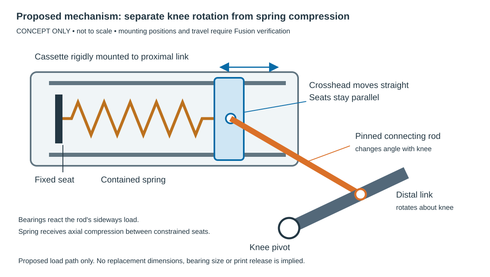

# Knee spring redesign — fixed-axis cassette and connecting rod

Status: **[SUPERSEDED 2026-09-25]**. The owner selected an active, belt-driven
knee after teardown evidence showed that Beni's knee is remotely actuated. This
passive-cassette study remains as failure-analysis history; do not continue it.
The replacement direction is
[`active_knee_revision2_plan.md`](active_knee_revision2_plan.md).

Original status: preferred concept for CAD evaluation; not dimensioned,
verified or released.
Based on the existing Fusion-derived design records, saved audit results and
builder/posing source. No live Fusion inspection was possible in this session:
no Fusion MCP tool is exposed, and plugin discovery returned no Fusion plugin.
No replacement STL, shopping list or physical test authorization is issued.

## Decision

**[SUPERSEDED FOR R2A]** Develop a **spring cassette fixed to the proximal link, with a translating
spring seat driven by a pinned connecting rod from the distal link**. The
existing knee remains a passive revolute joint. The spring axis is fixed
relative to the proximal link, not relative to the floor: the whole module
still rotates with the shoulder.

This is a change to the spring transmission and its reaction structure. It is
not a longer version of the loose guide. The physical report justifies
reopening the cartridge architecture and anchor constraints; it does not
justify changing the shoulder/wheel datums or serial-leg morphology.

The drawing is a mechanism schematic, **not a CAD fit claim**. Position,
proportions, connecting-rod length, mounting faces and operating branch remain
to be selected in Fusion.

## What the current evidence establishes

The owner reports spring bowing, ejection, apparent twisting near both ends,
and difficult assembly. Guide disengagement is another reported defect, but
**the owner requests a mechanism-level redesign rather than a guide repair**.
The root cause of the end distortion is not isolated; neither pivot binding
nor a particular printed-part error is established.

`beni_lib.pose()` computes the line between the cartridge anchors, rotates the
upper eye with `Cu`, and constructs the lower-eye transform `Cl` from the same
rotation plus an axial translation. `mechanical_spring_test_fusion.audit()`
then checks those prescribed poses and an ideal axial spring envelope. That is
useful clearance evidence. It **assumes the aligned configuration** rather
than demonstrating that physical joints, seats and sliding constraints produce
it under load. Collision-free animation did not establish a working spring
transmission.

The older design record §4 item 7 also accepted guide withdrawal using an
unsupported claim that buckling was not credible at small deflection. That
claim cannot justify this build after the physical failure. The old structural
spring and current owned spring are different; neither its old force curve
nor its old seat dimensions may be transferred to this ABS article.

## Proposed parts and load path

| Element | Function and implementation direction |
|---|---|
| Fixed cassette frame | Printed housing attached positively to the proximal link at separated mounting lands. A single existing pivot pin is not a rigid cassette mounting. New load-bearing bosses/mounts need design verification. |
| Fixed spring seat | Rigidly located in the cassette, perpendicular to its translation axis. Use a replaceable seat surface; locate the spring without clamping its end coil against normal end rotation. |
| Translating seat / crosshead | Captive carriage that moves only along the cassette axis. Its seat stays parallel to the fixed seat. Use a bought miniature linear guide with a rated moment capacity, or spaced bearings on bought shafts, selected after force and packaging analysis. |
| Connecting rod | Pin-jointed at the distal anchor and crosshead. It changes angle as the knee rotates; it does not carry a spring seat. Use bought smooth bearing surfaces and positive pin retention. No threaded shank as a bearing surface. |
| Spring enclosure | Removable cover and located seats keep the spring contained during handling. Clearance must allow the spring's diameter change and manufacturing tolerance; the enclosure is not a substitute for carriage bearings. |
| Captive travel limits | Retain the carriage and spring module when detached. Knee hard stops remain independent of coil bind and linear-guide end stops. Spring removal must be possible unloaded without dismantling the knee. |

Load path: distal-link spring anchor → connecting rod → crosshead → spring →
fixed seat → cassette mounts → proximal link. The connecting rod's transverse
force and overturning moment go through the **linear bearings and housing**,
not through an angled spring seat. This added bearing/mount load is a real
tradeoff and must be sized, not hidden.

Assembly concept: assemble bearings, crosshead, spring, end retention and cover
on the bench as one captive module; attach the module to the proximal link;
connect the rod to the distal link in the unloaded assembly position. No step
should require simultaneously aligning two loose spring caps and a free guide.
This is a design requirement, not yet a released assembly procedure.

## Fit to the existing robot

These are existing values, copied without recalculation; they do not describe
the proposed cassette.

| Existing constraint | Source and implication |
|---|---|
| Proximal and distal links: 120 mm each | Frozen guide §4. Preserve the shoulder, knee and wheel centers initially. |
| Current spring channel: 20 mm; structural knee width: 30 mm | Design record §3–4. Do not assume an enclosure plus carriage fits around the owned spring in this channel. |
| Owned spring: OD18 / ID9 / 50 mm | September 17 release. Retain only if the new travel, load and package work; its rate and solid height remain unmeasured. |
| Existing anchor radii Ru = 36 mm, Rl = 54 mm; nominal included angle 110° | Frozen guide §5. Evaluate the current distal clevis as the first connecting-rod pickup. A rigid cassette replaces the upper eye's role; old force-curve acceptance no longer applies. |
| Current cartridge eye spacing: 77.70 mm at -8°, 74.44 mm at 0° | Original CAD-derived design record §1.2. These are reference packaging constraints, not cassette lengths. |
| ABS spring compression: 0.000 mm at -8°, 3.257 mm at 0°, 10.240 mm at +15° | September 17 release. Historical geometric targets only; do not impose them on the new linkage without verifying its motion ratio. |
| ABS motion scope -8°…+15°; later structural stop +27° | Active traveller versus frozen structural guide. Check each explicitly; do not extend the ABS test to the structural range. |

Place the first layout study along the proximal link, near its existing spring
attachment region, with the load path as close to the leg's central plane as
practical. This is a **search region**, not established free space. The housing
may require a redesigned proximal link; the distal link can be retained only
if its existing clevis and new rod sweep pass the checks. An outboard relocation
must account for added bending and for the stop plate, pin keeper, future
encoder, motor and harness envelopes. Do not promise reuse of either link yet.

Shoulder plate, output hub, wheel actuator and wheel hub are outside the
intended redesign, subject to the full sweep clearance check.

## Alternatives considered

| Architecture | Advantage | Reason for selection or rejection at this stage |
|---|---|---|
| **Fixed cassette + connecting rod** | Seats have mechanically constrained orientation; knee rotation is accommodated in separate joints; captive bench assembly | **Preferred CAD study.** Adds linear-bearing side loads, rigid mounts and packaging work. Must reject if travel reverses, approaches a toggle, binds or cannot fit. |
| Captive pivoting coil-over cartridge with bearing eyes | Preserves the existing two-anchor load path most directly; could avoid a complete transmission change | Credible fallback, not inherently invalid because it changes angle. Needs a genuinely constrained telescoping body, free bearings and containment. Existing evidence does not show enough room for that body and end fittings; no suitable bought unit has been selected. |
| Torsion spring concentric with knee | Direct rotary compliance; removes axial spring seats entirely | New torque curve, mandrel, leg reactions and axial package compete with bearings, stop and encoder/keeper. No stocked spring meeting torque, fatigue and packaging requirements has been identified. Not a drop-in use of the owned spring. |
| Bell crank driving a fixed spring cassette | Additional control over motion ratio and packaging | Reserve only if the direct connecting rod cannot give the required travel/force curve. Adds another pivot, backlash, structure and service burden. |
| Longer loose guide / deeper caps only | Fewer changed parts | Does not resolve the requested architecture and assembly problem or demonstrate seat alignment. Rejected as the redesign scope. |

## Required engineering before a part can be released

1. **Validate the existing assembly through Fusion MCP.** Use the saved active
   rig; check reference guards, approved shapes, actual eye/pin axes, seats,
   stop positions and available space. Compare the physical end distortion to
   the actual mechanism, without requiring another spring-ejection test.
2. **Build a mechanism skeleton with constraints.** Ground the cassette to the
   proximal link, constrain the crosshead to translation and connect the rod
   with revolute joints. Drive only the knee angle. Do not independently pose
   the spring seats to make the result look aligned.
3. **Evaluate transmission.** Determine compression s(φ) from the constrained
   linkage. Require monotonic compression and no toggle over the intended
   range. The ideal restoring torque magnitude follows
   `τ(φ) = F(s) · ds/dφ`, with φ in radians. Neither the old moment-arm table nor
   its wheel-force curve is valid for a changed transmission. Evaluate carriage
   side loads, bearing moments, pin loads, rod buckling and housing reactions.
4. **Select the spring and bearings from traceable data.** The owned spring's
   color is not a force specification. Use supplier data or an appropriately
   separate characterization fixture; load characterization remains outside
   the active ABS self-weight article. Verify solid-height margin and fatigue
   requirements before a structural version is considered.
5. **Prove packaging and service.** Check full shoulder motion, both knee scopes,
   wheel motor, stops, future encoder, harness, fastener tools, module insertion
   and unloaded spring removal. Include tolerance, bearing alignment and
   printed-part deflection in the design review.
6. **Release through the existing gates.** Apply print-axis and coupon rules,
   renew dimensional contracts and native geometry/path checks through Fusion
   MCP, then export and verify meshes. Keep present files unchanged until
   replacement release. No source-only edit is a verified CAD revision.
7. **Physical acceptance begins spring-free.** Confirm the constrained mechanism
   travels freely and the seat orientation remains fixed. Subsequent contained,
   unpowered spring checks require a separately reviewed release. No spring
   bowing, ejection, side rubbing or manual realignment is acceptable.

## Sources

- [Existing failure and owner feedback](../../evidence/assembly/2026-09-24_spring_escape/README.md).
- [CAD-derived geometry and historical assumptions](../../beni_prototype1_design_record.md), §1, §3–4.
- [Frozen architecture and targets](../../beni_prototype1_fusion_guide_rewritten.md), §4–6; changes proposed here are not silently adopted into that datum.
- [Current ABS cartridge release evidence](../../evidence/assembly/2026-09-17_abs_spring_mechanical_test/README.md).
- [Posing source](../../beni_lib.py), `pose()`; [ABS audit source](../../mechanical_spring_test_fusion.py), `audit()`.
- [Lee Spring — compression spring design](https://www.leespring.com/learn-about-compression-springs): axial loading, spring expansion and guidance clearance. Supports the design principles, not this cassette's dimensions.
- [Thomson — linear guide rails](https://www.thomsonlinear.com/en/products/profile-rail/about-guide-rails): commercial linear guidance options. No product is selected or load-rated for this robot here.
- [Lee Spring — torsion springs](https://www.leespring.fr/en/learn-about-torsion-springs): mandrel and coil-body changes under deflection, relevant to the rejected drop-in torsion assumption.
