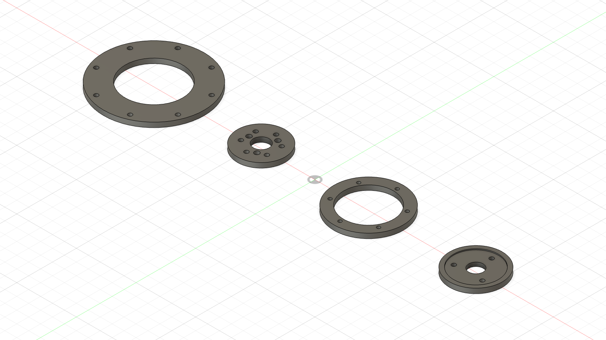
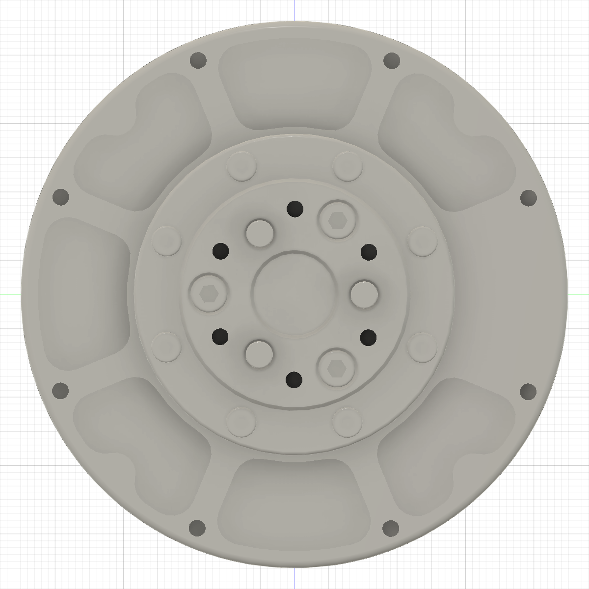
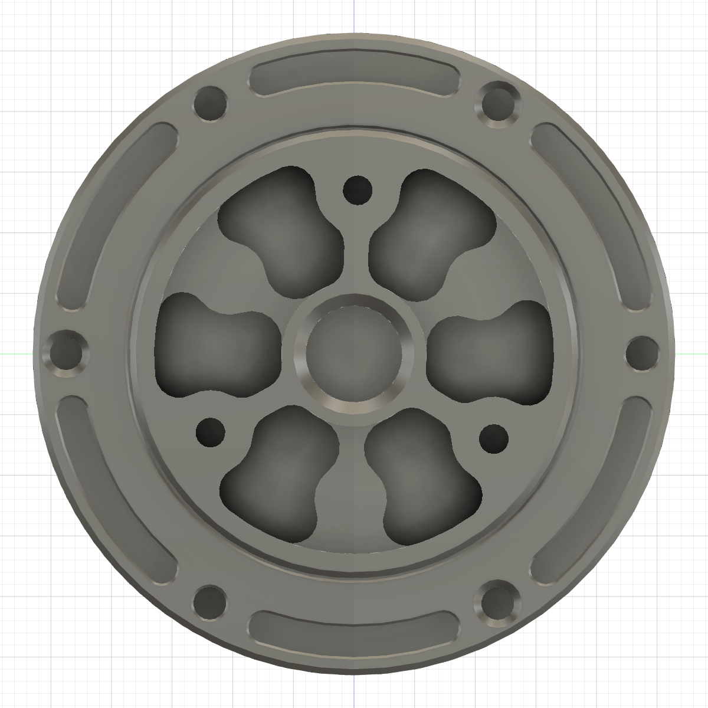

# ABS actuator-interface coupon test

The owner reported all four ABS actuator-interface coupons printed on
2026-08-22. This guide maps each coupon to the delivered actuator and records
the physical results reported that day. Photographic evidence remains pending.

## Reported results — 2026-08-22

| Test | Interface | Result | Evidence/status |
|---:|---|---|---|
| 1 | GIM6010 housing | **PASS** | Owner report: worked well; photograph pending. |
| 2 | GIM6010 output | **FAIL — BORE CLEARANCE** | Owner reports the three-hole pattern aligns perfectly, but the factory pins do not slide into the Ø4.05 printed bores. Do not clamp or force. Run the [Ø4.15/4.20/4.25 ABS diagnostic set](../../../first_article_stl/actuator_fit/gim6010_pin_trials/README.md) before changing the structural hub. |
| 3 | GIM4305 housing | **PENDING** | Matching M2.5 screws ordered; test not yet run. |
| 4 | GIM4305 output | **PASS** | Owner report: worked well; photograph pending. |

## Identify the four coupons

Fusion view, left to right:

1. `ABS_FIT_GIM6010_HOUSING` — largest ring, eight holes.
2. `ABS_FIT_GIM6010_OUTPUT` — small disk, six M3 holes plus three larger pin holes.
3. `ABS_FIT_GIM4305_HOUSING` — medium ring, six holes.
4. `ABS_FIT_GIM4305_OUTPUT` — smallest disk, three holes; one face has a shallow
   circular register pocket.

## GIM6010-8 shoulder actuator

Use the output side shown below. Both GIM6010 coupons test this same side, one
at a time.

### Test 1 — housing coupon

- Use the largest ring: `ABS_FIT_GIM6010_HOUSING`.
- Pass it over the centre output and place it on the stationary outer housing
  face.
- Rotate it until all eight outer holes align.
- Start two opposite M3 screws using fingertips only. Do not tighten them.
- Check the other six holes using loose screw shanks.

### Test 2 — output coupon

- Use the small disk with six small holes and three larger pin holes:
  `ABS_FIT_GIM6010_OUTPUT`.
- Place it on the rotating centre output.
- All three factory locating pins must enter together without tapping or using
  the screws to draw the coupon down.
- Confirm that all six M3 holes align; fingertip-start two opposite screws only.

## GIM4305-10 wheel actuator

Use the output side shown below. Both GIM4305 coupons test this same side, one
at a time.

### Test 3 — housing coupon

- Use the medium ring: `ABS_FIT_GIM4305_HOUSING`.
- Pass it over the centre output and place it on the stationary outer housing
  face.
- Rotate it until all six holes align.
- Start two opposite M2.5 screws using fingertips only. Do not tighten them.
- Check the other four holes using loose screw shanks.

### Test 4 — output coupon

- Use the smallest three-hole disk: `ABS_FIT_GIM4305_OUTPUT`.
- Put the face with the shallow wide circular pocket **toward the actuator**.
- Place it on the rotating centre output and rotate it until the three M3 holes
  align.
- It must sit flat on the output register before any screw is inserted.
- Fingertip-start the three M3 screws; do not use them to pull the coupon flat.

## Pass/fail rule

For each coupon, record:

- **PASS** — reaches the mating face by hand, lies flat without rocking, and the
  stated screws/pins enter without bending or drawing the coupon sideways.
- **FAIL** — catches on the centre/register, rocks, leaves a visible gap, needs
  tapping or screw torque to seat, or any hole cannot accept the matching
  screw/pin freely.

Before sanding, drilling, filing, heating or forcing anything, photograph:

1. A face-on view showing the complete coupon and actuator.
2. A low side view showing the mating seam.
3. A close-up of any obstruction or misaligned hole.

Send those photographs back with the four PASS/FAIL results. Do not energise or
backdrive either actuator during these checks.
