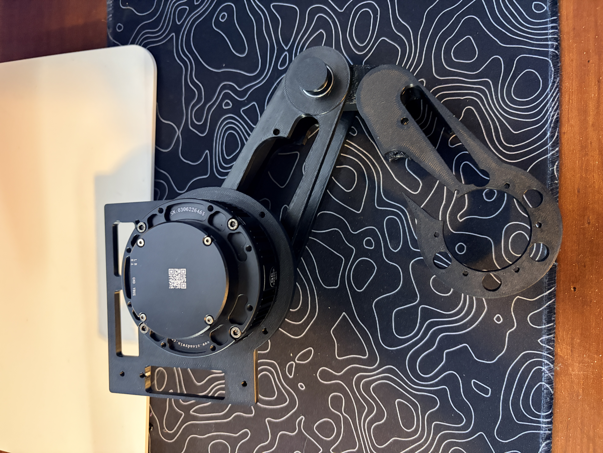

# Provisional knee assembly — owner report, 2026-09-07

The owner reports: “I printed the pin, the 2 spring caps, and the other link.
I was able to do the provisional assembly well.” The other link is interpreted
as the provisional distal link from the [released mock-up batch](../../../first_article_stl/knee_mockup/).

## Recorded result

- **Printed:** temporary knee pin, provisional distal link and two spring caps.
- **Provisional assembly succeeded, owner reported.** The photo shows the
  shoulder actuator/plate and proximal link connected to the provisional
  distal link with a printed knee pin visible. The wheel-motor mount is empty;
  the main spring and detached caps are not visible.
- **Supported knee hand fit: PASS.** In follow-up, the owner confirmed the
  knee moves freely with both links supported and the printed pin pulls out
  easily.
- **Detached spring-cap fit: PASS.** Both spring ends sit flat on the caps
  without force or compression, confirmed in the same follow-up.
- **Corrected proximal link and six hub screw seats: PASS.** The owner confirms
  this is the corrected replacement and all six screws seat properly.

The follow-up response was “Yes to all of them” to the three checks above.
These are owner physical observations, not measurements inferred from the photo.
Detailed support-removal quality and full-depth bearing seating/radial-rock
checks were not separately reported.

**PHYSICAL ASSEMBLY VERIFIED — supported provisional knee hand fit and corrected
proximal six-screw seating only.** The detached cap fit also passes. This does
not establish steel-pin fit, axial retention, encoder
coupling, spring-cartridge compatibility or a powered assembly release.

## Procedure scope

The [bench traveller](../../../first_article_stl/knee_mockup/#bench-assembly)
remains scoped to two detached links, both supported throughout. The photo
shows the shoulder motor attached; the owner's follow-up confirms the knee
movement/removal checks were supported. This does not extend the mock-up's
release to motor loads or power. Support the assembly before detaching the
link from the shoulder, and do not use the printed pin to suspend the distal
link or any motor. The passed cap fit remains an uncompressed, detached test.

Current priorities and remaining releases are maintained in
[PROJECT_STATUS.md](../../../PROJECT_STATUS.md); the active downloads are in
the final [README print queue](../../../README.md#current-print--convenience-link).

## Provenance

This update uses the owner's September 7 report/photo and local repository
baseline `8d72d8ebe2ad6f8753a71a535a1d07c06777506d`. The discarded remote-only
September 7 commits were not checked out, merged or read for engineering
content. No Fusion model, geometry, STL or firmware changed in this update.
