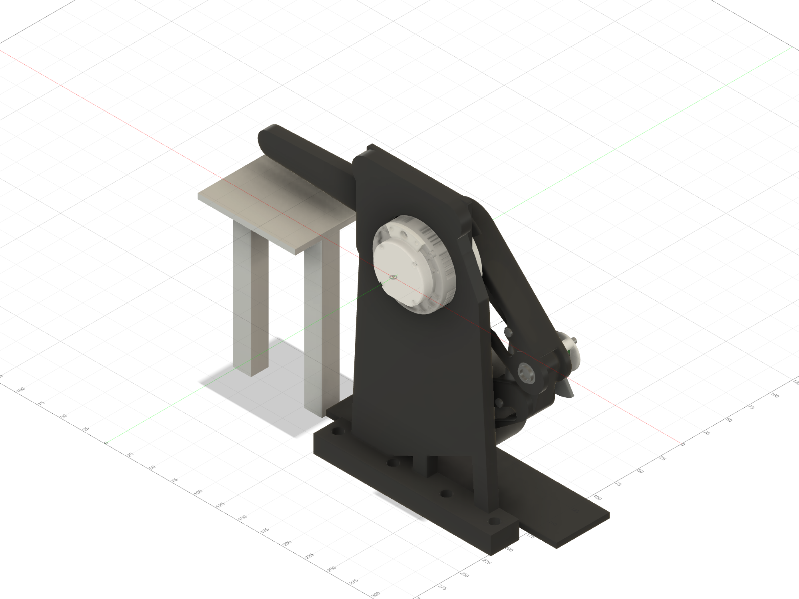
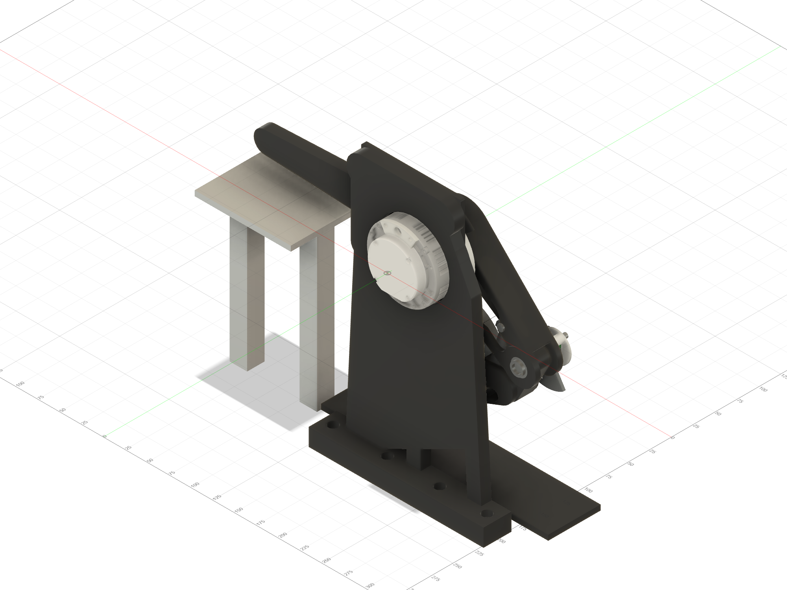

# Fusion release — unpowered ABS spring-mechanical article

> **September 21 update:** the original stop plate, Ø4 × 32 clevis-pin stack,
> and Ø6 × 9 stop-dowel stack are superseded by the
> [ordered-pin integration](../2026-09-21_ordered_pin_integration/). The motion
> limits, cartridge eyes, guide, D10 knee-pin keeper, wheel shell, and the
> updated mechanical audit remain current. The ordered-pin geometry is saved
> in `Beni_SingleLegRig` v28; v27 remains the historical September 17 release
> identified below.

The owner asked to complete a mechanical single-leg article in ABS, install the
owned OD18 / ID9 / 50 mm spring, keep both motors unpowered, and observe how the
spring and self-weight set the leg's compressed position. This record releases
that controlled test and no powered or structural use.

Fusion document `Beni_SingleLegRig` v27 was edited, swept, exported, saved, and verified
through the Fusion MCP. The new cartridge retains the frozen upper pivot-to-seat
datum and changes the total pin-to-seat dead length to **27.700099 mm**. This
gives these exact geometric endpoints:

| Knee angle | Installed spring length | Compression from 50 mm | Guide overlap | Guide-end clearance |
|---:|---:|---:|---:|---:|
| -8° | 50.000 mm | 0.000 mm | 5.500 mm | 13.200 mm |
| 0° | 46.743 mm | 3.257 mm | 8.757 mm | 9.943 mm |
| +15° | 39.760 mm | 10.240 mm | 15.740 mm | 2.960 mm |

The owned spring's rate and solid height remain unmeasured. These figures are
geometry, not force or coil-bind evidence. The +15° limit keeps this first test
inside a deliberately short range while the user observes the real spring.

The Fusion audit covered 24 integer-degree poses from -8° through +15°. At
every pose, the two eyes, guide, OD18/ID9 spring envelope, proximal link, and
distal link had zero modeled interference. The stop slot remained clear through
the allowed range; a 0.5° overtravel probe produced 2.270 mm³ of interference at
the extension end and 2.269 mm³ at the flexion end, demonstrating both stop
boundaries.

Assembly verification searched 24 radial directions for each cartridge eye and
found clear 40 mm approaches for both. It also proved zero interference over a
40 mm guide insertion, 30 mm spring-over-guide insertion, both 40 mm clevis-pin
paths, and the test rim's 40 mm axial service path. The pin spacer clears the
steel-pin end by 0.3 mm and the encoder-bracket plate by 0.5 mm; its Ø7.6 locator
fits the bracket's Ø8 center hole.

All seven exported STLs are closed manifolds with zero non-manifold edges and
zero degenerate triangles. Fusion verified exact bed planes and no unsupported
downward planar faces on the vertically printed cartridge eyes. Their 4.4 mm
pivot passages use pointed, self-supporting roofs. The other five parts export
from exact broad faces and require no supports. Full numeric evidence is in
[`fusion_mechanical_audit.json`](fusion_mechanical_audit.json) and
[`fusion_release_manifest.json`](fusion_release_manifest.json).

The test wheel shell preserves the frozen hub interface and outer drum but
omits the unsupported inner ledge, TPU bead geometry, and inboard tyre flange.
It is an ABS suspended-test part and cannot replace the final PA-CF rim or carry
the TPU tyre.

The spring should oppose flexion. Whether the leg settles at a useful compressed
angle depends on the real spring rate and self-weight moment and is intentionally
left as the physical observation. Follow the [print and assembly traveller](../../../first_article_stl/mechanical_spring_test/README.md).
