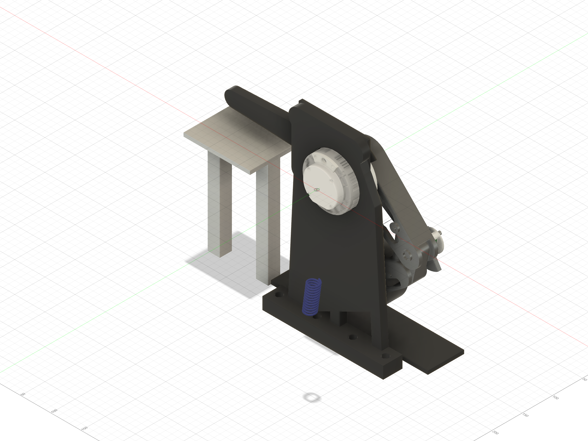

# Fusion release — ordered-pin mechanical integration

Status: `CAD PATH VERIFIED / PHYSICAL ASSEMBLY PENDING`

> **September 22 calibration hold:** the preliminary hub/link exports use
> Ø4.05 root press sockets and Ø4.15 clevis passages. Print the
> [orientation-matched fit ladders](../2026-09-22_ordered_pin_fit_ladders/)
> and promote the selected stations before printing the three large affected
> parts. The captive Ø6 × 10 stop design is unchanged and needs no ladder.

Fusion document `Beni_SingleLegRig` v28 was rebuilt, audited, exported, and
saved through the Fusion MCP for this release.

The September 20 order supplied the dimensions used for this redesign. No
owner measurement is required: Fusion was changed to consume the seller-listed
Ø4 × 10 dowels, Ø6 × 10 dowel, and M4 × 40 single-hole clevis pins directly.
The real pieces still receive a visual damage check and binary hand fit on
arrival; the order alone is not physical acceptance.

Order/source dimensions used: the receipt identifies 60 × ZDingTech Ø4 × 10
dowels, 8 × uxcell M4 × 40 single-hole clevis pins, and 15 × HARFINGTON Ø6 ×
10 dowels. The [matching uxcell listing and drawing](https://www.ebay.co.uk/itm/117132197309)
resolve the 40 mm shaft, 36 mm retaining-hole datum, Ø1.6 transverse hole,
Ø7 head, and 1.5 mm head thickness. The
[HARFINGTON product page](https://www.harfington.com/products/p-1892258)
confirms Ø6 × 10 mm 304 stainless dowels with beveled ends.

The design uses the purchased hardware as intended:

- Three Ø4 × 10 dowels now locate the shoulder hub and proximal root on the
  unused midpoints of their Ø44 bolt circle. Each pin is supported 5.0 mm in
  the hub and enters a 5.2 mm-deep slip socket in the link, with 0.2 mm bottom
  clearance. The existing six M4 screws clamp the faces and capture the pins.
- Each M4 × 40 clevis pin crosses a purpose-built 34.0 mm printed stack and an
  ISO 7089 M4 steel washer. The integral Ø14 upper and lower lands replace the
  temptation to use loose printed spacers. Even treating the seller drawing's
  36 mm retaining-hole datum conservatively as a hole-center dimension leaves
  0.4 mm between the washer and the near edge of the Ø1.6 hole.
- The Ø6 × 10 stop dowel sits in a Ø6.2 × 4.5 blind distal socket with a 0.5 mm
  ABS floor. A 5.8 mm stop plate has a 5.0 mm motion channel and a closed
  0.8 mm outer skin. The pin is captive with 0.3 mm axial clearance and needs
  neither glue nor an unreliable ABS press fit. Three M3 × 10 screws replace
  the former M3 × 6 stop screws while retaining 0.8 mm tip clearance.

The proximal outboard and distal inboard calibrated print faces are unchanged.
The live Fusion mechanical audit passed all 24 integer poses from -8° through
+15°, both 40 mm clevis insertion paths, the spring/guide/rim service paths,
and positive stop contact at 0.5° beyond each permitted end. All four released
meshes have zero non-manifold edges, zero degenerate triangles, and their
required bed planes at Z=0. Numeric results and hashes are in
[`fusion_release_manifest.json`](fusion_release_manifest.json); the complete
motion result is in the updated
[`fusion_mechanical_audit.json`](../2026-09-17_abs_spring_mechanical_test/fusion_mechanical_audit.json).

The active [print and assembly traveller](../../../first_article_stl/ordered_pin_integration/README.md)
keeps the build clamped, unplugged, wheel-clear, and hand-contained. Powered
motion, ground contact, added mass, final D10 retention/encoder coupling, and
the PA-CF structural build remain outside this release.
