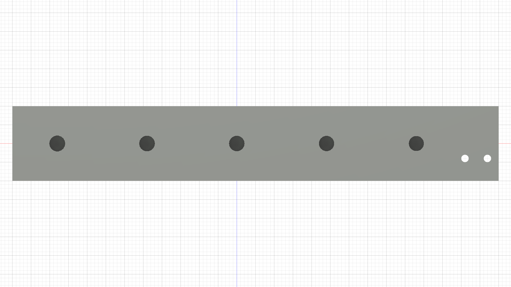
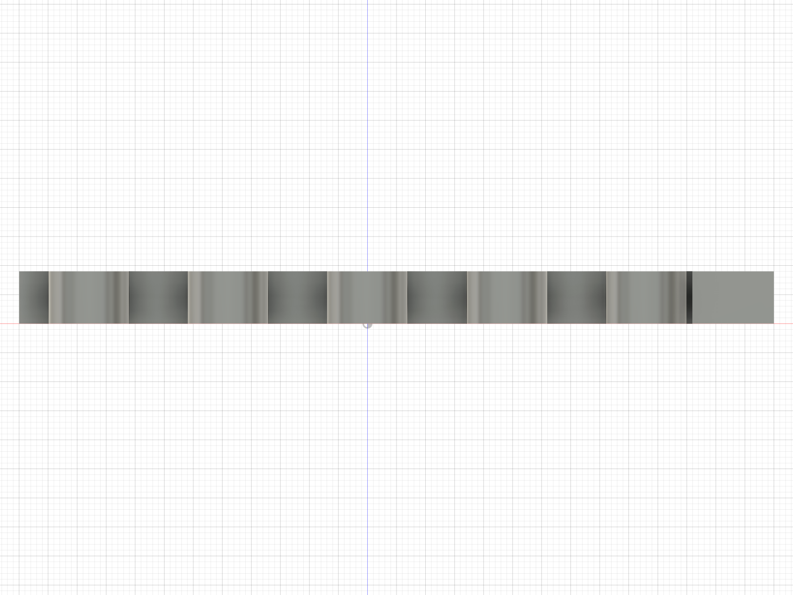

# Fusion release — ordered-pin ABS fit ladders

Status: `OWNER SELECTED / CAD PROMOTED`

Fusion generated both coupons in a temporary unsaved design through the Fusion
MCP, exported them in their controlled print orientations, verified their
B-Reps and binary meshes, and returned to the saved `Beni_SingleLegRig` v28
without modifying it. After the physical selection, Fusion v29 was rebuilt and
saved with the two selected Ø4.25 interfaces; the production meshes were
re-exported and reverified.

## Physical result

No pin measurement was requested. The actual ordered pins served as go/no-go
gauges:

- The owner selected the largest root-dowel station, nominal **Ø4.25**, farthest
  from the two marker holes. It was reported as relatively tight, pressable by
  thumb, and removable with pliers. This is promoted to the hub's retained
  socket; whitening/cracking remains a final-hub installation rejection check.
- The owner selected the middle clevis station, nominal **Ø4.25**, and reported
  that it works well. This is promoted to the proximal and distal link
  passages; insertion and withdrawal through each completed link/eye stack
  remain final-part checks.

The machine-readable owner report is in
[`physical_result.json`](physical_result.json).

The root-dowel ladder brackets Ø4.05…4.25 in 0.05 mm steps. Every station is a
5.0 mm blind socket in an 8.0 mm body, preserving the released shoulder hub's
3.0 mm closed floor and bed-facing socket orientation. This is the only new
interface that genuinely needs a light press selection; making it generally
loose would defeat the dowels' locating function.

The clevis ladder brackets Ø4.15…4.35 in 0.05 mm steps through five Ø14 bosses.
Live Fusion inspection of the v28 assembly found the restrictive link bore
spans are 5.0, 5.8, 8.2, and 9.0 mm. Both cartridge eyes are already looser at
Ø4.4 × 19 mm. The coupon therefore uses the worst 9.0 mm continuous link land,
not a fictitious solid 34 mm bore. The 34 mm figure is the complete retained
stack, including open gaps and the looser cartridge eye.

The Ø6 × 10 stop pin receives no ladder. Its Ø6.2 blind socket is a deliberate
clearance interface, and axial retention comes from the stop plate's closed
skin. Calibrating that socket tighter would not improve location or retention.

Both STLs have zero non-manifold edges, zero degenerate triangles, minimum
Z at the intended bed plane, and native/mesh volume error below 0.14%. Exact
topology, oriented bounding boxes, SHA-256 hashes, and selection rules are in
[`fusion_release_manifest.json`](fusion_release_manifest.json).

| Root blind-socket ladder | Clevis link-land ladder |
|:---:|:---:|
|  |  |

The completed selection procedure is retained in the
[physical selection traveller](../../../first_article_stl/ordered_pin_fit/README.md).
