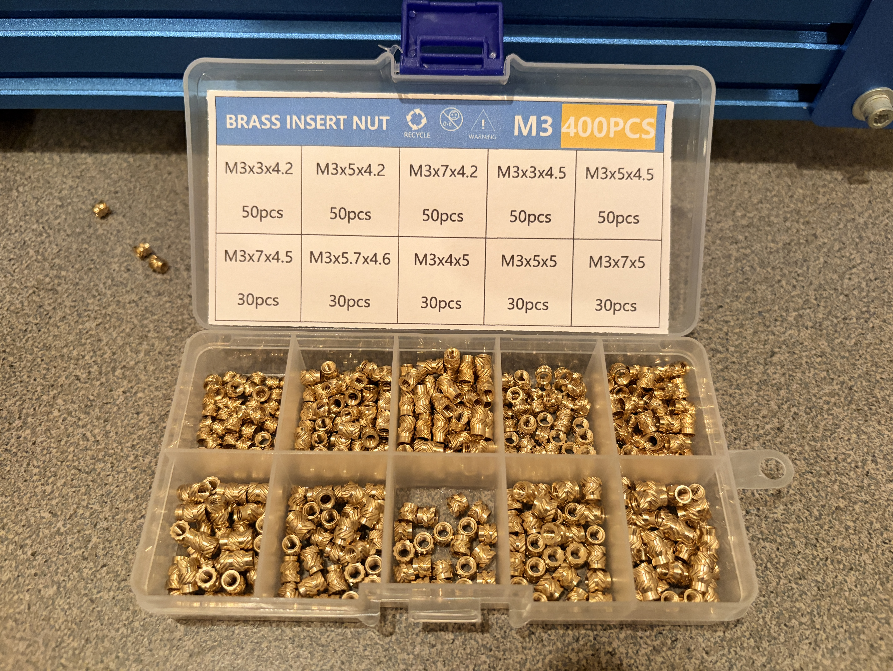
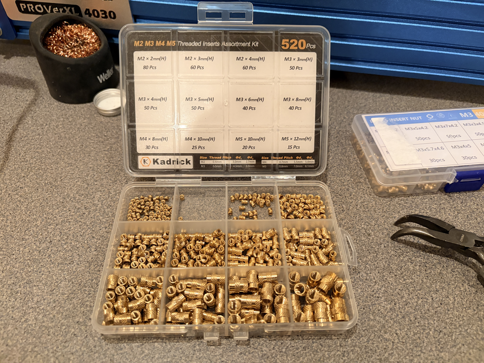

# Heat-set insert inventory evidence — 2026-09-02

The owner reports a separate supply of **Voron-style M3 heat-set inserts bought
on AliExpress**, plus the two assortments photographed below. The AliExpress
order URL and selected variant were not available in the connected browser on
2026-09-02, so the exact purchased Voron dimensions remain an inventory
verification item. The photographs establish possession and the case-label
markings; they do not establish a recommended printed-hole diameter.

## M3 assortment, 400 pieces

The case label lists these strings exactly:

- 50 each: `M3×3×4.2`, `M3×5×4.2`, `M3×7×4.2`, `M3×3×4.5`,
  `M3×5×4.5`
- 30 each: `M3×7×4.5`, `M3×5.7×4.6`, `M3×4×5`, `M3×5×5`,
  `M3×7×5`

The label does not define its dimension order, so do not reinterpret these
strings as a CAD pocket specification without the seller drawing or a physical
coupon.

## M2/M3/M4/M5 assortment, 520 pieces

The case label lists:

- M2 lengths: 2, 3 and 4 mm
- M3 lengths: 3, 4, 5, 6 and 8 mm
- M4 lengths: 8 and 10 mm
- M5 lengths: 10 and 12 mm
- printed diameter table: M2 `d1=3.0`, `d2=2.7`; M3 `d1=4.5`,
  `d2=3.9`; M4 `d1=5.5`, `d2=5.0`; M5 `d1=7.0`, `d2=6.1` mm

## Engineering disposition

- Use the owner-reported Voron-style M3 family only after the existing Ø4.0
  ABS pocket coupon accepts the exact insert without splitting or spin-out.
- The owned M4 × 8 and M4 × 10 inserts are **not** silent substitutes for the
  thin-hub joints; those labels denote insert lengths. The Fusion-verified
  design instead specifies PSM Sonic-Lok `SL-B-M4-5.8` for the 8 mm shoulder
  flange and `SL-B-M4-4.8` for the 6 mm wheel hub, both in manufacturer-specified
  Ø5.6 receivers. These short inserts are a procurement and physical-coupon
  gate, not present inventory.
- The canonical part-by-part map and current holds are in
  [`MANUFACTURING_CONSTRAINTS.md`](../../../MANUFACTURING_CONSTRAINTS.md#threaded-interfaces-in-printed-parts).

Image SHA-256:

- `m3_assortment_400pc.jpg` — `014e86386e179233eb8f001ae921d36744072118d75cbe7c6b78841957e1e9fd`
- `m2_m3_m4_m5_assortment_520pc.jpg` — `271f668f3de18dbb20965a4cbb4dd48206f874563a29b8415543d81953b6c9ff`
