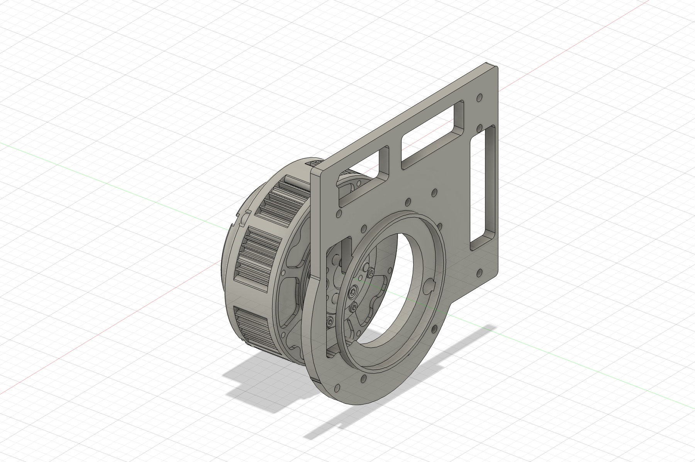
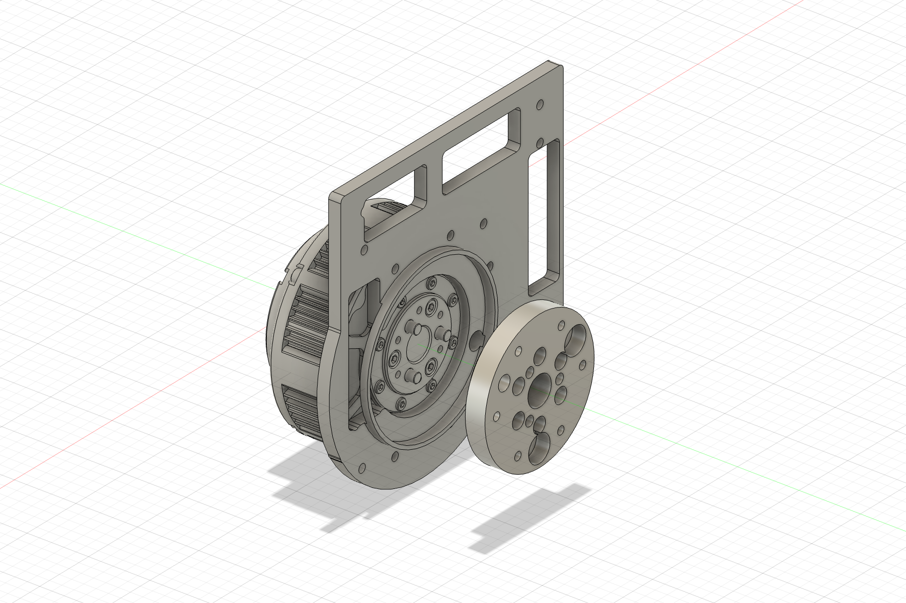
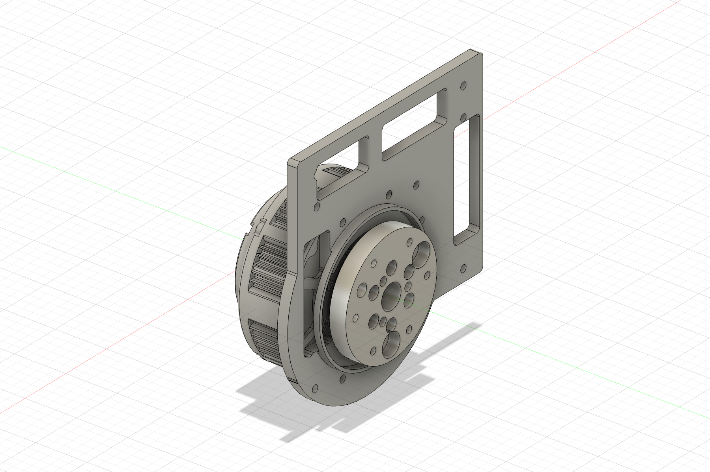

# GIM6010 shoulder plate assembly-path check — 2026-08-23

## Owner observations

The unloaded ABS shoulder batch was tried on the delivered GIM6010-8:

- `ABS_FA_Shoulder_Output_Hub_L_D4p15`: **PASS** — all three factory pins seat
  with light finger pressure and the hub reaches the metal output face.
- Six M3 output screw positions: **PASS** — two opposite screws and the remaining
  four can be finger-started/aligned without pulling the hub into place.
- `Chassis_Shoulder_Plate_L`: the first attempt was stopped because the owner
  tried to pass the actuator housing through the plate while the output hub was
  installed. No part was forced or modified.
- Corrected bare-rotor plate sequence: **PASS** — on 2026-08-23 the owner
  confirmed that the plate installs successfully before the output hub is
  reinstalled.

The two owner photographs are retained as
[`04_owner_shoulder_plate_attempt.jpg`](04_owner_shoulder_plate_attempt.jpg) and
[`05_owner_hub_installed_plate_loose.jpg`](05_owner_hub_installed_plate_loose.jpg).

## Verified assembly order

The actuator housing does **not** pass through the shoulder plate.

1. Remove the printed output hub from the actuator.
2. Hold the plate with its raised circular cable-spiral lip facing away from the
   actuator and its flat panel face toward the stationary housing. From the
   output/front side, move it toward the bare actuator. Its centre opening passes
   over the actuator's bare output rotor while the actuator's outer housing
   remains behind the plate.
3. Seat the plate on the stationary housing face. Finger-start two opposite
   **M3 × 8** housing screws, then confirm the other six before tightening
   anything. Do not use M3 × 10 here: the plate is 5 mm thick and the actuator
   housing threads are only 4.0 mm deep, so ×10 bottoms before clamping.
4. Install the printed output hub only after the plate is seated and fastened.

## Fusion MCP verification

Source document: `Beni_SingleLegRig`, cleanly reopened after the transient test.

- The plate centre opening is Ø48.000 mm.
- The actuator outer housing is Ø80.000 mm and is not intended to pass through
  that opening.
- The output hub body is Ø38.000 mm, but its outboard flange is Ø56.000 mm.
- With the hub removed, the plate was swept from +30.0 mm outboard to its final
  pose in 0.5 mm increments: 61 sampled poses, zero plate-to-actuator
  intersections.
- Repeating the sweep with the hub installed produced intersections at sampled
  offsets from +17.0 mm through +5.0 mm, with a maximum sampled intersection of
  2480.323318 mm³. The Ø56 flange cannot pass through the Ø48 opening even
  though the completed final pose itself is interference-free.

Status: **PHYSICAL ASSEMBLY VERIFIED, 2026-08-23**. The owner completed the
corrected sequence successfully. This verifies access and order only; the ABS
parts remain unloaded first articles and the joint has not been torque-tested.
