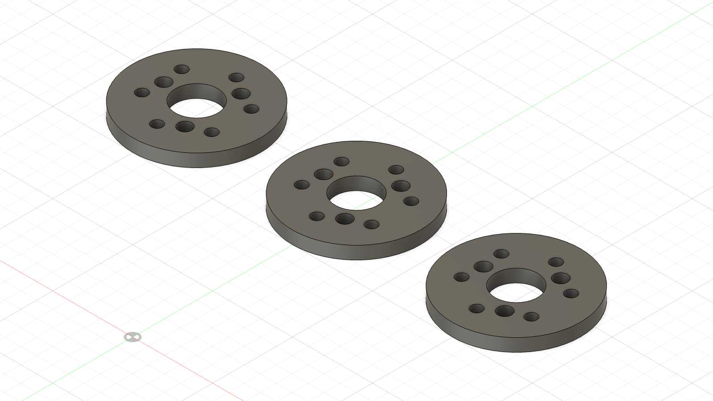

# GIM6010 output pin-bore calibration — ABS

The original Ø4.05 ABS coupon reproduced the STEP pattern: the owner reports
all three holes align with the delivered actuator, but the three factory pins
do not slide into the printed bores by hand.  This set therefore holds the
validated Ø20.4 PCD and all other geometry fixed while varying only the three
pin bores.

**Result, 2026-08-22:** Ø4.15 passed. The owner reports that it is not a loose
no-force slip fit, but seats easily with light pressure. Stop here; Ø4.20 and
Ø4.25 are not needed for this ABS profile. The released next article is the
[Ø4.15 ABS shoulder hub](../../assembly_dry_fit/README.md).

| Print order | STL | Pin bores |
|---:|---|---:|
| 1 | `ABS_CAL_GIM6010_OUTPUT_PIN_D4p15.stl` | 3 × Ø4.15 mm |
| 2 | `ABS_CAL_GIM6010_OUTPUT_PIN_D4p20.stl` | 3 × Ø4.20 mm |
| 3 | `ABS_CAL_GIM6010_OUTPUT_PIN_D4p25.stl` | 3 × Ø4.25 mm |

Ø4.15 is the project's existing printed slip-bore nominal for bought Ø4 mm
pins.  Ø4.20 and Ø4.25 are fine diagnostic steps above it.  They are not
structural release dimensions.

## Print

- Use the same tuned ABS profile, printer and orientation as the failed coupon.
- Print flat exactly as exported, with either 40 mm circular face on the bed.
- Use no slicer scaling or hole compensation.
- Prefer one plate containing all three.  Before removing them, mark the
  underside with one dot for Ø4.15, two for Ø4.20 and three for Ø4.25.

## Test

1. Remove only loose stringing; do not drill, file, sand or heat a bore.
2. Try Ø4.15 first.  Align all three factory pins simultaneously and press with
   fingertips only.
3. **PASS:** the coupon reaches the metal output face by hand, lies flat and
   comes off again without prying.  A close slip fit without rock is desirable.
4. **FAIL:** it needs a clamp, screw torque, tapping or visible bending to seat.
5. Stop at the first PASS.  If Ø4.15 fails, try Ø4.20; if that fails, try
   Ø4.25.  Report the smallest passing diameter, or `none pass`.

Do not use the six M3 screws to pull a coupon onto the pins.  Do not energise or
backdrive the actuator during this check.

## Verification

Built and exported from `Beni_Prototype1_TestGauges` through the Fusion MCP on
2026-08-22, then discarded from the cloud document; the original document was
reopened clean.  [`fusion_manifest.json`](fusion_manifest.json) records exact
B-Rep dimensions.  Each binary STL has 1,996 triangles, one closed manifold
shell, zero open edges, zero non-manifold edges and zero degenerate triangles.
Independent mesh feature recovery confirmed the three stated bore diameters on
Ø20.4 PCD, six Ø3.4 holes on Ø25.0 PCD, the Ø13.2 centre and Ø40.0 outside
diameter.
