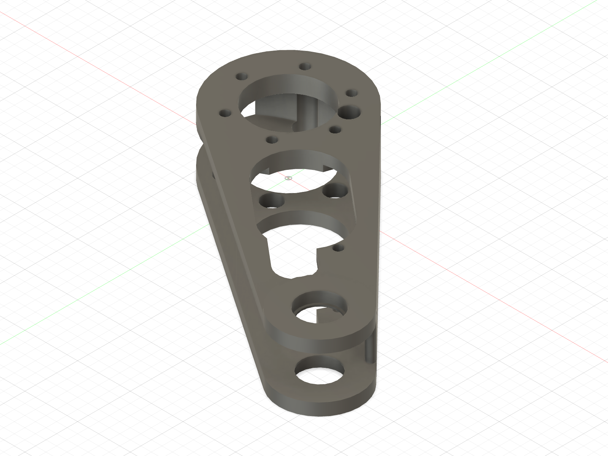

# ABS shoulder and proximal-link assembly articles

## Corrected proximal link — Ø4.5 replacement released 2026-09-14

The owner confirmed proper seating of all six hub screws on the printed Ø4.0
revision on September 7. [Physical result and photo](../../evidence/assembly/2026-09-07_owner_mockup/).
That result remains valid for the M4 access correction, but its five M3 pockets
are the failed Ø4.0 size. Print one replacement
[`ABS_FA_Proximal_Link_L_D19p15_M4_ACCESS_FIXED_PRINT_ORIENTED.stl`](ABS_FA_Proximal_Link_L_D19p15_M4_ACCESS_FIXED_PRINT_ORIENTED.stl)
in ABS; this file uses the owner-selected Ø4.5 M3 receiver diameter. The owner successfully printed the corrected Ø4.15 shoulder hub and
installed its Ø5.3 M4 inserts; retain that hub.

Fusion found two wall-obstructed M4 head paths and one incomplete screw seat
on the old link. The replacement clears both paths and shortens the large
lightening opening to support every head fully. The five knee M3 mouths are
clear. The replacement also uses the already-selected Ø19.15 ABS bearing
preference; this is now a required geometry reprint rather than a change made
only for bearing preference.

## Print and acceptance

- Quantity **1, ABS**. Import the supplied orientation unchanged: outboard
  arm/bearing face down, bearing and insert axes vertical. No scaling or hole
  compensation. Use the same enclosed ABS profile as the passed coupons:
  0.20 mm layers, 4 walls, 5 top/bottom layers and 30% infill.
- Disable supports. The 20 mm channel and root-pad ceilings bridge. Preview
  those bridges and inspect the printed undersides, both Ø17 bearing lips and
  every counterbore floor. A brim is permitted if the tuned profile uses one.
- Before attachment, each of the six **M4 × 10** screws must pass freely through
  its access hole and rest flat in its counterbore. No filing, forcing or screw
  pull-down to compensate for a failed print.
- Fit both 6800 bearings from their respective open faces using thumb pressure
  on the outer race. They must sit square and have no perceptible radial rock.
  Reuse bearings from the old link only if removed without damage.
- Install five M3 × 5 inserts in the new link's Ø4.5 pockets only after checking
  the print for cracks, bulging and bridge debris. Do not install them in the
  prior printed Ø4.0 revision. The six M4 inserts belong in the accepted hub.
- Keep the motor unplugged, support the knee end, attach the link and
  finger-start all six M4 screws. Every head must clamp flat. Remove/refit once
  and record the physical result.

[Exact audit, remaining holds and evidence](../../evidence/assembly/2026-09-05_access_fix/)
· [Shoulder picture guide](../../docs/assembly/shoulder_to_proximal_link.md)
· [Receiver map](../../docs/assembly/heatset_receiver_map.md)

## Adjacent available articles

The [cable cover](ABS_FA_Shoulder_Cable_Cover_L_CLEARANCE_PRINT_ORIENTED.stl)
and [wheel hub](ABS_FA_Wheel_Hub_L_OWNED_M4x8_D5p30_PRINT_ORIENTED.stl) are now
printed, along with the front cable post and general fit gauge.
[September 7 completion record](../../evidence/assembly/2026-09-07_small_parts_printed/).
Cover/post/harness fit and wheel-hub insert installation/detached motor fit
remain pending; no repeat print is currently requested.

The gauge's Ø4.0 M3 station failed, and the owner selected Ø4.5 on the dedicated
[M3 ladder](../insert_fit/). Print the re-exported stand separately. Print the
Ø4.5 shoulder plate if the fitted plate is the prior Ø4.0 revision or lacks
suitable cover-insert receivers. Use the documented bed orientations and insert gates.
The wheel rim is still **DO NOT PRINT** because of its unsupported ledges.
The final distal link and knee collar retain their pin-fit/retention gates.
For the interim two-link bench test, use the separate
[supported knee mock-up batch](../knee_mockup/): its provisional distal link
and temporary pin are for supported hand positioning only, with no motor or
spring cartridge attached.

The new [front cable post](../mode_a/ABS_FA_RIG_Cable_Post_A_COVER_MOUNT_PRINT_ORIENTED.stl)
fits outside the cover. Use two **M3 × 12** at the upper cover positions; the
lower two remain M3 × 10. Fit panel/stand and housing screws before post/cover,
then fit the link. Remove the link before servicing the cover. Verify the real
tie/harness through the eye and hand-check clearance before any powered step.

## Physical-fit history

The old Ø19.10 face-flat link accepted both real bearings on 2026-09-02. That
bearing result remains valid evidence; its outer fastener access and one seat
are superseded by the new link. Historical files below are **not the current
print queue**:

- [Ø19.10 full-depth owner report](../../evidence/knee_fit/2026-09-02_proximal_link_full_depth/)
- [Old bearing geometry manifest](proximal_d19p10_fusion_manifest.json)
- [Old bearing-path verification](proximal_d19p10_path_verification.json)
- [Old print-orientation record](proximal_d19p10_print_orientation_manifest.json)
- [Original wall-obstruction finding](../../evidence/inserts/2026-09-04_m4_coupon_pass/fusion_paths_and_print_audit.json)

Earlier on-edge printing caused a non-round bearing seat and damage during
support removal. Retain the corrected face-flat orientation: no support may
contact a bearing seat, retention lip, mating surface or service passage.

The ABS article is for supported dry assembly and, after all leg/fixture and
electronics gates pass, wheel-clear current-limited self-weight commissioning.
No spring preload, torque-arm load, stall/proof, traction or drop testing.
Repeat critical coupons before the later PA-CF structural build.
