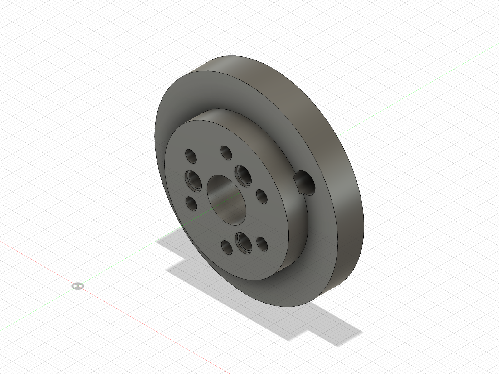
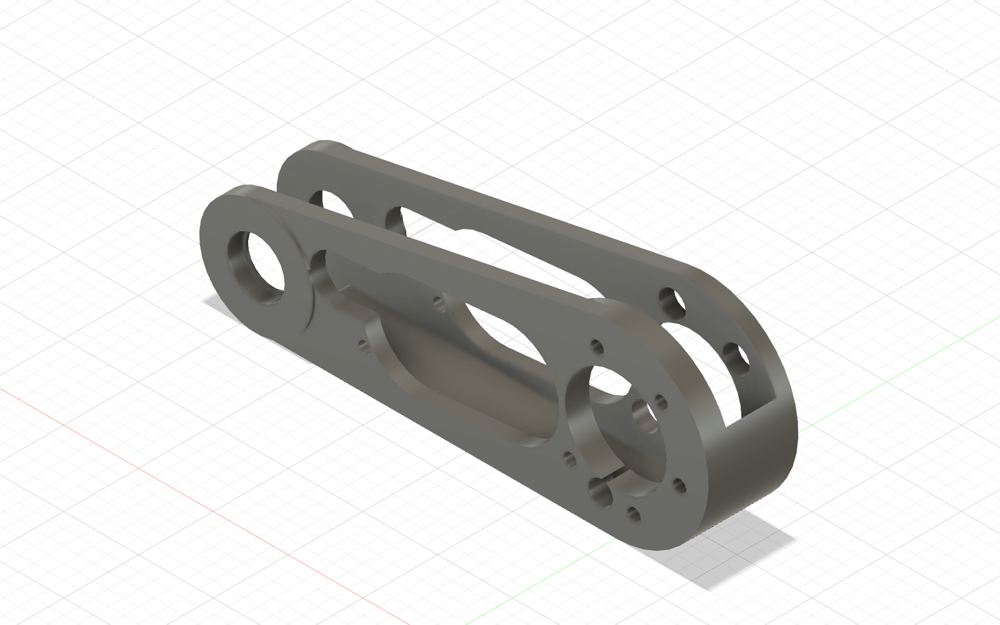

# Batch 2 — unloaded ABS shoulder assembly

The owner's Ø4.15 GIM6010 output-pin coupon passed on 2026-08-22: it is not a
loose slip fit, but it seats easily with light fingertip pressure.  That is the
selected compensation for this ABS printer/profile.  It does **not** change the
nominal Fusion assembly or release a PA-CF structural part.

## Print now, in this order

The GIM4305 housing coupon has now passed with the real M2.5 screws; these
shoulder prints never depended on that separate wheel-end gate.

1. [`../../print_stl/GAUGE_Fit_Coupon.stl`](../../print_stl/GAUGE_Fit_Coupon.stl)
   — 26 × 92 × 8 mm. Print flat. This is the next short print because it gates
   the Ø19 bearing seats and Ø10 knee axle before either long link is printed.
2. [`ABS_FA_Shoulder_Output_Hub_L_D4p15.stl`](ABS_FA_Shoulder_Output_Hub_L_D4p15.stl)
   — the actual shoulder hub with only its three pin bores changed from the
   nominal Ø4.05 to the owner-tested ABS Ø4.15. Rotate the assembly-coordinate
   STL 90° about X and place the Ø56 flange face flat on the bed.
3. [`../../print_stl/Chassis_Shoulder_Plate_L.stl`](../../print_stl/Chassis_Shoulder_Plate_L.stl)
   — print flat with the panel face on the bed and spiral cable lip upward. The
   GIM6010 housing coupon already released this interface for ABS dry assembly.

Optional while the printer is running:
[`../mode_a/RIG_Cable_Anchor_ModeA.stl`](../mode_a/RIG_Cable_Anchor_ModeA.stl),
with either broad face on the bed. It is useful later but does not gate the leg.

Use the same tuned, enclosed ABS profile as the successful coupon: no scaling
or hole compensation, 0.20 mm layers, 4 walls, 5 top and bottom layers, and
30% infill. These are unloaded geometry/assembly articles, not structural
parts. A brim is fine if this ABS profile normally needs one.

## What to test

1. Put the hub onto all three GIM6010 factory pins simultaneously. It should
   reproduce the Ø4.15 coupon result and reach the metal face with light finger
   pressure. Do not use screws to pull it down. **OWNER PASS, 2026-08-23.**
2. Finger-start two opposite of the six M3 output screws, then check the other
   four. Do not tighten or energise the actuator. **OWNER PASS, 2026-08-23.**
3. **Remove the output hub first.** Hold the plate with its raised circular
   cable-spiral lip facing away from the actuator and its flat panel face toward
   the stationary housing. From the actuator's output/front side, pass the
   plate's centre opening over the **bare output rotor**; the Ø80 actuator
   housing stays behind the plate and never passes through it. Seat the plate on
   the stationary housing face, finger-start two opposite M3 housing screws,
   then confirm the remaining six. Only after the plate is seated should the
   output hub be reinstalled. Do not draw the plate sideways with screws.
   Use **M3 × 8** housing screws for fastening; M3 × 10 bottoms in the
   actuator's 4.0 mm-deep threads before it can clamp this 5 mm plate.
   **OWNER ASSEMBLY PASS, 2026-08-23.** The staged
   Fusion views and owner evidence are
   [`../../evidence/shoulder_assembly/2026-08-23_plate_sequence/`](../../evidence/shoulder_assembly/2026-08-23_plate_sequence/).
4. When the 6800 bearings and Ø10 axle/dowel are on the bench, test the fit
   coupon before printing either link. The Ø19 bearing bore must be a
   thumb-pressure light press with no rock. The Ø10 h6 × 35 mm knee pin must be
   a light press, not a loose slip: the pin-to-distal-link press is the rig's
   angular reference. Record fit only; do not alter the coupon.

Stop after this batch until the remaining gates close:

- Do not print `Proximal_Link_L` until the real 6800 bearing passes the Ø19
  gauge (thumb-pressure light press, no rock).
- GIM4305 housing is **OWNER PASS, 2026-08-23** with the real M2.5 screws. Do
  not print the rerouted `Distal_Link_L` until the remaining real Ø10 h6 knee
  pin passes the fit coupon as a light press.
- Do not install the knee spring, torque/backdrive either actuator, mount the
  leg in the stand, or apply load through these ABS parts.
- Repeat the critical coupons in PA-CF before structural release; the Ø4.15
  ABS result must not be copied blindly into the PA-CF hub.

## Verification

Fusion MCP generated this transient component from `Beni_SingleLegRig`,
exported the high-refinement binary STL, and then discarded the cloud-document
change. Fusion was reopened clean. Exact B-Rep validation found one solid,
three Ø4.15 cylinder faces on the manufacturer-derived Ø20.4 PCD, and the
nominal 56 × 14 × 56 mm envelope. Independent mesh checks found 5,616
triangles, one closed manifold shell, zero open/non-manifold edges, and zero
degenerate triangles. [`fusion_manifest.json`](fusion_manifest.json) records
the Fusion result.

---

# Batch 3 — unloaded ABS proximal-link bearing rehearsal

The owner's Ø19.10 ladder bore passed on 2026-08-31 with firm thumb pressure,
square seating, no perceptible rock and tool-free removal. The actual ABS link
is the full-depth confirmation; the owner declined a separate depth coupon.

## Print now

Print
[`ABS_FA_Proximal_Link_L_D19p10_PRINT_ORIENTED.stl`](ABS_FA_Proximal_Link_L_D19p10_PRINT_ORIENTED.stl)
in the same enclosed ABS profile as the passing ladder: no scaling or slicer
hole compensation, 0.20 mm layers, 4 walls, 5 top and bottom layers and 30%
infill. This is an unloaded assembly article, not a structural proof part.

The `_PRINT_ORIENTED` file is already on its exact external-tangent bed datum:
**do not rotate it and do not use “lay on face.”** Its slicer envelope is about
169.39 × 31.60 × 62.00 mm with `min_z = 0`; the 20 mm fork channel stays open
sideways and needs no trapped support. Use a normal ABS brim if the tuned
profile benefits from one. The assembly-coordinate file without the suffix is
retained for traceability, but is not the file to print.

The first attempted print exposed a real source-geometry defect, not ordinary
ABS shrinkage. The unequal-circle outline used the wrong tangent-angle sign, so
the two circular ends extended 0.608 mm below the apparent long straight face.
The shared sketch helper and its proximal channel-wall equation now use the
exact external tangent. This adds material along the intended load path rather
than adding disposable feet; the ABS first-article volume changed from 62.9765
to 64.0181 cm³. Fusion verifies a continuous 3462.967 mm² supporting face.

## Bearing installation rehearsal

Status before printing: **CAD PATH VERIFIED; PHYSICAL ASSEMBLY PENDING.**

1. Keep the proximal link detached. Do not install the distal link, axle,
   cartridge, stop arc, encoder or cables first.
2. Do not apply retaining compound during the ABS rehearsal.
3. From the inboard open face, press the first 6800-2RS bearing in the +Y
   direction using both thumbs on the **outer race** until it seats on the Ø17
   retaining lip.
4. From the outboard open face, press the second bearing in the −Y direction in
   the same way.
5. Both bearings must enter squarely with firm thumb pressure, finish flush with
   the outside boss faces, and have no perceptible radial rock. Do not use a
   clamp, hammer, screw or fastener pull-down. Stop if the full-depth pockets
   feel materially tighter than the ladder.
6. Leave the bearings installed for the next unloaded knee dry assembly. For
   service, remove the detached link and reverse the same open-face paths with
   an internal bearing puller; sacrificing the bearing being replaced is
   acceptable, damaging the printed link is not.

There are no fasteners or cables in this operation. Fusion sampled both full
insertion paths every 2 mm and found 0 mm³ interference at every pose, including
the final seats. The reverse paths are the service paths. Records:

- [`proximal_d19p10_fusion_manifest.json`](proximal_d19p10_fusion_manifest.json)
- [`proximal_d19p10_print_orientation_manifest.json`](proximal_d19p10_print_orientation_manifest.json)
- [`proximal_d19p10_path_verification.json`](proximal_d19p10_path_verification.json)

Fusion exact-B-Rep verification found one solid body, two Ø19.10 cylindrical
seat faces, 5.0 mm seat depth and the two Ø17 retaining-lip openings. The first
mesh export also exposed two inherited zero-thickness topology defects in the
old source: the Ø34 root-access bore was exactly tangent to the Ø8 harness hole,
and the open-channel wall ended at a zero-radius four-face edge. The source now
uses an Ø8.2 harness clearance (0.10 mm nominal overlap at the tangent) and the
existing R1.0 channel-corner fallback as a wall-end relief. The final Fusion
high-refinement print-oriented STL has 6,244 facets; Bambu Studio 02.08.02.61
reports one part, `manifold = yes`, `min_z = 0`, and a
169.386 × 31.600 × 62.000 mm mesh envelope.

The PA-CF proximal link remains unreleased. Repeat the bearing coupon in PA-CF
before any structural print or load test.
