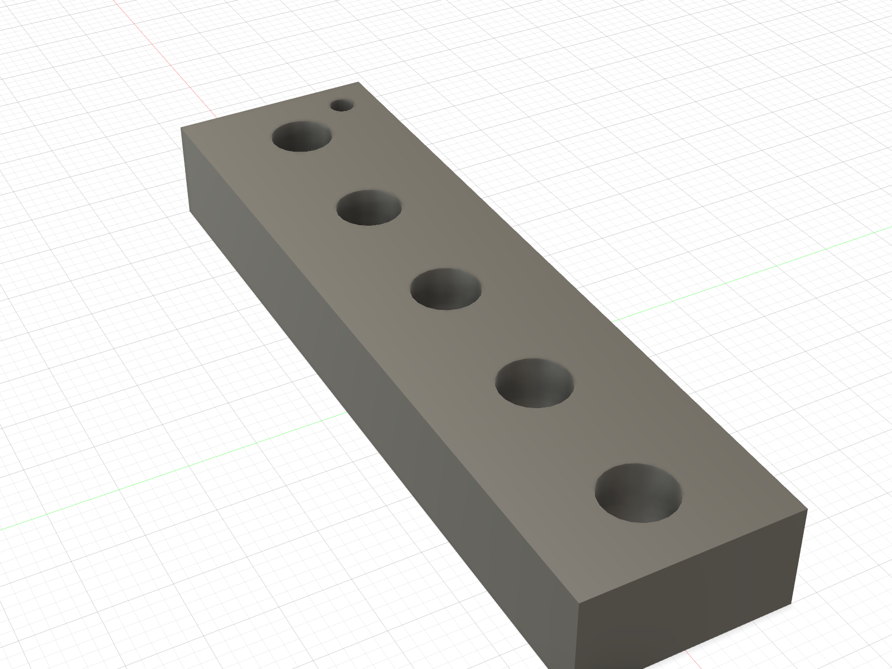

# ABS M4 × 8 heat-set receiver ladder

Print
[`ABS_CAL_OWNED_M4x8_INSERT_POCKET_LADDER_PRINT_ORIENTED.stl`](ABS_CAL_OWNED_M4x8_INSERT_POCKET_LADDER_PRINT_ORIENTED.stl)
before either M4 hub. It is for the **M4 × 8** compartment in the owner's
photographed Kadriick mixed kit. The case says 30 pieces and labels the M4
family `d1=5.5 mm`, `d2=5.0 mm`; it does not unambiguously define the required
printed-hole diameter.

The file is already on its 60 × 16 mm bed face. Do not rotate, scale, apply
slicer hole compensation, or use supports. Print it with the same tuned,
enclosed ABS profile planned for the single-leg parts.

The small Ø2 marker identifies the **Ø4.9 end**. Moving away from it, the five
vertical through bores are:

1. Ø4.9 × 8.0
2. Ø5.0 × 8.0
3. Ø5.1 × 8.0 — scripted centre candidate, not yet released
4. Ø5.2 × 8.0
5. Ø5.3 × 8.0

Use one fresh M4 × 8 insert per attempted station. Heat it perpendicular with
a depth stop, finish flush, and let it cool completely. Select the **smallest**
station that:

- accepts the insert without splitting, bulging, or driving excessive plastic
  ahead of it;
- leaves the insert flush and square;
- does not spin under a finger-started M4 screw; and
- resists a firm hand pull after cooling.

Do not use screw torque to pull an insert into place. Record the winning
station and photograph the result. If none passes, stop and revise the ladder
rather than drilling, filing, scaling, or modifying a hub.

That one diameter is then promoted through Fusion into:

- six full-depth 8.0 mm shoulder-hub receivers;
- six through receivers in the 6.0 mm wheel hub; and
- four full-depth 8.0 mm deferred Mode-B carriage receivers.

The wheel's complete insert length is accommodated by the mating rim: 6.0 mm
embeds in the hub and 2.0 mm projects into a Ø6.0 × 2.2 relief. M4 × 10 was not
selected because it would require 2.0 mm more projection without improving the
joint.

The Fusion B-Rep record is
[`owned_m4x8_insert_coupon_manifest.json`](owned_m4x8_insert_coupon_manifest.json).
