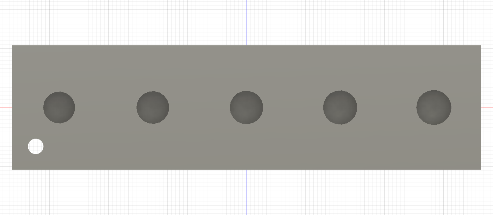

# ABS heat-set receiver ladders

## M3 × 5 — print next; physical selection pending

The general `GAUGE_Fit_Coupon.stl` contained only one M3 candidate. The owner
reported on 2026-09-14 that its nominal Ø4.0 hole is too small for the intended
M3 heat-set insert. [Physical result](../../evidence/inserts/2026-09-14_m3_coupon_fail/).
That gauge is not an M3 diameter ladder.

Print one ABS
[`ABS_CAL_OWNED_M3x5_INSERT_POCKET_LADDER_PRINT_ORIENTED.stl`](ABS_CAL_OWNED_M3x5_INSERT_POCKET_LADDER_PRINT_ORIENTED.stl)
with the same tuned, enclosed ABS profile as the single-leg parts. Import the
file unchanged: no rotation, scaling, hole compensation or supports. Its
60 × 16 mm pocket-opening face is already on the bed. The five pockets are
vertical, blind and 6.0 mm deep, matching the Mode A stand receiver depth for
the 5.0 mm insert. Inspect the bridged pocket roofs in the slicer preview.

The small Ø2 through marker identifies the **Ø4.1 end**. Moving away from it:

1. Ø4.1 × 6.0
2. Ø4.2 × 6.0
3. Ø4.3 × 6.0
4. Ø4.4 × 6.0
5. Ø4.5 × 6.0

Use one fresh owner-supplied Voron-style **M3 × 5** insert per attempted
station. Start at the marked Ø4.1 end and select the smallest station that:

- accepts a perpendicular heat-set without splitting, bulging or driving
  excessive plastic ahead of it;
- finishes square and flush;
- does not spin with a finger-started M3 screw after cooling; and
- resists a firm hand pull after cooling.

Stop once the first station passes. If none passes, report that result rather
than drilling, filing, scaling or changing the slicer compensation. The current
Ø4.0 production receivers remain unchanged and held until the physical winner
is promoted and reverified in Fusion.

[Fusion B-Rep and orientation manifest](owned_m3x5_insert_coupon_manifest.json) ·
[Fusion MCP verification of the exported mesh](owned_m3x5_insert_coupon_mesh_verification.json)

## M4 × 8 — completed

**Completed — owner PASS, 2026-09-04: nominal Ø5.3.** The owner confirmed
square/flush installation without splitting or bulging and secure retention
after cooling. [Physical result](../../evidence/inserts/2026-09-04_m4_coupon_pass/).
Both Fusion documents now use this ABS diameter. The procedure below remains
for reproduction and future material/profile changes.

Coupon:
[`ABS_CAL_OWNED_M4x8_INSERT_POCKET_LADDER_PRINT_ORIENTED.stl`](ABS_CAL_OWNED_M4x8_INSERT_POCKET_LADDER_PRINT_ORIENTED.stl)
was used before releasing the M4 hubs. It is for the **M4 × 8** compartment in the owner's
photographed Kadriick mixed kit. The case says 30 pieces and labels the M4
family `d1=5.5 mm`, `d2=5.0 mm`; it does not unambiguously define the required
printed-hole diameter.

The file is already on its 60 × 16 mm bed face. Do not rotate, scale, apply
slicer hole compensation, or use supports. Print it with the same tuned,
enclosed ABS profile planned for the single-leg parts.

The small Ø2 marker identifies the **Ø4.9 end**. Moving away from it, the five
vertical through bores are:

1. Ø4.9 × 8.0
2. Ø5.0 × 8.0
3. Ø5.1 × 8.0 — original centre candidate; Ø5.3 selected
4. Ø5.2 × 8.0
5. Ø5.3 × 8.0

Use one fresh M4 × 8 insert per attempted station. Heat it perpendicular with
a depth stop, finish flush, and let it cool completely. Select the **smallest**
station that:

- accepts the insert without splitting, bulging, or driving excessive plastic
  ahead of it;
- leaves the insert flush and square;
- does not spin under a finger-started M4 screw; and
- resists a firm hand pull after cooling.

Do not use screw torque to pull an insert into place. Record the winning
station and photograph the result. If none passes, stop and revise the ladder
rather than drilling, filing, scaling, or modifying a hub.

The selected Ø5.3 ABS diameter has been promoted through Fusion into:

- six full-depth 8.0 mm shoulder-hub receivers;
- six through receivers in the 6.0 mm wheel hub; and
- the shared source for four full-depth 8.0 mm deferred Mode-B carriage
  receivers; rebuild/verify that deferred component when Mode B returns.

The wheel's complete insert length is accommodated by the mating rim: 6.0 mm
embeds in the hub and 2.0 mm projects into a Ø6.0 × 2.2 relief. M4 × 10 was not
selected because it would require 2.0 mm more projection without improving the
joint.

The Fusion B-Rep record is
[`owned_m4x8_insert_coupon_manifest.json`](owned_m4x8_insert_coupon_manifest.json).
