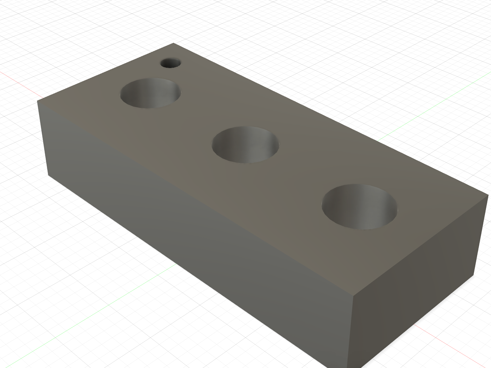

# ABS M4 heat-set insert pocket ladder

Print
[`ABS_CAL_PSM_SL_M4_INSERT_POCKET_LADDER_PRINT_ORIENTED.stl`](ABS_CAL_PSM_SL_M4_INSERT_POCKET_LADDER_PRINT_ORIENTED.stl)
before the corrected shoulder or wheel hub after the specified PSM inserts
arrive. It is already on its 36 × 16 mm bed face; do not rotate it and use no
supports.

The small Ø2 marker identifies the **Ø5.5 end**. Moving away from that marked
end, the three pockets are:

1. Ø5.5 × 7.2
2. Ø5.6 × 7.2 — the PSM catalogue nominal
3. Ø5.7 × 7.2

All three leave the shoulder hub's real 0.8 mm floor. Use the exact ABS profile
planned for the single-leg parts, with no scaling or slicer hole compensation.

Test both `SL-B-M4-5.8` and `SL-B-M4-4.8` using fresh stations/coupons. Heat the
insert perpendicular with a depth stop, stop flush, and let it cool completely.
Select the **smallest** station that:

- accepts the insert without splitting, bulging or driving excessive plastic
  ahead of it;
- leaves the insert flush and square;
- does not spin under a finger-started M4 screw; and
- resists a firm hand pull after cooling.

Do not use screw torque to pull an insert into place. Record the selected
station and photograph the result. If none passes, stop and revise the pocket
series rather than modifying a hub.

The Fusion B-Rep record is
[`m4_insert_coupon_manifest.json`](m4_insert_coupon_manifest.json).
