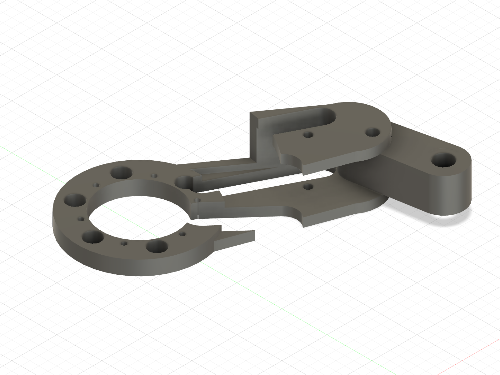
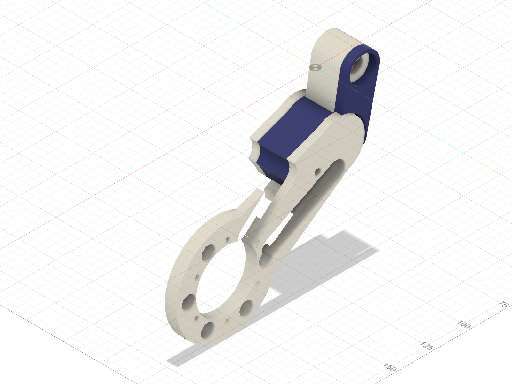
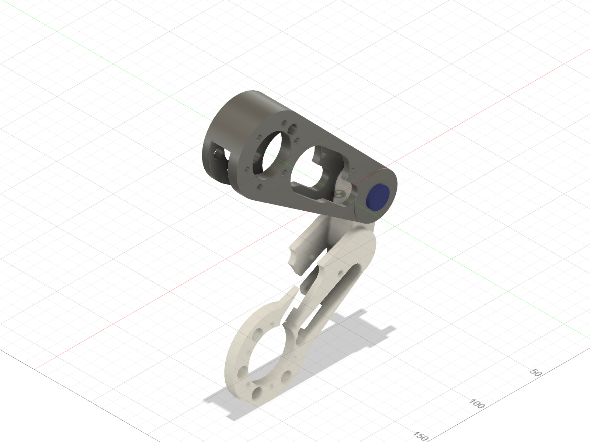

# Supported knee mock-up — ABS, 2026-09-06

Print the temporary pin first, then the provisional distal link. Two small
caps also let you try the ends of your **50 mm, OD18 / ID9 spring off the leg**.
The old proximal link can be used on the bench while the corrected one prints,
provided both bearings are fully seated and their retaining lips are intact.

**CAD PATH VERIFIED; physical assembly not yet verified.** This batch is for
two supported, detached links and gentle hand positioning. Keep motors,
cartridge, knee-stop hardware, encoder and collar off this mock-up. The pin
does not carry the leg's weight. No spring preload or powered movement.

## Print order and files

| Order | File | Quantity | Print setup |
|---|---|---:|---|
| 1 | [Temporary alignment pin](ABS_MOCKUP_Knee_Alignment_Pin_D9p7_PRINT_ORIENTED.stl) | 1 | ABS; grip on bed, shaft vertical; 0.20 mm layers, 4 walls, 100% infill; **no supports** |
| 2 | [Provisional distal link](ABS_MOCKUP_Distal_Link_L_PRINT_ORIENTED.stl) | 1 | ABS; supplied broad-face-down orientation; 0.20 mm layers, 4 walls, 5 top/bottom layers, 30% infill; **selective supports below** |
| Optional, with pin | [Detached spring-seat fit cap](ABS_Spring_Seat_Fit_Cap_D8_PRINT_ORIENTED.stl) | 2 | ABS; broad base on bed, pilot vertical; same 30% profile; **no supports** |

Use the tuned enclosed ABS profile. Import each file unchanged, with no
rotation, scaling or hole compensation. A brim is allowed if that profile
needs one. The pin is intentionally Ø9.7 in nominal Ø10 bores; it is a loose
alignment tool, not a steel-pin fit gauge or a retained axle.

## Distal supports

The wheel-mount ledge now continues down to the bed. The raised knee web and
the underside of the upper channel arm still need support. The blue volumes
below show the allowed support regions in a **different inspection view**;
use the STL's orientation for printing.

- Use manual/painted **normal supports** under those two regions. Allow
  supports on the lower channel floor as well as on the bed. Build-plate-only
  supports cannot reach the upper channel ceiling.
- Set support XY clearance to **0.6 mm** and top/bottom separation to
  **0.4 mm** for the 0.20 mm layer profile. Fusion checked a larger support
  envelope with 0.3 mm separation, so this leaves additional removal space.
- Keep a **Ø18 no-support region around the knee axis**, Ø8 around the small
  cartridge-pivot hole and Ø9 around the stop-pin hole. Keep every bore,
  motor mating face and bearing-contact area free of support. Do not fill
  holes with supports or let automatic supports spread beyond these regions.
- The small slot-corner ceiling and the narrow margins around blocked holes
  bridge. Inspect these layers in preview. Supports must not wrap around the
  knee boss or close the open side of the channel.
- After cooling, remove the knee-web support downward toward its bed face.
  Break away and withdraw the channel support through its **open side**,
  not through a pin hole. Fusion checked these removal paths. Do not pry
  against a bearing, bore, mating face or thin edge.

This is a first-article support policy, not a report of a successful physical
print. Reject a print with a blocked bore, damaged wall, curled datum or
support debris that prevents the following hand fit.

## Bench assembly

1. With the existing proximal link detached and supported, pass the printed
   pin through each bearing by hand. It must slide and withdraw freely.
   Check it separately in the new distal bore after removing supports.
   Stop if it needs force; do not hammer, heat-fit or drill it to hide a failure.
2. Support **both links** on padded blocks or folded towels, with the knee
   ends at the same height. The supports carry their weight throughout the
   test. Keep the joint accessible for your fingers.
3. Hold the distal tongue between the proximal fork arms. Slide it radially
   into the open end of the fork until the three bores line up. Fusion verified
   this with both proximal bearings already installed. **No thrust spacers
   are fitted in this temporary assembly.**
4. Push the pin from the proximal link's inboard bearing, through the distal
   tongue, then through the outboard bearing. Its large grip remains outside
   the inboard face. Leave it loose; do not add a clamp, collar or magnet carrier.
5. While continuing to support both links, gently change their relative angle
   through a small range. The tongue must move without rubbing, and the pin
   must remain freely removable. Some play is intentional. Do not use this
   assembly to measure knee backlash, encoder position, stiffness or load.
6. Support the links, pull the pin out using its grip, and slide the tongue
   out of the fork. Repeat once. Record any sticking or contact before adding
   any other hardware.

The Fusion view shows geometry, not a freestanding physical setup: keep both
links supported on the bench. No fasteners, heat-set inserts or wiring are
required for this particular rehearsal.

## Try the spring separately

Place one cap flat on the bench, pilot up. Lower one end of the uncompressed
spring over its pilot: it should seat flat without stretching the coil or
forcing the pilot in. Remove it and check the other spring end. You can place
the second cap on top under its own weight to see the end-to-end fit.
Do not squeeze the caps together or attach this stack to the links.

The cap tests an **Ø8 locating pilot** and **Ø20 seat** against the owned
spring. It is not a revised cartridge eye or a preload spacer. Actual cartridge
seats, guide/stop/bumper packaging, installed length and spring rate remain
open in the [spring record](../../evidence/springs/2026-09-05_reconciliation/).

## What carries forward

Keep the accepted shoulder hub and finish the corrected proximal-link print.
This distal mock-up preserves the link outline and pivot locations but omits
the original protruding thrust lands so it can enter a fork with bearings
already fitted. Its 19 mm tongue has 0.5 mm nominal clearance to each fork arm.
It is **not a release of the final distal/steel-pin/retention stack** and may
need replacement after that stack is resolved. Do not attach a motor to it.

The three STLs, their print orientations and the native geometry were checked
through Fusion MCP. [Engineering evidence and reproducible source](../../evidence/assembly/2026-09-06_supported_knee_mockup/).
