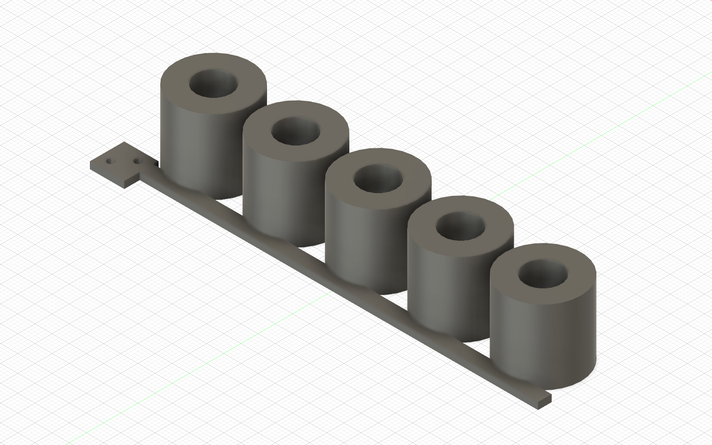

# ABS knee-pin full-span bore ladder — print and test

The received metal pin seized in the provisional shin's nominal Ø10 printed
bore. The owner then tested an initial Ø10.05–Ø10.25 ladder whose stations were
19.0 mm deep. Nominal Ø10.25 accepted the pin with firm thumb pressure, which
is the intended fit feel.

Fusion inspection found that the final printed receiver spans **21.6 mm**, not
19.0 mm: the Ø22 center boss runs from Y=65.0 to 84.0 and its Ø16 thrust lands
continue to Y=63.7 and 85.3. The initial coupon therefore underrepresented the
press length by 2.6 mm. This corrected ladder covers the complete receiver span
and starts at the owner's Ø10.25 candidate.

## Print

[Download the corrected print-oriented STL](ABS_CAL_KNEE_PIN_BORE_LADDER_PRINT_ORIENTED.stl).

- Quantity: 1
- Material/profile: the same tuned enclosed ABS profile used for the active leg
- Layer height: 0.20 mm
- Walls: 4
- Top/bottom layers: 5 / 5
- Infill: 30%
- XY hole compensation: 0
- XY contour compensation: 0
- Supports: off
- Orientation: import unchanged; the thin runner and index tab are on the bed,
  and all five pin bores are vertical

The two small holes mark the **Ø10.25 end**. Moving away from them, the five
stations are:

| Station from marked end | Nominal bore |
|---:|---:|
| 1 | Ø10.25 mm |
| 2 | Ø10.30 mm |
| 3 | Ø10.35 mm |
| 4 | Ø10.40 mm |
| 5 | Ø10.45 mm |

These are calibration candidates. None is a released distal-link dimension
until the physical test selects it.

## Test

1. Inspect the recovered pin for scoring or a raised end burr. Do not sand its
   ground journal. Use one pin for every station.
2. First pass that pin through each 6800 bearing separately, without the shin.
   It must insert and withdraw under controlled thumb pressure. Stop and report
   if either bearing needs impact or clamp force.
3. Test the ladder dry and at room temperature, starting at the two-hole
   Ø10.25 end.
4. Push only with your fingers. Stop a trial as soon as force rises sharply.
   The 35 mm pin remains 13.4 mm exposed through the 21.6 mm coupon, so withdraw
   or push it back using the exposed ends. Do not hammer it into a station.
5. Select the **smallest** station that accepts controlled thumb pressure,
   does not spin freely in the boss and remains removable. Report the station
   number and whether the cooled pin spins, rocks or pulls out by hand.

If every station is too tight or the pin becomes trapped, break only that coupon
boss and report the last attempted station. Do not print the final shin yet.

## Verification

Fusion MCP built and inspected one closed solid with exact Ø22 × 21.6 mm
stations and bores Ø10.25–Ø10.45 in 0.05 mm steps. The print-oriented
high-refinement STL is a closed, non-degenerate manifold at Z=0. See
[`fusion_manifest.json`](fusion_manifest.json) and
[`mesh_verification.json`](mesh_verification.json).

The owner's initial 19.0 mm result and its exact printed artifact are preserved
in the [physical evidence record](../../evidence/knee_fit/2026-09-15_steel_pin_provisional_shin/).

