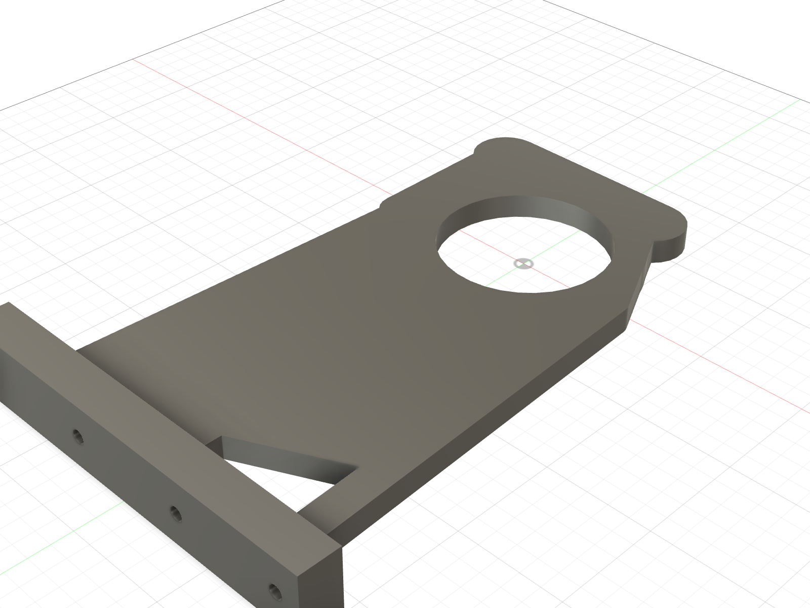

# Mode A — ABS single-leg fixture prints

The active single-leg integration article remains entirely ABS. These files
support dry assembly and wheel-clear, current-limited commissioning under
self-weight only. They are not structural-load articles.

## Stand

Print
[`ABS_FA_RIG_Stand_M3_INSERTS_PRINT_ORIENTED.stl`](ABS_FA_RIG_Stand_M3_INSERTS_PRINT_ORIENTED.stl)
exactly as supplied. Its mount face is at `Z=0`; the oriented envelope is
200.0 × 299.3119 × 32.0 mm and needs at least 300 mm on one bed axis. Use no
supports.

The five panel receivers are Ø4.0 × 6.0 blind pockets for approved 5 mm
Voron-style M3 inserts. They open on the bed datum, leave 1.0 mm below the
insert and retain a 6.0 mm printed floor. Coupon the exact owned insert before
installation.

Clamp or bolt the stand to the bench before mounting the leg. Its own weight
cannot react shoulder stall torque. The ABS commissioning scope still forbids
torque-arm, stall/proof, spring, ground-traction and drop testing.

## Cable anchor

`RIG_Cable_Anchor_ModeA.stl` is the optional rear-face strain-relief anchor.
Place either broad face on the bed and install with 2 × M3 × 8 plus washers.

The full receiver release record is
[`../heatset_receiver_release_manifest.json`](../heatset_receiver_release_manifest.json).
